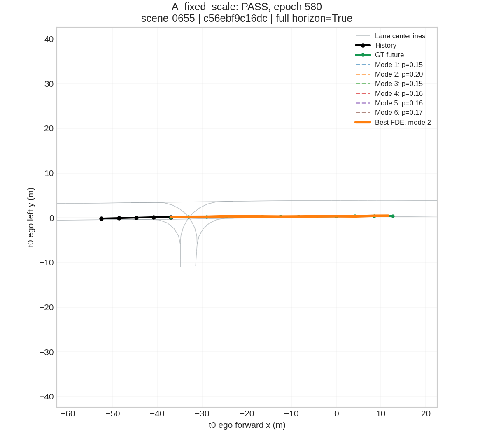
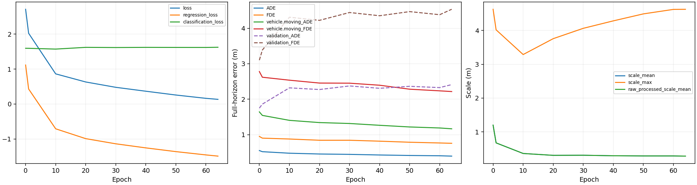
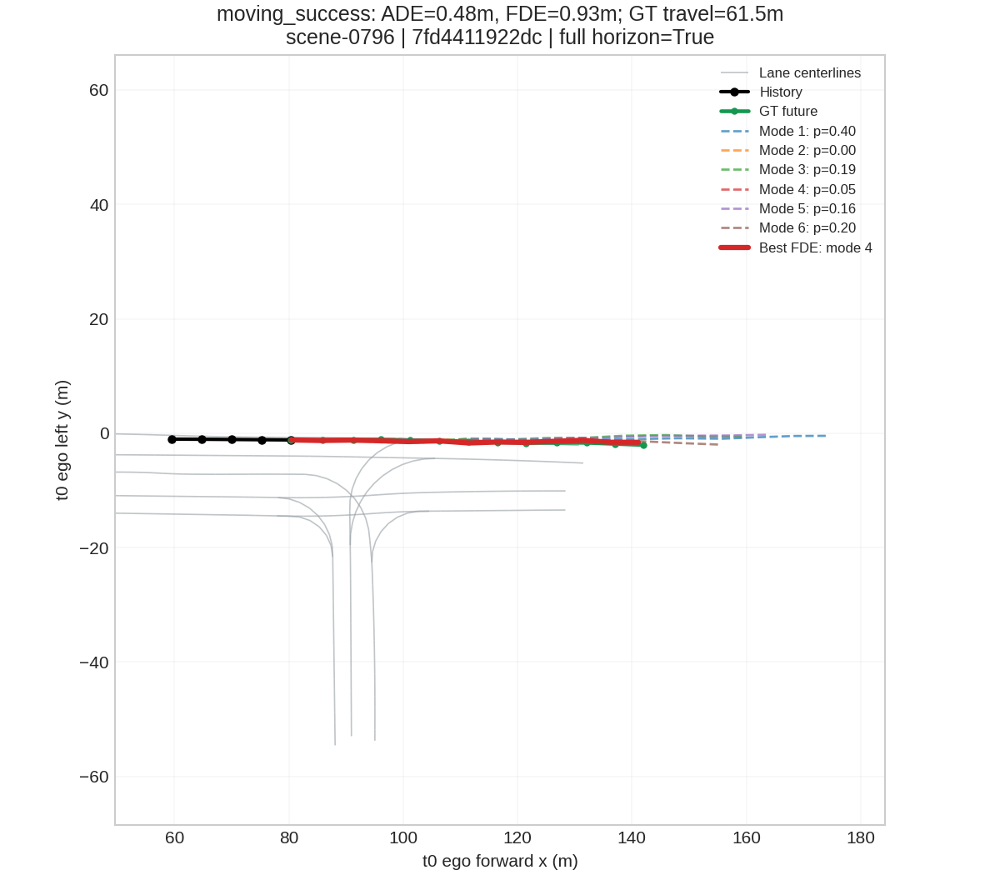
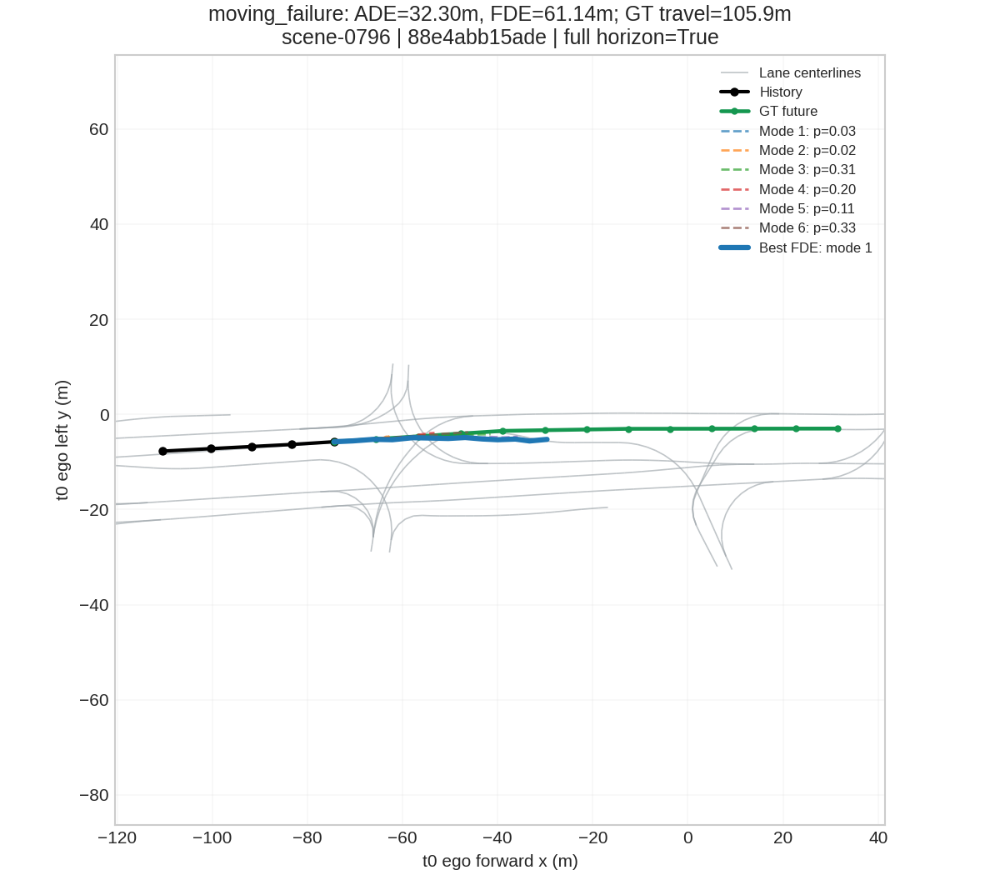

# Stage 2B: K=6 Loss Recovery & Baseline Finalization

工作目录 /home/lrj/Prediction_Hivt；分支 stage2/vehicle-hivt-baseline。复用 ped_intent，没有安装/升级依赖。
冻结前提交 `d8b93ae7fb89f9abaefe49d08e987975f21bc5c5`；原 tiny、moving audit 和 moving_* 报告共 175 个原文件 SHA256 保持相同。新结果仅写入 k6_loss_recovery/ 与 k6_* 报告。
K=6、Th=5、Tf=12、约2s/6s、HiVT-64、原 encoder/global interactor/MLP decoder、dropout=.1、weight_decay=1e-4、地图半径50m/间距2m 均保持不变。不删除 stopped/parked，不重采样，不加入创新模块。

## 【A K6 Fixed Scale】

epochs=580；ADE=0.123128m；FDE=0.950630m；MR=0.000000；**K6_FIXED_SCALE=PASS**。
同一 scene-0655 moving actor，GT endpoint 49.5348m；51 vehicle nodes + 666 lane segments 全部保留，只有该车参与监督。
regression=mean(|y−μ|)，保留原 best-sum-L2 mode selection 和 detached-soft-target mode classification。b=1，regression 不含 log(2) 常数；NLL 另记录。固定 lr=.001，seed2022，上限1000，每10 epoch评估。严格 gate ADE<.5/FDE<1，未放宽。
初始 ADE/FDE=26.388250/48.824348m；初始模型 SHA256=bd8bff1b8ca27d589f5c659d646838e390a5786d07ee43f29249600016527644。
最后 train backward head gradients：loc=3.1175，scale=0，pi=0.0102688。

## 【Mode Audit】

| Mode | Endpoint local xy (m) | Endpoint ego xy (m) | Displacement (m) | Probability | sum L2 (m) | FDE (m) |
|---|---|---|---:|---:|---:|---:|
| 0 | 48.361740/0.042718 | 11.416306/0.544708 | 48.361759 | 0.149119 | 4.700878 | 1.179667 |
| 1 | 48.584293/-0.062936 | 11.639618/0.440667 | 48.584335 | 0.199898 | 1.477532 | 0.950624 |
| 2 | 48.419426/0.024756 | 11.474121/0.527164 | 48.419434 | 0.154931 | 4.207389 | 1.120459 |
| 3 | 48.497162/0.031347 | 11.551807/0.534317 | 48.497169 | 0.163309 | 3.585509 | 1.043809 |
| 4 | 48.459789/0.001878 | 11.514648/0.504578 | 48.459789 | 0.158531 | 4.032969 | 1.078251 |
| 5 | 48.515244/0.018968 | 11.569977/0.522069 | 48.515244 | 0.174213 | 2.901119 | 1.024534 |

best training mode=1；best FDE mode=1；一致=True。
mode probabilities=[0.14911876618862152, 0.19989798963069916, 0.15493078529834747, 0.1633085310459137, 0.15853075683116913, 0.17421317100524902]。Mode audit用0–5编号，可视化图例用1–6编号。
MODE_COLLAPSE=NO；最大 mode pairwise trajectory distance=0.597049m；预先定义 collapse tolerance=.001m。单目标 collapse 可以接受，没有因此修改模型。
全部6个 mode 的完整12步 local/ego trajectory 与 probability 保存于 k6_mode_audit.json。

## 【B Warm-up】

warm-up epochs=580；ADE=0.129300m；FDE=1.028159m；PASS。
B 从 fresh seed2022 初始化，未使用 A final checkpoint。fixed-scale + classification、LR=.001，gate ADE<1/FDE<2，上限700。
raw pre-ELU scale head mean/min/max=0.084006/-1.718286/2.014637；processed raw scale mean/max=1.233169/3.015636。该分支此时不参与 regression。
warmup_checkpoint.pt 保存 weights、AdamW state 及 Torch CPU/CUDA RNG。

## 【Original NLL restored】

epochs=300；ADE=0.014022m；FDE=0.013048m；MR=0.000000；NLL=-1.828557；scale mean/max=0.116970/0.698733；**WARMUP_NLL=PASS**。
从 B warmup_checkpoint 继续，保留 AdamW state，LR降至1e-4，不用 scheduler，运行完整300 epochs。恢复原 free-scale LaplaceNLL 与原 mode classification。
最终 gate 预注册为 ADE<1/FDE<2，且相对 warm-up 的 ADE 增量≤.5m、FDE 增量≤1m；finite loss/gradients 必须通过。该增量定义在任何 B 结果前写入配置，用于量化‘不能明显退化’。

## 【C bounded scale】

NOT_RUN：只有 A PASS 且 B FAIL 才允许执行。

## 【Selected Protocol】

protocol=1；name=HiVT-NuScenes-Vehicle-Baseline。
K=6 fresh fixed-scale warm-up→原 Laplace NLL 严格通过，保留原 probabilistic loss；仅 optimization warm-up 为 nuScenes 约6s任务适配。
architecture unchanged；保留多模态与 mode probability。

## 【Full Tiny】

status=PASS；原16 tiny windows、原 scene/sample tokens 和原所有 vehicle target masks，未更改数据。完整未来作为主要指标，partial 单独报告。

| Group | Count | ADE | FDE | MR |
|---|---:|---:|---:|---:|
| overall | 236 | 0.698441 | 1.743845 | 0.135593 |
| vehicle.moving | 63 | 2.316497 | 5.846476 | 0.460317 |
| vehicle.stopped | 73 | 0.078665 | 0.220670 | 0.013699 |
| vehicle.parked | 90 | 0.061126 | 0.071662 | 0.000000 |
| unknown | 10 | 0.764878 | 2.066085 | 0.200000 |

预先固定的 gate：{'max_overall_to_failed_ADE_ratio': 0.7, 'max_overall_to_failed_FDE_ratio': 0.7, 'max_moving_to_failed_ADE_ratio': 0.5, 'max_moving_to_failed_FDE_ratio': 0.5, 'max_moving_ADE_m': 5.0, 'max_moving_FDE_m': 10.0}。最终 epoch 验收，不以最佳中间 epoch 替代。
Attributes 使用真实 t0 annotation，不能用未来位移重贴 moving/stopped/parked 标签。Stopped 之后起步的车辆保留在 stopped 组。
minADE 使用最低FDE的mode（上游HiVT评估约定），independent_minADE另存JSON；MR=末端误差>2m。Actor-window等权平均，重叠窗口不等于独立车辆。

Partial future 单独统计，不混入约6s主指标：

| Group | Count | ADE | FDE | MR |
|---|---:|---:|---:|---:|
| overall | 146 | 0.440118 | 0.975739 | 0.068493 |
| vehicle.moving | 59 | 0.966960 | 2.216158 | 0.152542 |
| vehicle.stopped | 14 | 0.204389 | 0.479830 | 0.071429 |
| vehicle.parked | 70 | 0.050389 | 0.058927 | 0.000000 |
| unknown | 3 | 0.272659 | 0.287328 | 0.000000 |

Full Tiny fresh初始化；fixed warm-up 230 epochs，然后原始NLL 300 epochs。最终NLL=-1.404319，scale mean/max=0.423241/6.798721。

## 【CV comparison】

所有方法使用相同原16 tiny windows、相同 eligible masks、相同 t0 attributes；CV 使用最后两个有效 past observations 和真实 timestamps。

| Method | Overall ADE/FDE | Moving ADE/FDE | Stopped ADE/FDE | Parked ADE/FDE |
|---|---|---|---|---|
| CV | 1.403184/3.194129 | 4.529295/10.319965 | 0.149589/0.368106 | 0.166303/0.340148 |
| Original HiVT free-scale failed run | 5.571721/11.274157 | 19.111268/38.526917 | 0.098331/0.234749 | 0.234403/0.416781 |
| Recovered HiVT | 0.698441/1.743845 | 2.316497/5.846476 | 0.078665/0.220670 | 0.061126/0.071662 |

## 【Mini】

status=COMPLETE；既有 mini train scenes / val scenes。Test 不用于调参或 checkpoint selection。
Fresh seed2022；warm-up 64 epochs + 原 NLL 64 epochs。固定LR .001/.0001，无scheduler。最终NLL阶段按val full-horizon overall minFDE选择 epoch 1，不选择 warm-up 或 test checkpoint。
沿用 Stage 1 mini 自定义6/2/2 scene划分，不是官方nuScenes leaderboard；完成工程 baseline 不等于验证模型泛化优于CV。

| Method | Group | Count | ADE | FDE | MR |
|---|---|---:|---:|---:|---:|
| CV | overall | 583 | 1.246142 | 2.914836 | 0.286449 |
| CV | vehicle.moving | 216 | 3.077110 | 7.268765 | 0.731481 |
| CV | vehicle.stopped | 50 | 0.226009 | 0.432937 | 0.000000 |
| CV | vehicle.parked | 303 | 0.129732 | 0.253984 | 0.009901 |
| CV | unknown | 14 | 0.802523 | 2.192304 | 0.428571 |
| HiVT | overall | 583 | 1.861680 | 3.386252 | 0.298456 |
| HiVT | vehicle.moving | 216 | 4.785299 | 8.741166 | 0.782407 |
| HiVT | vehicle.stopped | 50 | 0.071084 | 0.072802 | 0.000000 |
| HiVT | vehicle.parked | 303 | 0.067904 | 0.067356 | 0.000000 |
| HiVT | unknown | 14 | 1.971840 | 4.431755 | 0.357143 |

Partial future：

| Method | Group | Count | ADE | FDE | MR |
|---|---|---:|---:|---:|---:|
| CV | overall | 260 | 1.889563 | 4.098381 | 0.346154 |
| CV | vehicle.moving | 145 | 3.225889 | 7.026412 | 0.586207 |
| CV | vehicle.stopped | 36 | 0.158286 | 0.302802 | 0.027778 |
| CV | vehicle.parked | 64 | 0.067526 | 0.114761 | 0.000000 |
| CV | unknown | 15 | 0.900828 | 1.900252 | 0.266667 |
| HiVT | overall | 260 | 1.180716 | 2.073073 | 0.242308 |
| HiVT | vehicle.moving | 145 | 1.957491 | 3.438087 | 0.393103 |
| HiVT | vehicle.stopped | 36 | 0.219951 | 0.366758 | 0.027778 |
| HiVT | vehicle.parked | 64 | 0.038389 | 0.054111 | 0.000000 |
| HiVT | unknown | 15 | 0.851660 | 1.587324 | 0.333333 |

可视化覆盖：{'moving_success': {'requested': 5, 'available_actor_windows': 20, 'produced': 5, 'distinct_instances': 5}, 'moving_failure': {'requested': 5, 'available_actor_windows': 146, 'produced': 5, 'distinct_instances': 5}, 'stopped': {'requested': 2, 'available_actor_windows': 50, 'produced': 2, 'distinct_instances': 2}, 'parked': {'requested': 2, 'available_actor_windows': 303, 'produced': 2, 'distinct_instances': 2}}；完整=True。GT≥5m的真实 moving 目标，成功FDE≤2m、失败>2m；优先不同instance。图中lane/history/GT/6 modes/best-FDE/probabilities俱全。
[可视化清单与每个case的6条完整轨迹](../stage2/k6_loss_recovery/mini_visualization_audit.json)

Validation overall：HiVT/CV ADE ratio=1.4940，FDE ratio=1.1617。
Validation vehicle.moving：HiVT/CV ADE ratio=1.5551，FDE ratio=1.2026。

本次mini validation的HiVT尚未同时优于CV的ADE/FDE。Full Tiny支持运动拟合问题已改善；预定mini预算内的泛化性能仍需后续研究，本轮没有追加调参。

## 【Decision】

Stage2 baseline=PASS；Allow Stage3=YES（仅允许讨论）。本轮没有执行 Stage 3，也不 merge main。
Stop reason=None。

命令记录见 docs/stage2b_execution_commands.md；各实验 config/metrics/curve/gradient logs/figures 全部保留。Weights、optimizer states 和完整冻结副本仅保存在本机。
