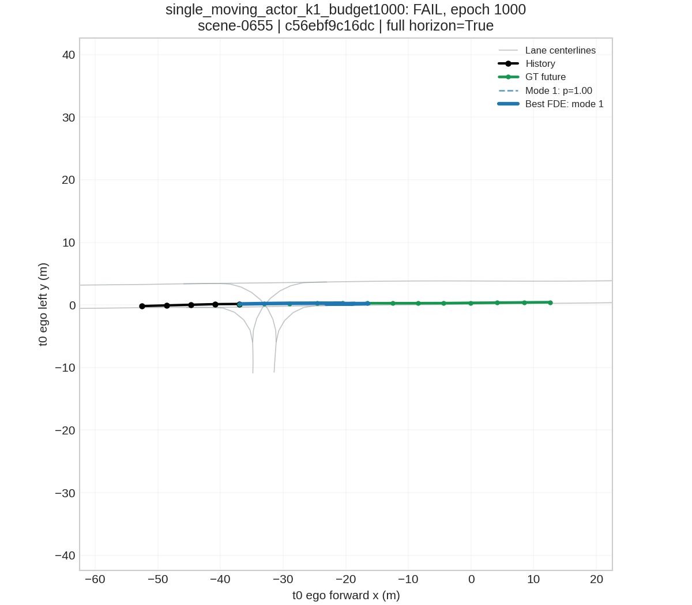
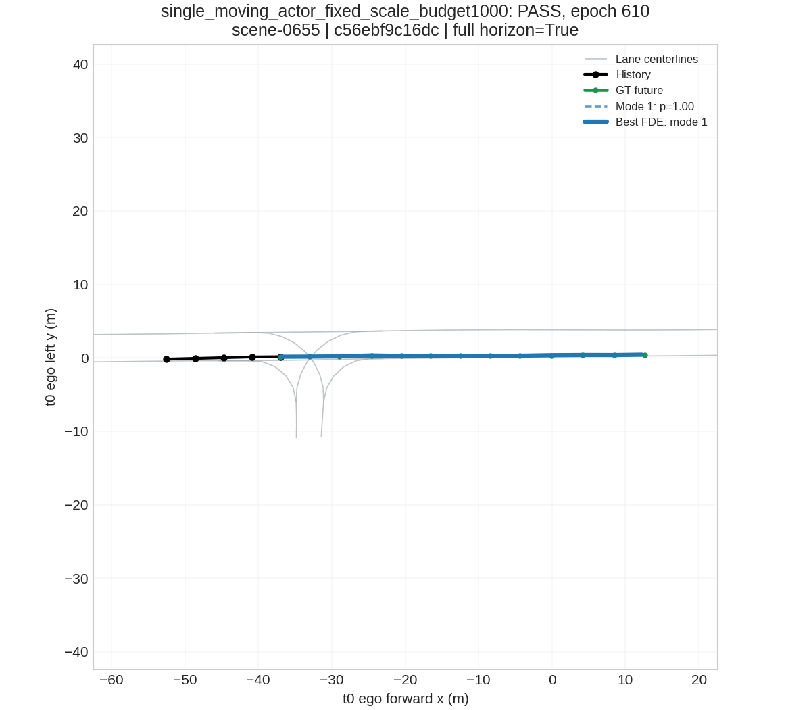

# Moving vehicle overfit audit

根因判定：**Case C**。同一 moving actor、同一 K=1 模型及相同训练步数下，free-scale 官方 Laplace 失败，固定 b=1 通过；uncertainty/NLL 优化抑制 location 学习是本例中得到实验支持的原因。

结论限于本次原失败 tiny 中选出的 moving car 和这些优化设置。官方 K=6 baseline 仍 FAIL；完整 tiny、mini、Stage 3 均未运行。

## 冻结与范围

原 commit：`2bddcd8d7b166d60120e4fb3b347d196f5214a58`。原 tiny checkpoint/metrics/curve/figures 及 failure figures 共 24 个文件 SHA256 前后相同。
完整快照只保存在本机 moving_overfit_audit/frozen_*，checkpoint 和缓存不上传；可追溯 manifest 与报告提交 Git。复用 ped_intent 环境，没有安装/升级包。

## 【Vehicle distribution】

总 vehicle actor-window=3623；loss eligible=3417；full horizon=2158。
真实 t0 attribute：moving=1166，parked=1434，stopped=903，unknown=120。

先读取实际 attribute_name：cycle.with_rider、cycle.without_rider、pedestrian.moving、pedestrian.sitting_lying_down、pedestrian.standing、vehicle.moving、vehicle.parked、vehicle.stopped。没有把低速车辆直接标为 parked。

| Endpoint bin | 全部有 future 的 actor-window | 占 3529 的比例 | full 12-step actor-window | 占 2158 的比例 |
|---|---:|---:|---:|---:|
| 0–1m | 2338 | 66.25% | 1518 | 70.34% |
| 1–2m | 48 | 1.36% | 34 | 1.58% |
| 2–5m | 55 | 1.56% | 19 | 0.88% |
| 5–10m | 87 | 2.47% | 24 | 1.11% |
| 10–20m | 196 | 5.55% | 77 | 3.57% |
| 20–40m | 357 | 10.12% | 169 | 7.83% |
| >40m | 448 | 12.69% | 317 | 14.69% |

另外 94 个 actor-window 没有 future，未计入 endpoint bins。partial endpoint 是最后可用位置，不能都称为 6s 位移。仅 full horizon 一栏可用于约 6s 比较。
历史速度、当前 past-only 速度、GT 平均位移/path length 和 future valid length 的分布及 attribute 交叉表见 vehicle_motion_distribution.json；每个 actor-window 见 vehicle_actor_windows.csv。

## 单目标与 target sanity

scene=scene-0655；scene_token=`bebf5f5b2a674631ab5c88fd1aa9e87a`；sample_token=`baaa60749cd04db7952fd8f4ef8ac837`；instance_token=`c56ebf9c16dc44b8b9cd34fb79f40bc6`。
GT endpoint displacement=49.534780m，future duration=6.052844s；真实 `vehicle.moving`；5/12 全有效；17 个 annotation 的 prev/next 连续。
当前 past-only speed=7.744m/s，未来最大区间速度=8.571m/s，最大区间加速度=0.912m/s²，无明显跳变。
保留 51 个 vehicle nodes、666 个 lane segments，以及所有原 actor/lane edges。仅该车 target_mask=True；每步 backward 验证其他车辆 raw prediction gradient 恰为零。context 的 encoder 仍可参与该车计算。
source annotation → cached ego 最大误差=1.81352534e-06m；rotated_y → inverse rotation → +current 最大误差=5.7220459e-06m，均 <1e-4m。
history/current/future/y/rotation/rotated_y/source annotation tokens 均保存在 single_moving_target_audit.json。只改变 timestamps 的 CPU forward 输出差为零，未发现隐式时间倍率。

## 【Single moving K=6】 / 【Single moving K=1】 / 【Fixed scale diagnostic】

所有模型均为原 HiVT-64 encoder+MLP decoder，原 dropout=0.1、AdamW 和 weight decay，fresh seed2022，固定 LR，不使用 scheduler。K=6 保留原 loss 和 K=6；K=1 与 fixed scale 仅为诊断。
| Experiment | LR | Epochs | Initial ADE | Final ADE | Initial FDE | Final FDE | Status |
|---|---:|---:|---:|---:|---:|---:|---|
| single_moving_actor_overfit | 0.0005 | 500 | 26.388250 | 21.827324 | 48.824348 | 45.857639 | FAIL |
| single_moving_actor_overfit_lr1e3 | 0.001 | 500 | 26.388250 | 18.754271 | 48.824348 | 41.082985 | FAIL |
| single_moving_actor_k1 | 0.001 | 500 | 26.335464 | 17.554472 | 48.655537 | 39.268654 | FAIL |
| single_moving_actor_fixed_scale | 0.001 | 500 | 26.335464 | 1.514733 | 48.655537 | 10.658605 | FAIL |
| single_moving_actor_k1_budget1000 | 0.001 | 1000 | 26.335464 | 12.087153 | 48.655537 | 31.373402 | FAIL |
| single_moving_actor_fixed_scale_budget1000 | 0.001 | 610 | 26.335464 | 0.072806 | 48.655537 | 0.338639 | PASS |
| moving_only_4 | 0.001 | 700 | 23.188164 | 0.400014 | 39.362556 | 1.498949 | PASS |
| moving_only_8 | 0.001 | 720 | 22.779538 | 0.432001 | 38.095670 | 1.946626 | PASS |
| moving_only_16 | 0.001 | 1000 | 22.709778 | 0.195157 | 39.572796 | 0.485542 | TREND_ONLY |
| balanced_8_moving_8_stationary | 0.001 | 430 | 11.848058 | 0.748739 | 19.733086 | 1.988793 | PASS |

ADE 使用原 HiVT 的 best-FDE mode，另记录 independent minADE；所有诊断 target 均 full horizon。严格单目标阈值：ADE<0.5m 且 FDE<1.0m。

K=1 classification 对单一 mode 恒为 0。fixed-scale 使用相同逐坐标 mean 的单位 scale Laplace：mean(|y−μ|)+log(2)，只训练 location，scale/pi 分支仍保留但不影响 loss。它不是最终 baseline。

500 epoch 的 fixed-scale 已明显改善，但还失败，因此另预注册等预算 K=1 对照（见 budget_check_plan.json），各自从同一个初始权重重新训练，上限 1000；只改变 epoch budget。没有延长官方 K=6 的 500 epoch 上限。

**等训练步数比较：epoch 610**，free-scale K=1 ADE=16.346298m、FDE=37.530266m；fixed-scale K=1 ADE=0.072806m、FDE=0.338639m。初始模型 SHA256 相同，target/context/optimizer/LR/dropout 均相同，loss 中的 uncertainty 是对照变量。

官方 K=1 最终预测（1000 epoch，仍 FAIL）：

同一车 fixed-scale 预测（610 epoch，PASS）：

## loc / scale / pi 梯度

下表为 train-mode backward、optimizer step 前的 L2 norm；每个 epoch 都记录，至少包含 1/10/50/100/final。GPU 归约可能产生微小浮点差异；新预算实验的相同 seed 不保证训练轨迹逐位相同。

| Experiment | Epoch | loc norm | scale norm | pi norm | Pred max displacement (m) | scale mean/max (m) |
|---|---:|---:|---:|---:|---:|---|
| single_moving_actor_overfit | 1 | 3.002437 | 61.650981 | 1.246939 | 2.159604 | 1.170090/4.166775 |
| single_moving_actor_overfit | 10 | 3.124959 | 19.661775 | 0.555474 | 2.404491 | 1.415959/3.001171 |
| single_moving_actor_overfit | 50 | 4.909826 | 4.603163 | 0.283868 | 1.969070 | 1.579235/3.748668 |
| single_moving_actor_overfit | 100 | 6.117084 | 2.737636 | 0.146690 | 2.434876 | 1.725924/4.528258 |
| single_moving_actor_overfit | 500 | 43.250157 | 1.363984 | 0.034496 | 5.967004 | 2.884451/8.564476 |
| single_moving_actor_overfit_lr1e3 | 1 | 3.002437 | 61.650976 | 1.246939 | 2.135888 | 1.087133/3.114938 |
| single_moving_actor_overfit_lr1e3 | 10 | 3.776465 | 8.805452 | 0.269313 | 1.914504 | 1.488150/3.188040 |
| single_moving_actor_overfit_lr1e3 | 50 | 7.208408 | 2.357467 | 0.017062 | 2.412721 | 1.872155/4.587764 |
| single_moving_actor_overfit_lr1e3 | 100 | 10.885408 | 1.908785 | 0.008793 | 3.221271 | 2.223907/5.992598 |
| single_moving_actor_overfit_lr1e3 | 500 | 53.255109 | 1.085309 | 0.003523 | 9.598895 | 4.087388/12.620753 |
| single_moving_actor_k1 | 1 | 6.528690 | 137.904530 | 0.000000 | 1.532414 | 1.247300/2.913863 |
| single_moving_actor_k1 | 10 | 4.707600 | 9.175747 | 0.000000 | 1.326838 | 1.602001/3.052831 |
| single_moving_actor_k1 | 50 | 5.565772 | 2.446349 | 0.000000 | 2.914325 | 1.953061/4.657042 |
| single_moving_actor_k1 | 100 | 13.768842 | 1.818939 | 0.000000 | 3.911252 | 2.272866/5.918073 |
| single_moving_actor_k1 | 500 | 60.388930 | 1.775124 | 0.000000 | 12.405992 | 3.857929/13.013596 |
| single_moving_actor_fixed_scale | 1 | 1.916596 | 0.000000 | 0.000000 | 1.544311 | 1.000000/1.000000 |
| single_moving_actor_fixed_scale | 10 | 1.810643 | 0.000000 | 0.000000 | 2.443136 | 1.000000/1.000000 |
| single_moving_actor_fixed_scale | 50 | 1.914346 | 0.000000 | 0.000000 | 4.569319 | 1.000000/1.000000 |
| single_moving_actor_fixed_scale | 100 | 2.015228 | 0.000000 | 0.000000 | 6.877101 | 1.000000/1.000000 |
| single_moving_actor_fixed_scale | 500 | 2.997806 | 0.000000 | 0.000000 | 39.751511 | 1.000000/1.000000 |
| single_moving_actor_k1_budget1000 | 1 | 6.528689 | 137.904526 | 0.000000 | 1.532414 | 1.247301/2.913863 |
| single_moving_actor_k1_budget1000 | 10 | 4.707597 | 9.175748 | 0.000000 | 1.326838 | 1.602001/3.052831 |
| single_moving_actor_k1_budget1000 | 50 | 5.565773 | 2.446350 | 0.000000 | 2.914324 | 1.953061/4.657042 |
| single_moving_actor_k1_budget1000 | 100 | 13.768852 | 1.818942 | 0.000000 | 3.911252 | 2.272865/5.918072 |
| single_moving_actor_k1_budget1000 | 1000 | 98.864382 | 1.884721 | 0.000000 | 20.628553 | 4.512494/17.400349 |
| single_moving_actor_fixed_scale_budget1000 | 1 | 1.916596 | 0.000000 | 0.000000 | 1.544311 | 1.000000/1.000000 |
| single_moving_actor_fixed_scale_budget1000 | 10 | 1.810643 | 0.000000 | 0.000000 | 2.443136 | 1.000000/1.000000 |
| single_moving_actor_fixed_scale_budget1000 | 50 | 1.914346 | 0.000000 | 0.000000 | 4.569320 | 1.000000/1.000000 |
| single_moving_actor_fixed_scale_budget1000 | 100 | 2.015228 | 0.000000 | 0.000000 | 6.877101 | 1.000000/1.000000 |
| single_moving_actor_fixed_scale_budget1000 | 610 | 3.163783 | 0.000000 | 0.000000 | 49.196285 | 1.000000/1.000000 |
| moving_only_4 | 1 | 1.453374 | 0.000000 | 0.000000 | 2.130753 | 1.000000/1.000000 |
| moving_only_4 | 10 | 1.185044 | 0.000000 | 0.000000 | 3.140615 | 1.000000/1.000000 |
| moving_only_4 | 50 | 1.321257 | 0.000000 | 0.000000 | 5.204276 | 1.000000/1.000000 |
| moving_only_4 | 100 | 1.512845 | 0.000000 | 0.000000 | 8.147541 | 1.000000/1.000000 |
| moving_only_4 | 700 | 2.606042 | 0.000000 | 0.000000 | 44.967621 | 1.000000/1.000000 |
| moving_only_8 | 1 | 1.329065 | 0.000000 | 0.000000 | 2.033004 | 1.000000/1.000000 |
| moving_only_8 | 10 | 1.257735 | 0.000000 | 0.000000 | 2.922524 | 1.000000/1.000000 |
| moving_only_8 | 50 | 1.197643 | 0.000000 | 0.000000 | 5.711483 | 1.000000/1.000000 |
| moving_only_8 | 100 | 1.302215 | 0.000000 | 0.000000 | 8.367840 | 1.000000/1.000000 |
| moving_only_8 | 720 | 1.750426 | 0.000000 | 0.000000 | 41.548340 | 1.000000/1.000000 |
| moving_only_16 | 1 | 1.472756 | 0.000000 | 0.000000 | 2.756603 | 1.000000/1.000000 |
| moving_only_16 | 10 | 1.407989 | 0.000000 | 0.000000 | 4.013278 | 1.000000/1.000000 |
| moving_only_16 | 50 | 1.697659 | 0.000000 | 0.000000 | 10.379874 | 1.000000/1.000000 |
| moving_only_16 | 100 | 2.367389 | 0.000000 | 0.000000 | 20.570211 | 1.000000/1.000000 |
| moving_only_16 | 1000 | 3.232681 | 0.000000 | 0.000000 | 49.618885 | 1.000000/1.000000 |
| balanced_8_moving_8_stationary | 1 | 1.389616 | 0.000000 | 0.000000 | 2.687714 | 1.000000/1.000000 |
| balanced_8_moving_8_stationary | 10 | 1.346906 | 0.000000 | 0.000000 | 3.079085 | 1.000000/1.000000 |
| balanced_8_moving_8_stationary | 50 | 1.458708 | 0.000000 | 0.000000 | 6.074061 | 1.000000/1.000000 |
| balanced_8_moving_8_stationary | 100 | 1.166461 | 0.000000 | 0.000000 | 12.015865 | 1.000000/1.000000 |
| balanced_8_moving_8_stationary | 430 | 2.964860 | 0.000000 | 0.000000 | 42.447277 | 1.000000/1.000000 |

汇总文件：moving_gradient_audit.csv。预测位移和 scale 只统计 supervised target，mean/max 默认覆盖全部 mode。fixed scale 的 effective scale 恒为 1，原未使用 scale head 的输出单独标记，不能当作本实验 uncertainty。

post-training CPU eval backward 没有 optimizer.step，额外验证每个参数进入 optimizer 一次、梯度 finite、loc 最后一层权重确实改变、最后 Linear 输出等于 raw location。
| Experiment (post-training eval) | Mean |μ−y| x/y (m) | Chosen scale mean x/y (m) | Endpoint scale x/y (m) | Endpoint |dL/dμ| x/y |
|---|---|---|---|---|
| single_moving_actor_overfit | 21.8272/0.0150619 | 5.79678/0.0214266 | 7.60229/0.015652 | 0.00548081/2.66206 |
| single_moving_actor_overfit_lr1e3 | 18.7539/0.0174367 | 8.17836/0.0177989 | 11.5183/0.0197628 | 0.00361744/2.10834 |
| single_moving_actor_k1 | 17.5543/0.0196161 | 7.69753/0.0183252 | 11.7508/0.0147425 | 0.00354585/2.82629 |
| single_moving_actor_fixed_scale | 1.50632/0.0213745 | 1/1 | 1/1 | 0.0416667/0.0416667 |
| single_moving_actor_k1_budget1000 | 12.0832/0.0147638 | 9.0132/0.0117839 | 16.2862/0.00986256 | 0.00255841/4.22473 |
| single_moving_actor_fixed_scale_budget1000 | 0.0637876/0.0220769 | 1/1 | 1/1 | 0.0416667/0.0416667 |

官方 NLL 的 location 导数为 sign(μ−y)/(24b)。逐时刻 autograd 与解析梯度核对通过。一个方向大误差被较大 b 降低梯度，接近拟合的另一个方向可以通过缩小 b 降低 NLL 并产生大梯度，因此总 loc norm 非零并不表示远期主运动方向已拟合。必须结合 stepwise residual/scale/gradient 判断。

## 输出量纲

下表的 prediction 使用各实验 best-FDE mode 的 agent-local displacement，单位米。没有修改原数据尺度。

| Experiment | Future step | GT x/y (m) | Pred x/y (m) | Pred/GT norm ratio |
|---|---:|---|---|---:|
| single_moving_actor_overfit_lr1e3 | 1 | 3.9287/-0.0002 | 3.9455/-0.0122 | 1.004267 |
| single_moving_actor_overfit_lr1e3 | 3 | 12.3721/0.0380 | 6.8172/0.0569 | 0.551030 |
| single_moving_actor_overfit_lr1e3 | 6 | 24.4394/-0.0610 | 9.5988/-0.0483 | 0.392762 |
| single_moving_actor_overfit_lr1e3 | 12 | 49.5347/-0.0828 | 8.4517/-0.1010 | 0.170634 |
| single_moving_actor_k1_budget1000 | 1 | 3.9287/-0.0002 | 3.9116/0.0334 | 0.995676 |
| single_moving_actor_k1_budget1000 | 3 | 12.3721/0.0380 | 12.3757/0.0327 | 1.000296 |
| single_moving_actor_k1_budget1000 | 6 | 24.4394/-0.0610 | 15.2878/-0.0629 | 0.625544 |
| single_moving_actor_k1_budget1000 | 12 | 49.5347/-0.0828 | 18.1613/-0.0917 | 0.366642 |
| single_moving_actor_fixed_scale_budget1000 | 1 | 3.9287/-0.0002 | 3.9258/-0.0140 | 0.999249 |
| single_moving_actor_fixed_scale_budget1000 | 3 | 12.3721/0.0380 | 12.3436/0.0852 | 0.997717 |
| single_moving_actor_fixed_scale_budget1000 | 6 | 24.4394/-0.0610 | 24.5214/-0.0891 | 1.003357 |
| single_moving_actor_fixed_scale_budget1000 | 12 | 49.5347/-0.0828 | 49.1962/-0.0724 | 0.993167 |

各时刻及训练阶段的比例不一致，没有观测到统一 5×、10× 或 0.5× 因子。保留 2Hz/5-history/12-future 数据，位置与输出始终使用米。
额外的代数 range probe 在临时模型副本上，将 GT 放入最终 Linear 的 bias、weight 置零，可还原同一条 49.53m GT（误差 <1e-4m）。这是明确使用 GT 的输出范围检查，**不是训练结果、预测指标或 PASS 证据**，原 checkpoint 未改变。

## 【Moving-only】 / 【Balanced】

单目标 fixed-scale 通过后，按用户条件扩展 target 数量；沿用已通过的 K=1、固定 scale、LR=.001 诊断设置。这些不是官方 K=6 baseline 的结果。16 个 moving 来自 distinct instances；stationary 有 4 个真实 stopped、4 个真实 parked，全部完整历史与未来，各自场景 context 保留。

| Targets | Scene windows | Epochs | Optimizer steps | ADE (m) | FDE (m) | Loss | Status |
|---|---:|---:|---:|---:|---:|---:|---|
| 4 moving | 3 | 700 | 700 | 0.400014 | 1.498949 | 0.925794 | PASS |
| 8 moving | 4 | 720 | 720 | 0.432001 | 1.946626 | 0.938963 | PASS |
| 16 moving | 9 | 1000 | 3000 | 0.195157 | 0.485542 | 0.815502 | TREND_ONLY |
| 8 moving + 4 stopped + 4 parked | 5 | 430 | 860 | 0.748739 | 1.988793 | 1.101150 | PASS |

4 targets 阈值 ADE<.75/FDE<1.5；8 targets 阈值 ADE<1/FDE<2；16 targets 为 trend only、不强制阈值。balanced 预注册诊断阈值 ADE<1/FDE<2。它在 4/8 gate 都通过后运行。每个 epoch 的更新步数随 scene-window 数变化，比较 target 数量时必须同时看 optimizer steps；不把此诊断当作严格等步数的容量曲线。
以上门槛是 actor 平均指标；不能称为每辆车都已完全记忆。逐 actor identities/attributes/metrics 保存在 moving_final_actor_metrics.json。

| Experiment | MR (>2m endpoint) | Worst actor FDE (m) |
|---|---:|---:|
| moving_only_4 | 0.2500 | 5.417539 |
| moving_only_8 | 0.2500 | 8.008027 |
| moving_only_16 | 0.0000 | 1.746992 |
| balanced_8_moving_8_stationary | 0.1250 | 19.035250 |

Balanced 真实 attribute 子组：

| Attribute | Count | ADE (m) | FDE (m) |
|---|---:|---:|---:|
| moving | 8 | 1.465309 | 3.942855 |
| parked | 4 | 0.039384 | 0.042968 |
| stopped | 4 | 0.024953 | 0.026494 |

**Balanced 仅 pooled mean gate PASS；moving 子组仍未达到 8-moving 的 ADE<1/FDE<2 门槛。不能把 balanced 总体达标当作移动车全部过拟合，也不能宣称静止比例问题已经解决。**

## 【Root cause judgment】

同一 moving actor、同一 K=1 模型及相同训练步数下，free-scale 官方 Laplace 失败，固定 b=1 通过；uncertainty/NLL 优化抑制 location 学习是本例中得到实验支持的原因。

- 单目标 loss 已消除 parked/static 占比因素，不能将失败仅归因于静止车分布。
- K=1 去除了多模态竞争和 classification 的影响后仍失败，Case D 不成立。
- target 原始标注、旋转往返、输出米制和 decoder range 均检查通过；本次未发现坐标或统一 timestep multiplier 错误。
- 规模/平衡实验若使用 fixed-scale 诊断 loss，即使成功，也不能形成 Case B 的官方 loss/采样对照；不能据此决定删除 parked 或 stopped 车辆。

此结论不将官方 HiVT loss 说成实现 bug；在当前 nuScenes 6s 位移、初始化和优化设置下，free-scale NLL 可以下降而 location 长距离误差仍很大。static 分布可能另有作用，但本轮没有验证其独立贡献。

## 【Next Stage】

重新运行完整 tiny：**NO**。mini 完整训练：**NO**。Stage 3：**NO**。

保持 K=6、原 horizon 和 context，继续诊断官方 loss 的 scale/loc 优化；先使官方 single moving PASS，再在官方 loss 下验收 4/8/16 和 balanced。本次 fixed-scale/K=1 诊断不能替代最终 baseline 验收。

## 验证与命令

7 个单元测试通过，包括原 baseline 4 个和新诊断 3 个；额外 source/roundtrip/gradient/optimizer/output range 检查通过，19 个 upstream 文件 SHA256 保持原值。
启动阶段最初的 GPU timestamps probe 使用严格零误差断言，受 scatter 归约浮点变化影响失败；当时尚未创建 optimizer/训练。已改用相同权重的 CPU probe，完整保留 startup_failure_run.txt 与无训练配置，避免将这种误差误判为时间尺度依赖。
完整执行命令见 docs/moving_overfit_audit_commands.md。原 tiny 冻结文件再次验证 24/24 相同。
