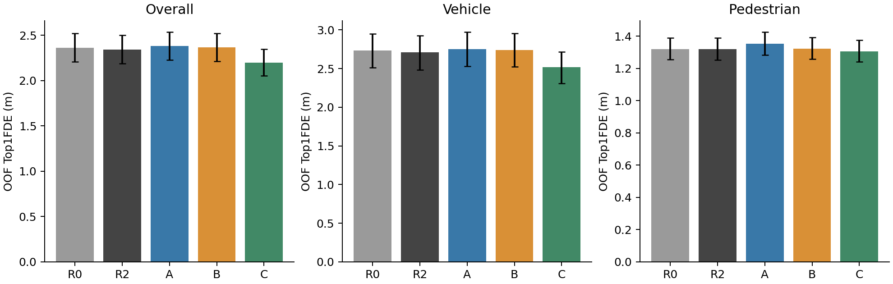
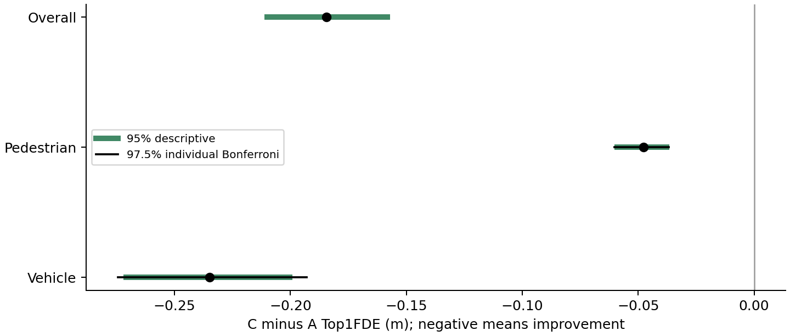
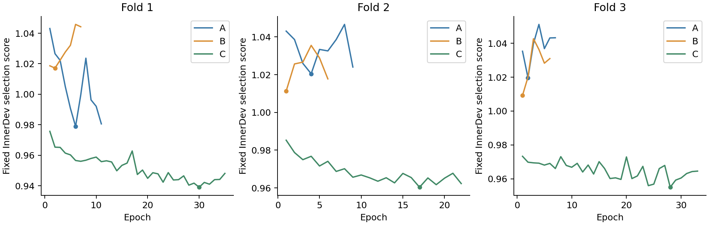

# Stage11B Controlled Error-Aware Ranking Objective Study

基础commit：`5617f9463b3f5baa4d941f52c157c25a341fd5e1`；分支：`stage11b/controlled-ranking-objectives`。

## 【Research Question】

固定 Stage5A 的六条候选和 Stage8 G1 架构，仅改变 ranking objective，检验车辆高代价错误切换、行人错误切换以及 SoftCE 与 Top1FDE 不对齐的问题。主要比较在训练前登记为 C−A 的 Vehicle / Pedestrian Top1FDE；Overall 作为方向检查。

实际结论：**ErrorAwareRanking=STRONG_SUPPORTED；HardCE=NOT_SUPPORTED；Stage11B=GO**。本阶段已完成后停止，等待大脑AI审查。

## 【Stage11A Findings】

Stage11A 冻结结论保持：LossRankingMismatch=CONFIRMED，CostlyModeSwitchProblem=CONFIRMED，CandidateGeometryBottleneck=PARTIAL，SoftTargetAmbiguity=NOT_CONFIRMED。此前车辆错误切换的平均 harm 高于平均 gain，行人错误切换次数增加；这些发现提出本阶段假设，并不预定本阶段结果。Stage8 AgentGraph=SUPPORTED / FSCG=NOT_SUPPORTED / SemanticGraph=NOT_SUPPORTED，Stage9 TAFIG=NOT_SUPPORTED，Stage10A=STOP，均未改写。

## 【Controlled Variables】

复用原始 Stage8 `SparseGraphReranker("G1")`：Node15D、Edge17D、hidden64、1层消息传递、50m、nearest8、K6、Th5、Tf12、24,066 参数。最终分数是 original Stage5A logits + graph delta；未使用 Stage9 R2 residual、semantic、adapter 或 gate。每折 A/B/C 初始 state_dict 相同，最后评分层零初始化；折1/2/3种子2022/2122/2222。候选、feature、训练 actor、同一 epoch 的 carry batch 顺序、AdamW、FP32、预算和选择指标一致，正式变量只有 loss。

Stage5A checkpoint SHA256：`88fe3feb59b7e830ec1e40aa917484386e0d2799d0f6116f410adda2d97fdce7`。预测器 eval、requires_grad=False、梯度数0；完整 forward cache 来源和 bitwise replay 已审计。模型训练仅消耗冻结 cache。

## 【Fold-specific R2】

每折独立新建原 Stage6A R2：19→32→1、673参数、ReLU、最后层零初始化、原 SoftCE loss、seed2022、AdamW lr1e−3 / weight_decay1e−4、FP32、batch1024、末尾不足batch正常更新、eval4096、max50 / patience5。原 CPU Generator(seed2022+epoch) randperm 和 Overall Top1FDE 严格改善选择协议保留。仅改变该折 scene 分区和 normalization。历史 R2 权重与旧 HeadTrain630 normalization 均未加载；折 R2 按 InnerDev Overall Top1FDE 选择，第一轮才具备 checkpoint 资格。

## 【3-fold Nested Data Split】

仅使用 HeadTrain630。按 SHA256(`2022|outer|scene_token`) 排序，连续三个210-scene block作OuterTest；各折其余420按 SHA256(`2022|inner|foldN|scene_token`) 排序，前42为InnerDev，其余378为InnerTrain。均加scene-token词典序tie规则。全部划分在拟合前登记；三分区互斥，630场景各做一次OuterTest，同scene所有window/actor/sample始终同分区。

| Fold | Partition | Scenes | Actors | Vehicle | Pedestrian | Bicycle |
| --- | --- | --- | --- | --- | --- | --- |
| 1 | InnerTrain | 378 | 159151 | 117069 | 40291 | 1791 |
| 1 | InnerDev | 42 | 18327 | 12401 | 5604 | 322 |
| 1 | OuterTest | 210 | 82673 | 61556 | 20250 | 867 |
| 2 | InnerTrain | 378 | 157356 | 116330 | 39500 | 1526 |
| 2 | InnerDev | 42 | 19084 | 14245 | 4537 | 302 |
| 2 | OuterTest | 210 | 83711 | 60451 | 22108 | 1152 |
| 3 | InnerTrain | 378 | 148900 | 108363 | 38747 | 1790 |
| 3 | InnerDev | 42 | 17484 | 13644 | 3611 | 229 |
| 3 | OuterTest | 210 | 93767 | 69019 | 23787 | 961 |

历史 HeadDev70 的1703个window跳过；official VAL/test从未参与本阶段训练、选择、OOF或归一化。

## 【Normalization】

各折 Graph连续feature和R2连续feature均仅由该折InnerTrain378拟合。使用原实现的valid-neighbor masks、population std(ddof=0)+1e−6；type/binary字段不变，missing-neighbor convention保留。R2 raw features从仅含可观测信息的历史窗口重新计算，未反归一化旧630统计量。fit scene列表、actor索引SHA及统计量保存于`../02_splits/`。100窗口GT poison：GT置NaN并扰动future/target masks，固定既定actor索引，raw graph/R2输入逐位不变；166次Bicycle-neighbor出现保留。

## 【A SoftCE】

`q=softmax(−FDE/1m)`；`L_A=mean_i[−Σ_k q_ik log p_ik]`。这是在本次CV协议重新训练的G1受控对照，不是历史G1 checkpoint。GT FDE只用于监督/offline。

## 【B HardCE】

`best=argmin_k FDE_k`，tie选择最低mode index；`L_B=mean_i[−log p_i,best]`。B是预先登记的secondary对照；其结果不改变C−A的两项主要比较。

## 【C Normalized Error-Aware Ranking】

`c_ik=FDE_ik−min_j FDE_ij`，`scale_i=max(1m, mean_k c_ik)`，`L_C=mean_i[Σ_k p_ik c_ik/scale_i]`。这是**normalized formulation**，与Stage11A未归一化的原始expected regret不同。scale、1m下限、无clip、无额外类别权重在训练前固定；只控制actor loss尺度，不保证类别平衡。FDE/c/scale都detach，绝不进入node/edge/ranker/inference gate。

## 【Tiny Overfit】

折1 InnerTrain 固定128 actor、每模型300 optimizer updates、同初始状态、tiny权重全部丢弃。A只按高于q entropy floor的excess计算下降，B/C按自身初始loss相对下降；三者都finite、梯度finite且非零、预测器梯度0。

| Variant | Status | Updates | InitialLoss | FinalLoss | EntropyFloor | Reduction | Threshold | PredictorGradientCount |
| --- | --- | --- | --- | --- | --- | --- | --- | --- |
| A | PASS | 300 | 1.576090 | 1.206010 | 1.204894 | 0.996993 | 0.900000 | 0 |
| B | PASS | 300 | 1.564864 | 0.001369 | 0.000000 | 0.999125 | 0.800000 | 0 |
| C | PASS | 300 | 0.412033 | 0.033828 | 0.000000 | 0.917900 | 0.800000 | 0 |

全部门槛在正式CV前通过，没有调参救结果。

## 【Training】

严格执行折1 R2→A→B→C，然后折2、折3。ABC：AdamW lr1e−3、weight_decay1e−4，FP32，无AMP，micro128、累积8、effective1024、max50、patience5。训练剩余项carry至下一epoch；停止时pending occurrences保存在last.pt，所有distinct有效actor均已参与至少一次optimizer update，包括Bicycle target。不同方案执行epoch数可因统一早停规则而不同；最大预算与共用epoch的batch顺序相同。

| Fold | Model | SelectedEpoch | ExecutedEpochs | CheckpointScore | Seconds | MeanEpochSeconds | Params | AllDistinctTrainingActorsUsed |
| --- | --- | --- | --- | --- | --- | --- | --- | --- |
| 1 | R2 | 1 | 6 | 2.239732 | 6.622402 | 1.097121 | 673 | 159151 |
| 1 | A | 6 | 11 | 0.978972 | 353.733698 | 31.979524 | 24066 | 159151 |
| 1 | B | 2 | 7 | 1.017143 | 233.818324 | 33.125397 | 24066 | 159151 |
| 1 | C | 30 | 35 | 0.939083 | 1131.929251 | 32.276073 | 24066 | 159151 |
| 2 | R2 | 2 | 7 | 2.294887 | 7.643278 | 1.084684 | 673 | 157356 |
| 2 | A | 4 | 9 | 1.020487 | 291.615275 | 32.170382 | 24066 | 157356 |
| 2 | B | 1 | 6 | 1.011320 | 199.268838 | 32.879677 | 24066 | 157356 |
| 2 | C | 17 | 22 | 0.960343 | 699.469926 | 31.694134 | 24066 | 157356 |
| 3 | R2 | 2 | 7 | 2.001992 | 6.862634 | 0.973724 | 673 | 148900 |
| 3 | A | 2 | 7 | 1.019676 | 212.004518 | 30.020757 | 24066 | 148900 |
| 3 | B | 1 | 6 | 1.009232 | 186.775947 | 30.823546 | 24066 | 148900 |
| 3 | C | 28 | 33 | 0.955067 | 987.743840 | 29.867209 | 24066 | 148900 |

总训练用时 4317.49 秒。A/B/C的每epoch TrainLoss、DevLoss、类型/Overall Top1FDE、S_dev、entropy、max probability、gradient norm完整保存。C额外保存raw/normalized regret和scale分布。各模型启动时额外收集可用脚本SHA；评估辅助脚本可在训练期间新增，实际training/common/tiny源码SHA全程相同，不构成训练变量。

## 【Checkpoint Selection】

先固定每折R2最佳InnerDev Vehicle/Pedestrian Top1FDE。ABC统一选择 `S_dev=.5*VehicleDevFDE/R2VehicleDevFDE+.5*PedestrianDevFDE/R2PedestrianDevFDE` 的最小值；严格改善，第一epoch起选择。没有按各自loss选择，没有根据OuterTest重选。审计从完整curve重算S_dev及argmin，并核对12个best权重SHA。**全部三折12个checkpoint冻结并完成训练审计后，才开始任何OuterTest evaluation**。

| Fold | Model | SelectedEpoch | CheckpointScore | SHA256 |
| --- | --- | --- | --- | --- |
| 1 | R2 | 1 | 2.239732 | c1fbdcf592b9d0b255adb53aefdc05d07d9eca8b6d6d66c0515320a32db9cde7 |
| 1 | A | 6 | 0.978972 | 862d36c145f4db7a2b8556899d6dcb106282a1b887eaa466f2ab2582bb7b3bde |
| 1 | B | 2 | 1.017143 | 994171566e480dc85643eb7f6981ae749a59cc91b8b3dbf67dab6e7e7e14ee5d |
| 1 | C | 30 | 0.939083 | a3d44679c40e2e4200ae05d360d2bfca947141fae1e5434e4870a0a21bd4bb1c |
| 2 | R2 | 2 | 2.294887 | 8fc4b8534942026e05e4acfb9129a557bd44f90ec73e9e50039e4e465032d3d2 |
| 2 | A | 4 | 1.020487 | 24d0e6d0c30861d141a1eb57ac7a07cbde7ba433f14be3d82d6ba3d6ad8c9101 |
| 2 | B | 1 | 1.011320 | 915b7159c3b15ae267d0dfb7c54ecdebed0c13a7ef15859eee4e88286815dda3 |
| 2 | C | 17 | 0.960343 | 13d177b8381c5ad75ee8d5d20bbe5fc56f861dd4184976749cae110468551247 |
| 3 | R2 | 2 | 2.001992 | 1c70f5e7e5d069ff1cf35339b412340386afde6b3d3d9add1c6aedd1bb50c9f9 |
| 3 | A | 2 | 1.019676 | 85027cb40a9f735d9cf7789df0d683968719b5bebeb15b6c8c7081c60b83399c |
| 3 | B | 1 | 1.009232 | f403946694fc42d3160706b27287f0b1f6155e4f26646e4211d541116576b6ab |
| 3 | C | 28 | 0.955067 | 1a13b2251bd390f1956524114dde8dd13fd10f9fb2aff43876c3c3c1fe7a2e1d |

完整manifest还包含split、normalization及training-config SHA。

## 【OOF Identity】

合并仅包含630个OuterTest scene、260151个full-horizon actor-window：Vehicle191026 / Pedestrian66145 / Bicycle2980。actor_id及source_index一一对应，没有InnerDev预测混入。每fold相应ranking训练/选择没有接触其OuterTest。共享candidate坐标maxdiff=0，minADEOracle6/minFDE6/MR6在五模型逐位一致；MR6定义oracle minFDE>2m。原R0分数、FoldR2、ABC均使用同一冻结候选。缓存prediction/logit/prob/metric/identity文件保存本地，SHA公开；不上传大数组。

## 【Overall Results】

| Model | Count | Top1FDE | Top1ADE | OracleGap | HitRate | MRR | SoftCE | ExpectedRegret | NormalizedExpectedRegret |
| --- | --- | --- | --- | --- | --- | --- | --- | --- | --- |
| R0 | 260151 | 2.362940 | 1.063395 | 1.104805 | 0.257616 | 0.550876 | 1.584828 | 1.913560 | 0.428148 |
| R2 | 260151 | 2.344301 | 1.054015 | 1.086166 | 0.259726 | 0.552546 | 1.551431 | 1.599436 | 0.326051 |
| A | 260151 | 2.384061 | 1.089466 | 1.125926 | 0.385069 | 0.616157 | 1.535392 | 1.496802 | 0.309241 |
| B | 260151 | 2.367404 | 1.065420 | 1.109269 | 0.422866 | 0.631292 | 1.736723 | 1.584728 | 0.314332 |
| C | 260151 | 2.199512 | 0.973628 | 0.941377 | 0.420121 | 0.632271 | 36.790614 | 0.948244 | 0.161491 |

| Comparison | DeltaTop1FDE | CI95Lower | CI95Upper | BonferroniCILower | BonferroniCIUpper |
| --- | --- | --- | --- | --- | --- |
| C-R2 | -0.144788 | -0.163707 | -0.126026 | — | — |
| B-A | -0.016657 | -0.042854 | 0.009097 | — | — |
| C-A | -0.184549 | -0.209950 | -0.158241 | — | — |
| C-B | -0.167892 | -0.188834 | -0.146778 | — | — |

## 【Vehicle Results】

| Model | Count | Top1FDE | Top1ADE | OracleGap | HitRate | MRR | SoftCE | ExpectedRegret | NormalizedExpectedRegret |
| --- | --- | --- | --- | --- | --- | --- | --- | --- | --- |
| R0 | 191026 | 2.733575 | 1.216739 | 1.351981 | 0.233811 | 0.549287 | 1.542397 | 2.267304 | 0.353622 |
| R2 | 191026 | 2.708376 | 1.203753 | 1.326782 | 0.235570 | 0.550642 | 1.504876 | 1.901352 | 0.252500 |
| A | 191026 | 2.751081 | 1.244684 | 1.369488 | 0.410766 | 0.638008 | 1.487497 | 1.777739 | 0.242058 |
| B | 191026 | 2.738890 | 1.219045 | 1.357296 | 0.460775 | 0.659942 | 1.740455 | 1.893352 | 0.245952 |
| C | 191026 | 2.516273 | 1.096568 | 1.134680 | 0.451991 | 0.657225 | 35.253639 | 1.135766 | 0.127363 |

| Comparison | DeltaTop1FDE | CI95Lower | CI95Upper | BonferroniCILower | BonferroniCIUpper |
| --- | --- | --- | --- | --- | --- |
| C-R2 | -0.192103 | -0.218630 | -0.165844 | — | — |
| B-A | -0.012191 | -0.046864 | 0.022914 | — | — |
| C-A | -0.234808 | -0.270857 | -0.200290 | -0.274322 | -0.193043 |
| C-B | -0.222617 | -0.252430 | -0.193042 | — | — |

## 【Pedestrian Results】

| Model | Count | Top1FDE | Top1ADE | OracleGap | HitRate | MRR | SoftCE | ExpectedRegret | NormalizedExpectedRegret |
| --- | --- | --- | --- | --- | --- | --- | --- | --- | --- |
| R0 | 66145 | 1.320020 | 0.632193 | 0.412072 | 0.319525 | 0.551513 | 1.707686 | 0.912176 | 0.643200 |
| R2 | 66145 | 1.319636 | 0.632774 | 0.411688 | 0.322186 | 0.553864 | 1.686447 | 0.748127 | 0.539076 |
| A | 66145 | 1.352684 | 0.653994 | 0.444735 | 0.309199 | 0.551737 | 1.673556 | 0.701454 | 0.503115 |
| B | 66145 | 1.322379 | 0.633465 | 0.414431 | 0.313433 | 0.547920 | 1.734861 | 0.713382 | 0.511893 |
| C | 66145 | 1.304968 | 0.626157 | 0.397020 | 0.328007 | 0.559617 | 42.817558 | 0.397968 | 0.253248 |

| Comparison | DeltaTop1FDE | CI95Lower | CI95Upper | BonferroniCILower | BonferroniCIUpper |
| --- | --- | --- | --- | --- | --- |
| C-R2 | -0.014668 | -0.020308 | -0.009343 | — | — |
| B-A | -0.030304 | -0.040980 | -0.020348 | — | — |
| C-A | -0.047715 | -0.059111 | -0.037744 | -0.060337 | -0.036762 |
| C-B | -0.017411 | -0.023935 | -0.011352 | — | — |

冻结候选oracle minFDE=0.907948m，C Top1FDE=1.304968m；oracle为Top1FDE的69.58%，残余排序gap=0.397020m。这只描述候选条件下的误差构成，不给PedestrianCandidateRefinement新的训练授权。

本次至少一个ranking objective的行人点估计优于FoldR2；因此不能把结果解释为所有排序目标均失败，是否值得确认仍按预登记主要比较和R2 guard判断。

## 【Bicycle Results】

Bicycle仍有完整观测、六条候选和六个最终概率，参与graph neighbor、ABC训练loss和Overall。最终ABC按提前固定路由使用相同fold R2；全部2980个OOF Bicycle的candidate/logits/probability/selected mode及metric逐位一致。Bicycle稳定来自该部署策略，不能解释为graph本身学会了避免负迁移。

| Model | Count | Top1FDE | Top1ADE | OracleGap | HitRate | MRR |
| --- | --- | --- | --- | --- | --- | --- |
| R0 | 2980 | 1.753224 | 0.804730 | 0.636261 | 0.409396 | 0.638619 |
| R2 | 2980 | 1.749867 | 0.805404 | 0.632905 | 0.421812 | 0.645352 |
| A | 2980 | 1.749867 | 0.805404 | 0.632905 | 0.421812 | 0.645352 |
| B | 2980 | 1.749867 | 0.805404 | 0.632905 | 0.421812 | 0.645352 |
| C | 2980 | 1.749867 | 0.805404 | 0.632905 | 0.421812 | 0.645352 |

## 【MovingVehicle】

| Group | Model | Count | Top1FDE | Top1ADE | OracleGap |
| --- | --- | --- | --- | --- | --- |
| MovingVehicle | R0 | 41728 | 10.846384 | 4.743983 | 5.519220 |
| MovingVehicle | R2 | 41728 | 10.736375 | 4.687821 | 5.409210 |
| MovingVehicle | A | 41728 | 10.905267 | 4.860093 | 5.578103 |
| MovingVehicle | B | 41728 | 10.882791 | 4.764173 | 5.555627 |
| MovingVehicle | C | 41728 | 9.906479 | 4.227418 | 4.579315 |
| StoppedVehicle | R0 | 23044 | 1.244651 | 0.485128 | 0.433232 |
| StoppedVehicle | R2 | 23044 | 1.242996 | 0.484301 | 0.431577 |
| StoppedVehicle | A | 23044 | 1.238519 | 0.484530 | 0.427099 |
| StoppedVehicle | B | 23044 | 1.245834 | 0.485094 | 0.434414 |
| StoppedVehicle | C | 23044 | 1.236939 | 0.478716 | 0.425519 |
| ParkedVehicle | R0 | 121939 | 0.225177 | 0.143049 | 0.100592 |
| ParkedVehicle | R2 | 121939 | 0.224341 | 0.142648 | 0.099757 |
| ParkedVehicle | A | 121939 | 0.235169 | 0.146872 | 0.110584 |
| ParkedVehicle | B | 121939 | 0.221053 | 0.139964 | 0.096469 |
| ParkedVehicle | C | 121939 | 0.216743 | 0.137365 | 0.092159 |
| Vehicle>5m | R0 | 38241 | 12.423998 | 5.355935 | 6.152579 |
| Vehicle>5m | R2 | 38241 | 12.305489 | 5.294058 | 6.034070 |
| Vehicle>5m | A | 38241 | 12.439421 | 5.468962 | 6.168001 |
| Vehicle>5m | B | 38241 | 12.424589 | 5.361899 | 6.153169 |
| Vehicle>5m | C | 38241 | 11.269159 | 4.738813 | 4.997739 |

以上motion组属于exploratory；没有用于split、checkpoint选择或推理路由。

## 【Pedestrian Motion Groups】

| Group | Model | Count | Top1FDE | Top1ADE | OracleGap |
| --- | --- | --- | --- | --- | --- |
| Pedestrian<5m | R0 | 24005 | 0.906120 | 0.436237 | 0.440553 |
| Pedestrian<5m | R2 | 24005 | 0.889830 | 0.428599 | 0.424263 |
| Pedestrian<5m | A | 24005 | 0.891483 | 0.438291 | 0.425916 |
| Pedestrian<5m | B | 24005 | 0.910601 | 0.438277 | 0.445034 |
| Pedestrian<5m | C | 24005 | 0.880861 | 0.424724 | 0.415294 |
| Pedestrian>5m | R0 | 42140 | 1.555798 | 0.743819 | 0.395848 |
| Pedestrian>5m | R2 | 42140 | 1.564475 | 0.749083 | 0.404525 |
| Pedestrian>5m | A | 42140 | 1.615406 | 0.776869 | 0.455456 |
| Pedestrian>5m | B | 42140 | 1.556948 | 0.744654 | 0.396998 |
| Pedestrian>5m | C | 42140 | 1.546560 | 0.740902 | 0.386610 |
| Pedestrian5-8m | R0 | 22483 | 1.554045 | 0.726626 | 0.402692 |
| Pedestrian5-8m | R2 | 22483 | 1.545072 | 0.722668 | 0.393720 |
| Pedestrian5-8m | A | 22483 | 1.688360 | 0.799061 | 0.537007 |
| Pedestrian5-8m | B | 22483 | 1.557790 | 0.728924 | 0.406437 |
| Pedestrian5-8m | C | 22483 | 1.529405 | 0.717004 | 0.378053 |

GT位移仅离线诊断。<5m和>5m严格不含等于5m；5–8m采用[5,8)并复用Stage11A分组。未将GT未来运动组输入推理。

## 【High-Cost Switch Analysis】

delta定义new−reference；负为改善。changed按mode index变化；gain/harm按严格FDE差值正负，不用结果筛阈值。mean gain/harm是条件均值，gross是组内绝对总和；net delta按全部actor平均。top10取最大的ceil(10%×worsened_count)个正harm。

| Group | Comparison | ChangedCount | ImprovedCount | WorsenedCount | MeanGain | MeanHarm | GrossGain | GrossHarm | NetFDEDelta | P90Harm | P95Harm | P99Harm | Top10HarmShare |
| --- | --- | --- | --- | --- | --- | --- | --- | --- | --- | --- | --- | --- | --- |
| Vehicle | A-R2 | 101558 | 63353 | 38205 | 1.375608 | 2.494613 | 87148.913346 | 95306.702905 | 0.042705 | 8.267871 | 12.643396 | 21.667231 | 0.565710 |
| Vehicle | B-R2 | 94010 | 64785 | 29225 | 0.301703 | 0.868257 | 19545.836472 | 25374.804990 | 0.030514 | 2.262977 | 5.326025 | 15.135650 | 0.841452 |
| Vehicle | C-R2 | 92261 | 68003 | 24258 | 1.190615 | 1.824914 | 80965.364976 | 44268.771292 | -0.192103 | 5.883669 | 7.193195 | 13.465433 | 0.476113 |
| Vehicle | B-A | 77910 | 44192 | 33718 | 2.093751 | 2.675077 | 92527.057344 | 90198.236303 | -0.012191 | 8.552607 | 13.187202 | 21.806883 | 0.542831 |
| Vehicle | C-A | 82713 | 50250 | 32463 | 2.156182 | 1.955881 | 108348.156057 | 63493.772814 | -0.234808 | 6.591607 | 9.530384 | 16.480493 | 0.549523 |
| Vehicle | C-B | 56928 | 32465 | 24463 | 2.739220 | 1.896874 | 88928.783525 | 46403.221323 | -0.222617 | 5.989376 | 7.684918 | 14.254122 | 0.485540 |
| Pedestrian | A-R2 | 31863 | 13574 | 18289 | 0.458444 | 0.459775 | 6222.914470 | 8408.830053 | 0.033047 | 0.887280 | 1.450121 | 3.788784 | 0.429710 |
| Pedestrian | B-R2 | 11854 | 5685 | 6169 | 0.336852 | 0.339835 | 1915.006413 | 2096.439553 | 0.002743 | 0.576310 | 0.994873 | 2.376153 | 0.374169 |
| Pedestrian | C-R2 | 18140 | 9805 | 8335 | 0.395686 | 0.349068 | 3879.703721 | 2909.481792 | -0.014668 | 0.599162 | 0.987675 | 2.089560 | 0.354001 |
| Pedestrian | B-A | 29336 | 16808 | 12528 | 0.468524 | 0.468588 | 7874.952784 | 5870.470341 | -0.030304 | 0.966562 | 1.997052 | 3.881474 | 0.485167 |
| Pedestrian | C-A | 33173 | 19245 | 13928 | 0.478487 | 0.434545 | 9208.473470 | 6052.335960 | -0.047715 | 0.904414 | 1.500468 | 3.406691 | 0.428684 |
| Pedestrian | C-B | 17355 | 9627 | 7728 | 0.394572 | 0.342507 | 3798.548368 | 2646.893300 | -0.017411 | 0.580853 | 1.000548 | 2.067170 | 0.358160 |

相对A−R2，C−R2车辆gross harm减少51037.931613m（53.55%）；top10正harm总量减少32839.018814m（60.91%）。行人worsened次数减少9954（54.43%）。负的“减少”表示增加。CostlySwitchReduced要求gross和tail sum都下降；PedestrianWrongSwitchReduced只评价频率，不等价于净FDE改善或错误严重度下降。

## 【Probability Analysis】

| Group | Model | PredictionEntropy | Top1Probability | Top1Top2Margin | OracleModeProbability | ProbabilityAbove0p9Fraction | ProbabilityAbove0p99Fraction | ExpectedRegret | NormalizedExpectedRegret |
| --- | --- | --- | --- | --- | --- | --- | --- | --- | --- |
| Vehicle | R0 | 1.624256 | 0.237585 | 0.005952 | 0.222612 | 0.000000 | 0.000000 | 2.267304 | 0.353622 |
| Vehicle | R2 | 1.508089 | 0.268038 | 0.013085 | 0.242373 | 0.000000 | 0.000000 | 1.901352 | 0.252500 |
| Vehicle | A | 1.474257 | 0.281721 | 0.024781 | 0.249735 | 0.000005 | 0.000000 | 1.777739 | 0.242058 |
| Vehicle | B | 1.270729 | 0.459628 | 0.236956 | 0.369554 | 0.047821 | 0.000000 | 1.893352 | 0.245952 |
| Vehicle | C | 0.074136 | 0.969143 | 0.938618 | 0.450780 | 0.902422 | 0.793892 | 1.135766 | 0.127363 |
| Pedestrian | R0 | 1.749084 | 0.207103 | 0.004986 | 0.188882 | 0.000000 | 0.000000 | 0.912176 | 0.643200 |
| Pedestrian | R2 | 1.681765 | 0.234935 | 0.011047 | 0.204035 | 0.000000 | 0.000000 | 0.748127 | 0.539076 |
| Pedestrian | A | 1.654668 | 0.243569 | 0.015524 | 0.209635 | 0.000000 | 0.000000 | 0.701454 | 0.503115 |
| Pedestrian | B | 1.609009 | 0.299815 | 0.069801 | 0.229910 | 0.000000 | 0.000000 | 0.713382 | 0.511893 |
| Pedestrian | C | 0.110419 | 0.954262 | 0.909484 | 0.327403 | 0.854033 | 0.698556 | 0.397968 | 0.253248 |

0.9/0.99阈值在OOF计算前固定于统计代码，仅描述高置信概率占比，不是筛选模型、推理gate或校准声明。B和C是否呈现更低entropy/更高pmax必须从表读出；高置信并不证明选择正确，结合HitRate、oracle-mode probability和Top1FDE解释。没有概率NaN/Inf或归一化失败。

Vehicle B：相对A输出更集中；entropy=1.270729，mean pmax=0.459628，pmax>0.99占比=0.00%，HitRate=0.460775，oracle-mode probability=0.369554。

Vehicle C：相对A输出更集中；entropy=0.074136，mean pmax=0.969143，pmax>0.99占比=79.39%，HitRate=0.451991，oracle-mode probability=0.450780。

Pedestrian B：相对A输出更集中；entropy=1.609009，mean pmax=0.299815，pmax>0.99占比=0.00%，HitRate=0.313433，oracle-mode probability=0.229910。

Pedestrian C：相对A输出更集中；entropy=0.110419，mean pmax=0.954262，pmax>0.99占比=69.86%，HitRate=0.328007，oracle-mode probability=0.327403。

概率接近one-hot而HitRate远低于1，说明尖锐输出并不等于确定性正确；这是概率质量的描述性风险，未做正式校准检验，也不能从单一统计量宣称因果或完整概率塌缩。

C 的 Overall SoftCE=36.790614，A=1.535392；Vehicle/Pedestrian的C SoftCE分别为35.253639/42.817558。C虽改善Top1FDE，但对SoftCE teacher的概率拟合明显变差。mean pmax接近0.95–0.97，而oracle HitRate远低于该数值；现有输出不应直接解释为已校准的真实轨迹置信度。

数值复核记录：C CUDA FP32 SoftCE与独立CPU FP64重算的最大绝对差4.90525819e-05，带单位下限的最大相对差3.37196153e-07。492条超过最初仅绝对2e−5门槛；改为atol2e−5、rtol2e−6（约16个FP32 epsilon）后全部通过，另以CPU FP32 replay交叉检查。原OOF指标/权重未改动，Primary FDE、candidate、Bicycle检查仍为逐位一致，科学判定规则未改变。两次工程修正均见`../00_manifest/stage11b_engineering_notes.json`。

## 【Bootstrap】

2000 paired scene-cluster replicates，seed2022。每replicate在每折210个Outer scene内有放回抽210次，全部scene actor/window一起赋权，并合并三折actor-window平均。五模型、所有比较和group共用同组draws。模型固定，不重新训练/选择。报告percentile95%区间[2.5,97.5]；C−A的Vehicle/Pedestrian是两个共同primary，同时提供97.5% individual区间[1.25,98.75]以作Bonferroni family95%覆盖调整。Secondary/motion不伪装成primary。权重文件被独立seed replay核对。

| Comparison | Group | Count | DeltaTop1FDE | CI95Lower | CI95Upper | BonferroniCILower | BonferroniCIUpper |
| --- | --- | --- | --- | --- | --- | --- | --- |
| C-R2 | Overall | 260151 | -0.144788 | -0.163707 | -0.126026 | — | — |
| C-A | Overall | 260151 | -0.184549 | -0.209950 | -0.158241 | — | — |
| C-R2 | Vehicle | 191026 | -0.192103 | -0.218630 | -0.165844 | — | — |
| C-A | Vehicle | 191026 | -0.234808 | -0.270857 | -0.200290 | -0.274322 | -0.193043 |
| C-R2 | Pedestrian | 66145 | -0.014668 | -0.020308 | -0.009343 | — | — |
| C-A | Pedestrian | 66145 | -0.047715 | -0.059111 | -0.037744 | -0.060337 | -0.036762 |

## 【Limitations】

假设来自Stage11A；历史HeadDev与official VAL已经用于此前研究开发。本阶段没有再用它们，但冻结Stage5A可能在历史训练中使用过这些scene。因此OOF是冻结候选条件下排序模型的内部泛化证据，**不是 fully independent end-to-end test**。三个fold的数据、模型和训练集有依赖；bootstrap是在固定训练结果上的scene采样不确定性，不涵盖训练seed/训练集变动。只有各折一套固定seed，无追加loss搜索。期望归一化regret目标不必然改善离散Top1选择；尺度归一化也不保证类别公平。GT未来组仅用于离线解释，不能据此改推理。

推理时延仅含缓存feature准备/排序，不含冻结候选生成器；synchronized batch128的观测含首批启动开销。各fold评估GPU峰值包含同时加载的R2/ABC，不应当作单模型独占峰值；训练峰值逐模型记录。实验效率表：

| Fold | Model | Params | TrainingSeconds | MeanEpochSeconds | HeadLatencyMSPerActor | ApproxRankingWithFeaturePreparationMSPerActor | TrainPeakGPUMemoryBytes | EvalPeakGPUMemoryBytes |
| --- | --- | --- | --- | --- | --- | --- | --- | --- |
| 1 | R0 | 0 | 0.000000 | 0.000000 | 0.000439 | 0.075336 | 0 | 89714176 |
| 1 | R2 | 673 | 6.622402 | 1.097121 | 0.004276 | 0.079173 | 169622016 | 89714176 |
| 1 | A | 24066 | 353.733698 | 31.979524 | 0.015666 | 0.094839 | 155383296 | 89714176 |
| 1 | B | 24066 | 233.818324 | 33.125397 | 0.013371 | 0.092544 | 155383296 | 89714176 |
| 1 | C | 24066 | 1131.929251 | 32.276073 | 0.013142 | 0.092315 | 155386368 | 89714176 |
| 2 | R0 | 0 | 0.000000 | 0.000000 | 0.000370 | 0.072949 | 0 | 89714176 |
| 2 | R2 | 673 | 7.643278 | 1.084684 | 0.003239 | 0.075817 | 169574912 | 89714176 |
| 2 | A | 24066 | 291.615275 | 32.170382 | 0.013810 | 0.089627 | 155383296 | 89714176 |
| 2 | B | 24066 | 199.268838 | 32.879677 | 0.013278 | 0.089095 | 155383296 | 89714176 |
| 2 | C | 24066 | 699.469926 | 31.694134 | 0.013119 | 0.088936 | 155386368 | 89714176 |
| 3 | R0 | 0 | 0.000000 | 0.000000 | 0.000402 | 0.076088 | 0 | 89714176 |
| 3 | R2 | 673 | 6.862634 | 0.973724 | 0.003340 | 0.079027 | 162968064 | 89714176 |
| 3 | A | 24066 | 212.004518 | 30.020757 | 0.014119 | 0.093146 | 155383296 | 89714176 |
| 3 | B | 24066 | 186.775947 | 30.823546 | 0.013432 | 0.092458 | 155383296 | 89714176 |
| 3 | C | 24066 | 987.743840 | 29.867209 | 0.013194 | 0.092220 | 155386368 | 89714176 |

## 【Scientific Decision】

以下结论按训练前登记规则计算，没有根据结果更换primary、loss scale或结构。HardCE仅是secondary开发证据；即使比C更好，也等待大脑AI决定是否进一步验证。

- **LossImplementation=PASS**
- **CVIsolation=PASS**
- **CandidateIdentity=PASS**
- **BicyclePreserved=YES**
- **HardCE=NOT_SUPPORTED**
- **ErrorAwareRanking=STRONG_SUPPORTED**
- **VehicleImproved=YES**
- **PedestrianImproved=YES**
- **OverallImproved=YES**
- **CostlySwitchReduced=YES**
- **PedestrianWrongSwitchReduced=YES**
- **Stage11B=GO**
- **ReadyForFurtherConfirmation=YES**

完成Stage11B后STOP：没有official VAL/test评价、没有Stage11C、没有新loss/seed搜索、没有网络结构修改。代码、小型报告和图表推送独立分支，未merge；checkpoint/缓存/actor级大表仅保存在本地。
