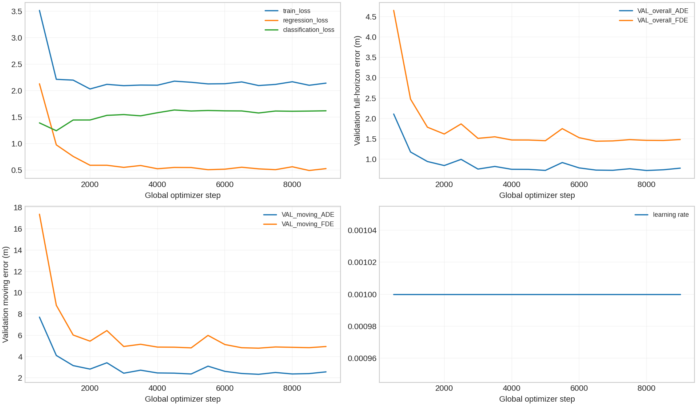
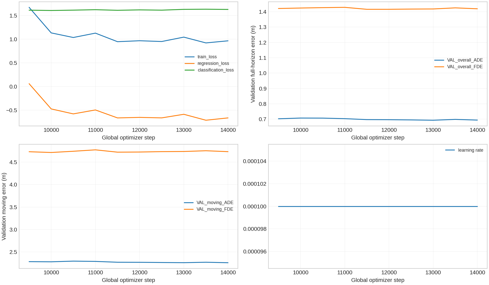
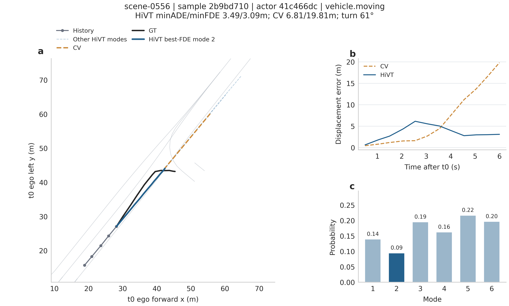

# Stage 2C — official nuScenes trainval vehicle-only HiVT baseline

Protocol 1: fixed-scale location warm-up → original learnable Laplace NLL. Architecture and original data definition unchanged; no Stage3, no merge into main.
Official scene split, existing ped_intent environment and read-only source data; no new environment/dependency upgrade/sensor download.

## 【Dataset】

train scenes=700；val scenes=150；overlap=0；test unused.
train supervised windows=16821；candidate windows=16930；empty-supervision windows=109；vehicle targets=315257；full=213745；partial=101512；context actor-windows=336643。
val supervised windows=3603；candidate windows=3619；empty-supervision windows=16；vehicle targets=62981；full=42332；partial=20649；context actor-windows=67312。
Audit scope=full official trainval。Real t0 attributes define motion states; stopped-to-moving transitions remain stopped at t0.

## 【Preprocessing】

scene shards=850；failed shards=0；NaN=0；Inf=0；resumed=836。
PREPROCESS_SMOKE=PASS。One scene per atomic shard; stream minimal trajectory metadata; at most two scene shards in loader memory.
5/12 frames, K6, HiVT64, heads8, temporal4/global3, radius50m/resolution2m; vehicle.* excluding bicycle, parked/stopped retained, ego context only. Existing numerical adapter and core modules are reused.

## 【Training】

batch size=16；steps/epoch=1052。Largest stable batch below90% reserved VRAM on high-context train windows; benchmark models discarded.
warmup steps=9000；best overall FDE=1.443932；early stop=True。
NLL steps=5000；warm-up source step=6500；executed warm-up steps=9000；early stop=True。
best checkpoint global step=11500；NLL phase step=2500；SHA256=86e717bc24b5998dcee73de2152cc4ab549ea22d845c58478501793663744afe。
Warm-up LR=.001, min2500/max10000 optimizer steps; NLL LR=.0001, max10000; validation every500, no scheduler. Predeclared patience5 after warm-up minimum and during NLL. Best overall VAL full-horizon FDE selects primary; moving checkpoints are diagnostic only. AdamW/RNG state is restored from best warm-up overall checkpoint.
Cumulative executed steps and selected warm-up source step are separately recorded because returning to the best checkpoint rewinds weights and optimizer state. Final selection uses post-update original-NLL checkpoints; no train/moving/test selection.

## 【Validation Full Horizon】

Main results require all12 future observations; partial futures are separate. Actor-windows are equally weighted; overlapping windows are correlated. minADE6 uses lowest-FDE mode as upstream HiVT; independent minimum-ADE is separately saved. MR6 means endpoint error>2m. CV uses one trajectory; shared table headers follow the requested metric names.

| Method | Group | Count | minADE6 | minFDE6 | MR6 |
|---|---|---:|---:|---:|---:|
| CV | overall | 42332 | 1.358683 | 3.169864 | 0.264811 |
| CV | vehicle.moving | 10461 | 4.329576 | 10.346895 | 0.832138 |
| CV | vehicle.stopped | 5599 | 0.620081 | 1.563017 | 0.147348 |
| CV | vehicle.parked | 25198 | 0.290082 | 0.548778 | 0.056671 |
| CV | unknown | 1074 | 1.343341 | 3.136267 | 0.234637 |
| HiVT | overall | 42332 | 0.696837 | 1.415823 | 0.166919 |
| HiVT | vehicle.moving | 10461 | 2.273309 | 4.720428 | 0.602619 |
| HiVT | vehicle.stopped | 5599 | 0.350963 | 0.858287 | 0.086444 |
| HiVT | vehicle.parked | 25198 | 0.113839 | 0.153847 | 0.003889 |
| HiVT | unknown | 1074 | 0.822971 | 1.743063 | 0.167598 |

Paired actor identities/horizons/t0 motion states verified row by row; total full+partial paired actors=62981。
Both methods use exactly the same VAL masks; no split changes or actor removal to obtain a CV win.

Partial future:

| Method | Group | Count | ADE | FDE | MR |
|---|---|---:|---:|---:|---:|
| CV | overall | 20649 | 0.735095 | 1.534637 | 0.169645 |
| CV | vehicle.moving | 5478 | 2.078120 | 4.475746 | 0.522819 |
| CV | vehicle.stopped | 1997 | 0.367704 | 0.746743 | 0.077116 |
| CV | vehicle.parked | 12589 | 0.196747 | 0.348457 | 0.028517 |
| CV | unknown | 585 | 0.998105 | 2.209585 | 0.215385 |
| HiVT | overall | 20649 | 0.448319 | 0.839805 | 0.089399 |
| HiVT | vehicle.moving | 5478 | 1.324704 | 2.575531 | 0.301387 |
| HiVT | vehicle.stopped | 1997 | 0.186617 | 0.342955 | 0.041062 |
| HiVT | vehicle.parked | 12589 | 0.092548 | 0.126125 | 0.002145 |
| HiVT | unknown | 585 | 0.791178 | 1.640504 | 0.147009 |

## 【Bootstrap】

1000 paired scene-cluster resamples from 150 VAL scenes; seed2022; percentile95% CI. Entire scenes, including correlated windows/actors, are repeated together. Pooled actor-window means are retained. Δ=HiVT−CV; negative favors HiVT.

| Group | Metric | Δ (m) | 95% CI (m) |
|---|---|---:|---|
| overall | delta_ADE | -0.661846 | [-0.761536, -0.571184] |
| overall | delta_FDE | -1.754041 | [-2.019637, -1.510447] |
| vehicle.moving | delta_ADE | -2.056267 | [-2.248054, -1.883242] |
| vehicle.moving | delta_FDE | -5.626467 | [-6.145971, -5.157060] |

## 【Artifacts】

root directory=/home/lrj/Prediction_Hivt/outputs/stage2c_trainval_vehicle_baseline
PNG count=17；table count=4。
[Artifact manifest](../00_manifest/stage2c_artifact_manifest.json) records path/size/SHA256/tracked status; checkpoint manifest also records epoch/step/selection metric. Processed shards, checkpoints, SQLite cache and large actor CSVs are local and ignored by Git.
Case coverage={'moving_success': {'requested': 5, 'produced': 5, 'available': 2715}, 'moving_failure': {'requested': 5, 'produced': 5, 'available': 6114}, 'stopped_case': {'requested': 3, 'produced': 3, 'available': 5599}, 'parked_case': {'requested': 3, 'produced': 3, 'available': 25198}}；turning main case found=True。
Each case uses a distinct instance within its category; moving success ADE/FDE≤2m, moving failure FDE>2m, both GT travel≥5m. Figures show lanes/history/GT/6 modes/best-FDE/probabilities and required identities/state/errors in titles.
Case views require at least five visible original lane segments. Main case requires sustained turn>=60 degrees, lateral deviation>=3m, and ADE/FDE<=75% of CV; it is ranked by HiVT FDE then ADE and need not meet the separate <=2m success-case threshold. Candidate audit CSV retained. Square metric axes. Qualitative selection only; fixed full VAL metrics/checkpoint unchanged.
Main case turn=60.59°；HiVT ADE/FDE=3.490882/3.089349；CV=6.808322/19.806074。
GT lateral deviation=5.413m. The example retains nonzero trajectory errors; lower error than CV does not mean perfect turn tracking.
[Main case source arrays](../04_evaluation/stage2c_qualitative_main_case.json), PNG600dpi + editable SVG/PDF. One selected turning case illustrates a local gain; aggregate results and scene bootstrap determine the broader claim.

## 【Git】

branch=stage2c/trainval-vehicle-baseline；report generation commit=c46da4698a5863eedaa7fbff6d69404fb2fcb238。
Push verification is recorded separately after final upload; no merge main.

## 【Decision】

Stage2C=PASS；Allow Stage3=YES；Stage3 executed=False。
Research case=A。Overall and moving ADE/FDE both improve on CV.
Predeclared reasonable-generalization guard passed=True；HiVT/CV ratios={'overall': {'minADE6': 0.5128769472495143, 'minFDE6': 0.4466510851435817}, 'vehicle.moving': {'minADE6': 0.5250650944509739, 'minFDE6': 0.45621686963218433}}。
Point-estimate A/B/C labels do not assert statistical significance; bootstrap intervals are reported above. No additional architecture/data/hyperparameter search was performed to obtain the chosen result.

Full trainval and mini have different scene distributions; this report does not treat their unpaired scores as a controlled before/after comparison.
Commands and experiment contract: [stage2c_execution_commands.md](stage2c_execution_commands.md).
