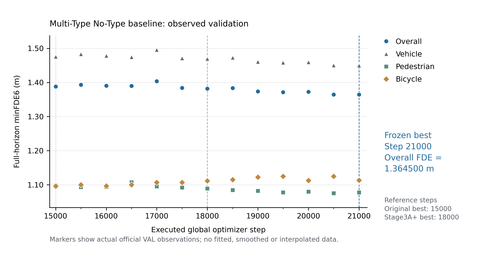

# Stage3A 最终冻结报告

本轮从 18000-step 正式 best 恢复模型、AdamW、CPU/CUDA 随机状态和 scene sampler 游标，仅继续原始 learnable-scale Laplace NLL。数据、完整 scene-window、HiVT64、LR=1e-4、batch=16、K=6、Th=5、Tf=12 均沿用冻结协议。

【Training】

Start step=18000
Final executed step=21000
Final best step=21000
Stop reason=global_step_21000_budget
converged_by_patience=NO
stopped_by_budget=YES
Executed extra optimizer steps=3000; full official VAL evaluations=6.

每 500 步运行完整 official VAL150；只用 full-horizon overall minFDE6 严格改善选择 checkpoint。连续 5 次不改善可停止，global step 21000 为不可再延长的预算上限。预算停止与 patience 收敛分开报告，固定预算并不证明全局最优。

Training code commit: `9e54cd84c4372d4c4b949f167b7ca437d27315d1`; config SHA256: `1199e630be8fab71e5a2dc3f5a21a229d44aac949b27d003444eaed384f8f425`.

【Final Overall】

ADE=0.670958962 m
FDE=1.364499516 m
MR=0.166121113
Top1 ADE=1.207082911 m
Top1 FDE=2.723307813 m

最终 checkpoint 独立重新推理所有 3603 个有监督 VAL windows，覆盖 150 scenes；得到 85027 actor-windows，其中完整 12 步 54990，partial future 30037。NaN=0，Inf=0；最终 actor CSV SHA256: `8b5b60ead1cb61bf92500f381709f92e449c29155633daa3258764b74bfa5e22`。该 CSV 来自新推理，不由旧结果拼接。报告及表格采用最终 fresh evaluation；manifest 的 selection 字段保留训练中选中 VAL 值，并另存 final_fresh_full_horizon_metrics。两次评价的已核对指标误差 <=1e-6。

minADE6 为 best-FDE mode 的 ADE；MR6 为 endpoint error >2 m；Top1 使用模型最大概率 mode。NLL 沿用原始 best-summed-L2 mode 的 Laplace valid-time 坐标密度均值，允许负值。所有主指标对 actor-window 等权。

【Per Class】

| Group | Count | minADE6 (m) | minFDE6 (m) | MR6 | Top1ADE6 (m) | Top1FDE6 (m) | NLL |
|---|---:|---:|---:|---:|---:|---:|---:|
| Vehicle | 42332 | 0.711687 | 1.449723 | 0.167037 | 1.356195 | 3.094630 | -0.812092 |
| Pedestrian | 12002 | 0.534771 | 1.077623 | 0.163723 | 0.702517 | 1.466291 | -0.043146 |
| Bicycle | 656 | 0.534423 | 1.113615 | 0.150915 | 0.816242 | 1.759772 | -0.665586 |

[Full main results](../06_tables/stage3a_final_frozen_main_results.csv)

【Motion Groups】

只统计完整 12 步未来，按 norm(GT endpoint − t0 position) 严格大于阈值分组。Count 为 actor-window；同一 instance 的重叠窗口有相关性，两个阈值组嵌套。运动 bicycle 单独报告，并列出独立 instance/scene 覆盖。

| Group | Count | UniqueInstances | UniqueScenes | minADE6 (m) | minFDE6 (m) | MR6 | Top1ADE6 (m) | Top1FDE6 (m) |
|---|---:|---:|---:|---:|---:|---:|---:|---:|
| Vehicle >5m | 9744 | 853 | 137 | 2.632745 | 5.630972 | 0.684113 | 5.178651 | 12.193457 |
| Pedestrian >1m | 8810 | 825 | 113 | 0.684970 | 1.409273 | 0.222701 | 0.889714 | 1.887576 |
| Pedestrian >5m | 7581 | 716 | 110 | 0.668646 | 1.372662 | 0.213033 | 0.840261 | 1.750384 |
| Bicycle >1m | 155 | 15 | 13 | 1.917197 | 4.296504 | 0.638710 | 2.974911 | 6.740913 |
| Bicycle >5m | 132 | 12 | 11 | 2.099068 | 4.673726 | 0.651515 | 3.303135 | 7.452160 |

[Nontrivial motion table](../06_tables/stage3a_final_frozen_nontrivial_motion_metrics.csv)

【Vehicle Retention】

Stage2C vehicle-only 与最终 No-Type 逐 actor 配对：scene/sample/instance/horizon 完全一致，62981 个 full+partial vehicle actor-windows；future mask length、motion state、GT endpoint displacement 一致。下表仅完整未来，未删减 actor。

| Group | Count | Stage2C ADE/FDE/MR | Stage3A final ADE/FDE/MR | Stage3A/Stage2C FDE ratio | relative change |
|---|---:|---|---|---:|---:|
| Vehicle overall | 42332 | 0.696837/1.415823/0.166919 | 0.711687/1.449723/0.167037 | 1.023943 | +2.394% |
| vehicle.moving | 10461 | 2.273309/4.720428/0.602619 | 2.314935/4.826872/0.600803 | 1.022550 | +2.255% |
| vehicle.stopped | 5599 | 0.350963/0.858287/0.086444 | 0.361156/0.878404/0.085908 | 1.023439 | +2.344% |
| vehicle.parked | 25198 | 0.113839/0.153847/0.003889 | 0.117625/0.156686/0.004365 | 1.018453 | +1.845% |
| unknown | 1074 | 0.822971/1.743063/0.167598 | 0.860871/1.870953/0.181564 | 1.073371 | +7.337% |

[Vehicle retention table](../06_tables/stage3a_final_vehicle_retention.csv)

Vehicle overall/moving FDE ratio <=1.25 为既有异常退化防护阈值；它不选择 checkpoint，也不改变训练。

【Interaction Dataset】

本轮未为交互密度重新扫描 graph；直接引用既有冻结 Stage3A+ 统计。以下为 train700 + val150 pooled、20 m、self excluded，邻居包括所有当前三类 context actors，目标含完整和部分未来。

20m mean neighbors:
Vehicle=6.780583 (targets=378238)
Pedestrian=8.784112 (targets=130674)
Bicycle=6.509409 (targets=6696)

V-V pairs=1134308; windows=19059
V-P pairs=380851; windows=15536
V-B pairs=22001; windows=4018

Pairs 在每个 window 内无序去重且至少一端为监督 target；同一物理 pair 可在不同 window 重复。空间邻近描述可用 context，不证明因果交互。

[Frozen interaction CSV](../01_data_audit/stage3_interaction_density.csv), [JSON](../01_data_audit/stage3_interaction_density.json).

Frozen interaction JSON SHA256: `1f7e70454af44704b80fa6d3e6c7d5378f71d86f0bbfab5914d67aedce562658`.

【Motion Case Policy】

Overall FDE improvement relative to step18000=1.276661%.
改善达到 0.5%，三个 motion case 已由最终 checkpoint 的真实预测更新，并保留原 Stage3A+ 图。未来每条轨迹显示全部 12 个 marker，局部放大来自真实最后 6 点。
[Updated final case manifest](../04_evaluation/stage3a_final_motion_case_manifest.json).

【Scientific Decision】

Stage3A frozen = YES
Final baseline checkpoint=`07_checkpoints/stage3a_final_frozen_best_overall_minfde.pt`
Final checkpoint SHA256=`e432906f8938f5e37e9f16816a90dac29734762d6e1cde51376aa2b7ef7648f8`
Ready for Stage3B Type Embedding = YES

按预先限定的 patience/21000-step 预算正式冻结 No-Type baseline；本轮结束后不再追加 No-Type 训练。Stage3B 后续消融必须采用相同最大 global step=21000、validation interval=500、full-horizon official VAL overall minFDE6 严格改善 selection，保证比较的预算一致。

本轮未执行 Type Embedding。checkpoint、shards 和大型 actor CSV 留在本地；代码及小型可追溯结果提交 stage3/multitype-hivt，不 merge main。
