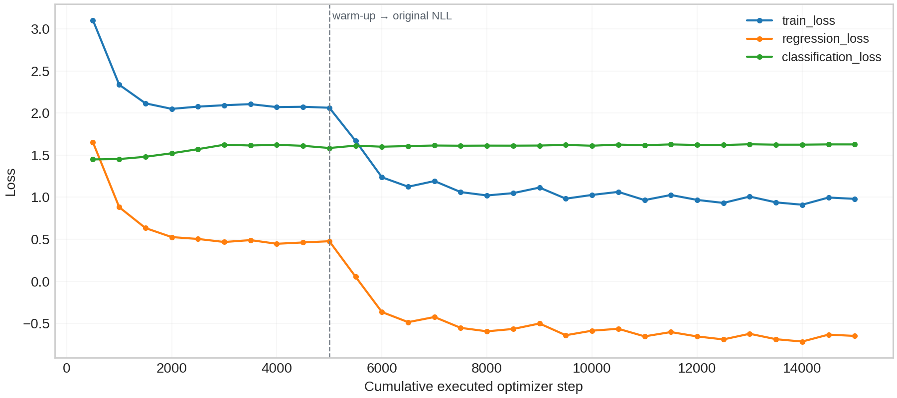
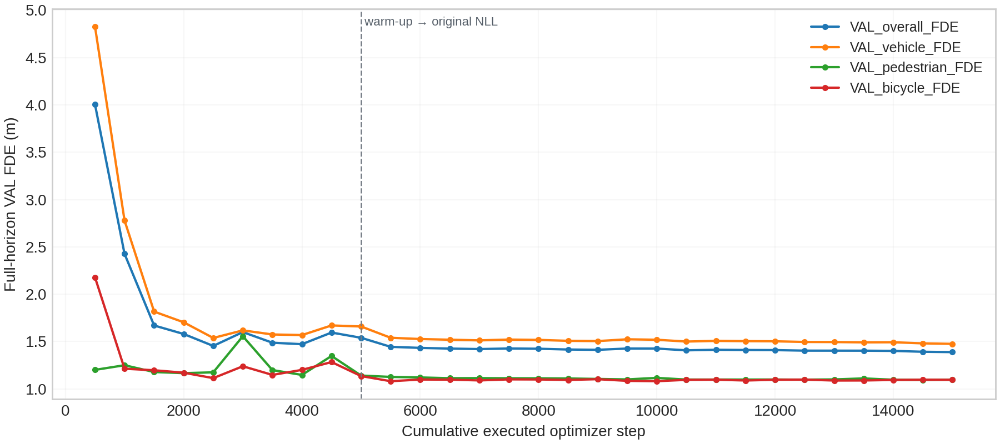

# Stage3A Multi-Type HiVT (No Type)

使用 nuScenes official trainval 的自然类别分布，保留 Stage2C 的 HiVT64 架构与 Protocol 1。三类参与者共享模型，未加入 type embedding、类别加权或 oversampling。Ego 仅提供坐标参考与 context，本轮止于 Stage3A。

## 【Dataset】

Official scenes: train700 / val150; overlap0; test unused. Candidate/supervised windows: {'train': {'scenes': 700, 'candidate_windows': 16930, 'supervised_windows': 16898}, 'val': {'scenes': 150, 'candidate_windows': 3619, 'supervised_windows': 3603}}

| Split | Class | Targets | Full horizon | Partial | Mean valid history | Mean valid future |
|---|---|---:|---:|---:|---:|---:|
| train | vehicle | 315257 | 213745 | 101512 | 4.783 | 10.047 |
| train | pedestrian | 109934 | 73202 | 36732 | 4.784 | 10.008 |
| train | bicycle | 5390 | 3138 | 2252 | 4.697 | 9.443 |
| val | vehicle | 62981 | 42332 | 20649 | 4.784 | 10.005 |
| val | pedestrian | 20740 | 12002 | 8738 | 4.769 | 9.465 |
| val | bicycle | 1306 | 656 | 650 | 4.665 | 8.971 |

Class ratio counts={'train': [315257, 109934, 5390], 'val': [62981, 20740, 1306]}; normalized to bicycle={'train': [58.489239332096474, 20.39591836734694, 1.0], 'val': [48.224349157733535, 15.880551301684532, 1.0]}.
表中 Targets 为符合监督条件的 actor-window 数，同一 instance 可以出现在多个窗口。完整 context actor 和无监督 anchor 另有索引；数据未按类别重采样，损失未按类别加权。

## 【Tiny Overfit】

| Class | Targets | Initial ADE/FDE (m) | Final ADE/FDE (m) | Initial/final fixed-scale regression |
|---|---:|---|---|---|
| vehicle | 11 | 13.341507/23.736714 | 0.043912/0.030991 | 9.263578/0.029887 |
| pedestrian | 12 | 1.816083/2.060203 | 0.036994/0.055034 | 0.902029/0.018220 |
| bicycle | 6 | 7.575955/13.472106 | 0.047084/0.082144 | 4.307013/0.029182 |

TINY_OVERFIT=PASS. all three classes ADE, FDE and fixed-scale diagnostic regression decrease at least50%; all losses/gradients finite. Train-only complete context; tiny weights discarded for formal initialization.

## 【Full Validation】

主指标仅统计完整 12 步未来。minADE6 使用 best-FDE mode 的 ADE，MR6 为终点误差大于 2 m 的比例；Top1 使用模型概率最大的 mode。独立最小 ADE 另存。NLL 沿用原始损失的 best-summed-L2 mode Laplace 密度，先按 actor 的有效时间与坐标取均值，再对 actor 汇总；连续密度的 NLL 可以为负。

| Group | Count | minADE6 | minFDE6 | MR6 | Top1ADE6 | Top1FDE6 | NLL |
|---|---:|---:|---:|---:|---:|---:|---:|
| overall | 54990 | 0.677361 | 1.388404 | 0.170340 | 1.225789 | 2.763445 | -0.693140 |
| vehicle | 42332 | 0.717716 | 1.475390 | 0.171100 | 1.381412 | 3.147477 | -0.886934 |
| pedestrian | 12002 | 0.542788 | 1.097585 | 0.169055 | 0.688663 | 1.441516 | -0.007470 |
| bicycle | 656 | 0.535395 | 1.095899 | 0.144817 | 1.010508 | 2.167347 | -0.732363 |
| vehicle.moving | 10461 | 2.345721 | 4.923529 | 0.614282 | 4.737272 | 10.987782 | 1.311565 |
| vehicle.stopped | 5599 | 0.358331 | 0.884231 | 0.089837 | 0.515082 | 1.328572 | -1.158450 |
| vehicle.parked | 25198 | 0.115152 | 0.156635 | 0.004881 | 0.177845 | 0.289670 | -1.737481 |
| unknown | 1074 | 0.871388 | 1.912008 | 0.177840 | 1.448813 | 3.312881 | -0.929941 |

Partial-future 指标单独保存在 [stage3_no_type_partial_results.csv](../06_tables/stage3_no_type_partial_results.csv)，不混入主指标或 checkpoint 选择。

## 【Vehicle Retention】

Exact paired vehicle actor-windows=62981; identities, horizons and real t0 motion states match. No actor deletion or split changes.

| Group | Stage2C ADE/FDE/MR | Stage3A ADE/FDE/MR |
|---|---|---|
| vehicle | 0.696837/1.415823/0.166919 | 0.717716/1.475390/0.171100 |
| vehicle.moving | 2.273309/4.720428/0.602619 | 2.345721/4.923529/0.614282 |
| vehicle.stopped | 0.350963/0.858287/0.086444 | 0.358331/0.884231/0.089837 |
| vehicle.parked | 0.113839/0.153847/0.003889 | 0.115152/0.156635/0.004881 |
| unknown | 0.822971/1.743063/0.167598 | 0.871388/1.912008/0.177840 |

Vehicle FDE ratios to Stage2C={'overall_FDE': 1.0420726397648552, 'moving_FDE': 1.0430260263241948}. Stage2C is a vehicle reference only, not a multi-type overall comparison.

## 【Training】

batch size=16; steps/epoch=1057; warmup steps=5000; NLL steps=10000.
Th=5; Tf=12; K=6; seed=2022; embed_dim=64.
Primary best global step=15000; NLL phase step=10000; warm-up source step=2500; warm-up actually executed=5000.
Checkpoint SHA256=9ebd0bb23b44f0a738122cee0316e127063d6af006bff7d057bc0a5470a0384a; training-code commit=fbb7eac3a8ca972f77526b30620d194831afc9eb; config SHA256=1199e630be8fab71e5a2dc3f5a21a229d44aac949b27d003444eaed384f8f425.
每 500 optimizer steps 完整评价 official VAL。三类 target 均进入原始损失；各类回归损失另作诊断，不改变优化目标。warm-up 与 NLL 的回归损失定义不同，曲线阶段边界已标注。
全 train 有效 future-step 监督量={'vehicle': 3167533, 'pedestrian': 1100210, 'bicycle': 50900}；类别比例={'vehicle': 0.7334556248340046, 'pedestrian': 0.254758265501455, 'bicycle': 0.011786109664540459}。Vehicle 的监督量最多。回归损失沿用每个 batch 的有效时间/坐标均值，分类损失沿用 eligible actor 均值；类内回归均值记录在曲线 CSV 中，不作为类别权重或梯度份额估计。

## 【Visualization】

Coverage={'vehicle_success': 2, 'vehicle_failure': 2, 'pedestrian_success': 2, 'pedestrian_failure': 2, 'bicycle_success': 2, 'bicycle_failure': 2}; data-coordinate QA=10 samples/class in3 PNGs; prediction figures=12 PNG/PDF/SVG bundles. Total05_figures PNG count=15.
每张预测图从保存的真实 case JSON 重画，GT、best 与 Top1 各包含 12 个未来 marker，并标记终点。Inset 范围由三条轨迹最后 6 个真实点计算；图前重新计算四项 ADE/FDE，误差均小于 1e-4 m。终点文字置于主图两侧，已检查画布边界及与 inset、标题、图例和其他文字的遮挡。无轨迹平滑、插值或坐标改写。Success 要求明显 GT 位移，vehicle success 为真实 t0 moving；排名案例用于解释误差，整体性能以完整 VAL 表为准。

## 【Decision】

Stage3A=PASS; Ready for Type Embedding=YES; Stage3B executed=False.
Ready 判断依据工程检查和训练前声明的实用条件：vehicle overall 与 moving FDE 相对 Stage2C 的退化均不超过 25%。该条件未用于调整数据、训练或 checkpoint 选择。Stage3B 未执行，type embedding 的收益尚未评价。

## Reproducibility

Branch=stage3/multitype-hivt; report-generation commit=fbb7eac3a8ca972f77526b30620d194831afc9eb; final upload verified separately. No merge main.
代码、配置、审计、小型表格与图件纳入版本管理。Scene shards、checkpoint、大型 actor CSV 与传输缓存保留本地，通过 artifact/checkpoint manifest 记录大小和 SHA。
原始数据在预处理时通过只读分区检查；2026-10-05 恢复工作时，原路径未挂载，后续训练与评价使用已冻结的 850 个本地 shards。重新预处理需先恢复配置中的原始数据挂载，详见 resume environment 记录。
[Execution commands and frozen protocol](stage3_execution_commands.md)
