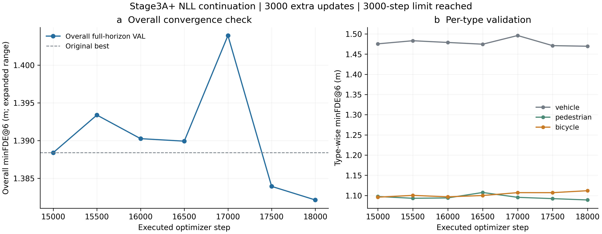
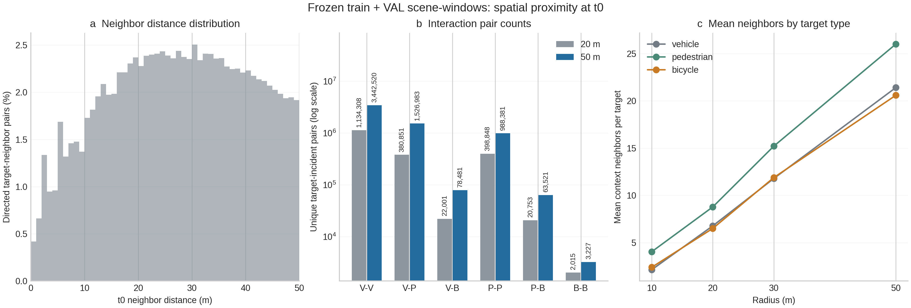
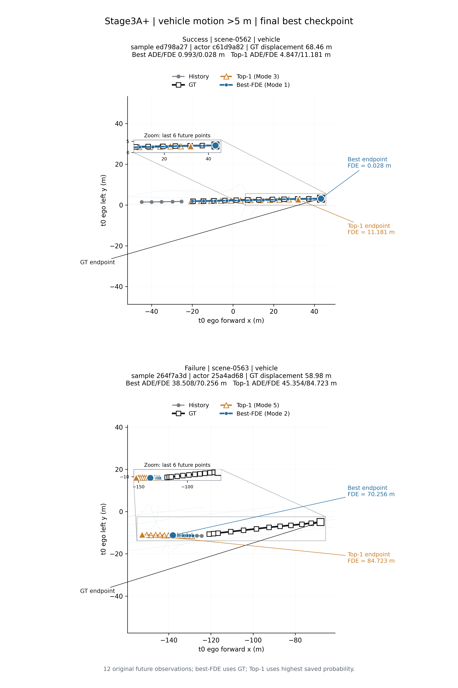
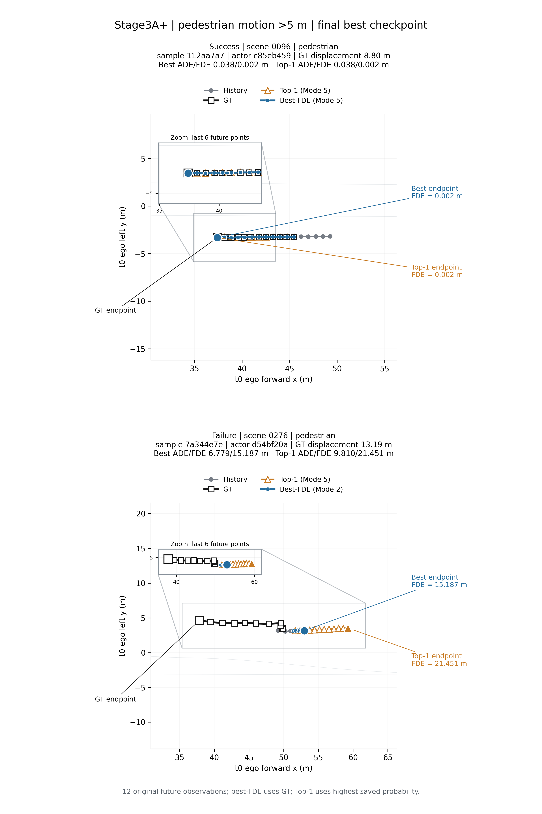
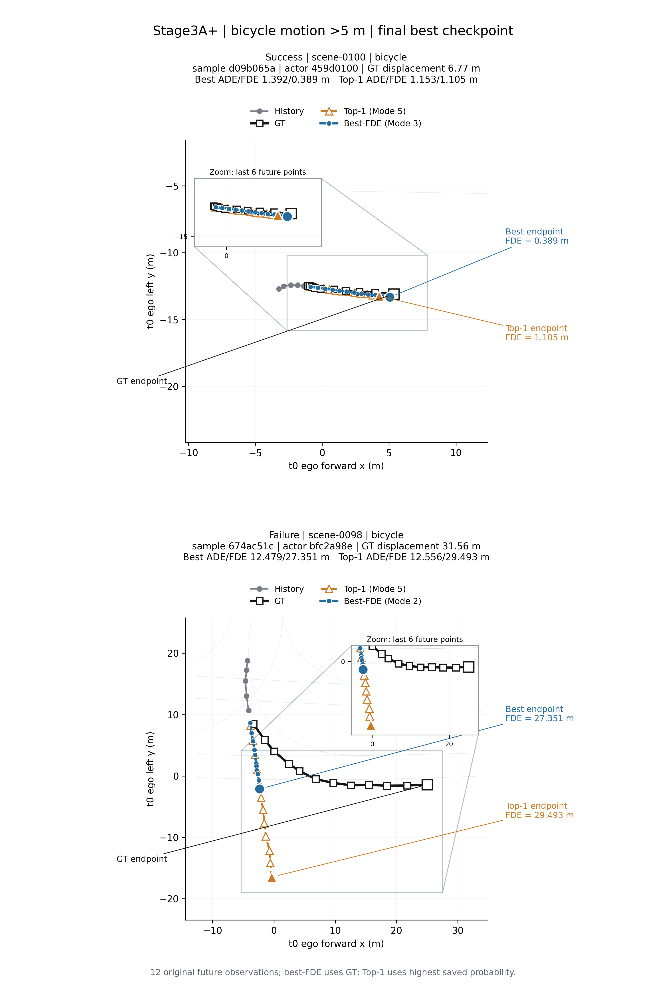

# Stage3A+ 收尾审计

原 Stage3A 文件、数据、模型及结果保持冻结。追加实验恢复正式 best 的 AdamW、随机数和采样游标，使用原始 NLL；所有新 checkpoint 和结果独立保存。未从头训练，未执行 Type Embedding，未使用 test。

## 【NLL Extension】

original best = step 15000, overall minFDE6 1.388404393 m
new best = step 18000, overall minFDE6 1.382144825 m
是否刷新 best = YES
converged = no; executed extra steps = 3000; stop reason = extra_steps_3000_limit
LR=0.0001、batch=16、原始 NLL、完整 scene-window 与 HiVT64 均不变。每 500 步评价完整 official VAL150，以 full-horizon overall minFDE6 严格改善选 best。收敛在本报告中特指连续 5 次不改善；3000 步上限本身不能证明收敛或达到全局最优。

Final checkpoint: `07_checkpoints/stage3a_plus_best_overall_minfde.pt`; SHA256 `fa81a63f69aadc3158f20df0e046366172cb333f8db5b8a34cc853f4a0a00e77`.
Optimizer/training code commit: `5ac984d72b9000f9ecf185c8b20fad2f4312f360`.

## 【Nontrivial Motion】

使用最终 best 已保存的 VAL actor 误差，未为分组统计重新训练或重新推理。仅完整 12 步未来；按 norm(GT endpoint − t0 position) 严格大于阈值分组。minADE6 使用 best-FDE mode，MR6 为终点误差大于 2 m；Top1 使用模型概率最大 mode。

| Group | Count | minADE6 (m) | minFDE6 (m) | MR6 | Top1ADE6 (m) | Top1FDE6 (m) |
|---|---:|---:|---:|---:|---:|---:|
| Vehicle >5m | 9744 | 2.643539 | 5.713362 | 0.692426 | 5.269742 | 12.388213 |
| Pedestrian >1m | 8810 | 0.691293 | 1.426715 | 0.228036 | 0.882375 | 1.875282 |
| Pedestrian >5m | 7581 | 0.674222 | 1.386942 | 0.214879 | 0.836894 | 1.747327 |
| Bicycle >1m | 155 | 1.951937 | 4.305738 | 0.651613 | 3.300352 | 7.448724 |
| Bicycle >5m | 132 | 2.139177 | 4.684445 | 0.666667 | 3.690908 | 8.299353 |

完整未来总目标 54990；排除 partial future 30037。Count 为 actor-window，阈值组存在嵌套，不能相加。Bicycle 的两组真正运动指标独立列出，不以 overall 代替。

[Source table](../06_tables/stage3_nontrivial_motion_metrics.csv)

Bicycle 运动子组的独立覆盖：>1m: 155 actor-windows / 15 instances / 13 scenes；>5m: 132 actor-windows / 12 instances / 11 scenes。同一 instance 的重叠窗口有相关性，本文只报告描述性指标，未将这些窗口当作独立重复实验。

## 【Interaction Density】

扫描全部 850 frozen shards。可用 graph windows={'train': 16908, 'val': 3607}；无图 anchors={'train': 22, 'val': 12}；有图但无监督 target windows={'train': 10, 'val': 4}。
t0 欧氏距离 <= 10/20/30/50 m，排除目标自身；邻居包含三类当前 context actor，包括非监督 actor，ego 仅为独立坐标参考。Target 使用原 target_mask，含 full 与 partial，未按运动阈值删减。目标到邻居的统计有方向；下面的 pair/window 数对每个 scene-window 的无序参与者对去重，至少一个端点为监督 target。空间邻近表征可用交互 context，不等同于因果交互或 attention 权重。

| Pair (train + val) | 20m pairs | 20m windows | 50m pairs | 50m windows |
|---|---:|---:|---:|---:|
| V-V | 1134308 | 19059 | 3442520 | 19779 |
| V-P | 380851 | 15536 | 1526983 | 16621 |
| V-B | 22001 | 4018 | 78481 | 4764 |
| P-P | 398848 | 12456 | 988381 | 13905 |
| P-B | 20753 | 3042 | 63521 | 4151 |
| B-B | 2015 | 1114 | 3227 | 1486 |

| Target (train + val) | Target count | 20m mean neighbors | 50m mean neighbors |
|---|---:|---:|---:|
| vehicle | 378238 | 6.780583 | 21.410308 |
| pedestrian | 130674 | 8.784112 | 26.011709 |
| bicycle | 6696 | 6.509409 | 20.594235 |

20m平均邻居数 = 7.284829；50m平均邻居数 = 22.565874（按 target 数加权的总体均值）。
CSV/JSON 分开提供 train、val、pooled 的全部 4 半径、9 个有向类型组合及每类总邻居的均值/中位数/>=1/>=2 概率；另外提供 all-context 与 target-incident 无序 pair/window 数。

## Motion cases

每类一个 success 和一个 failure，均为完整未来、GT 位移 >5 m；vehicle 还要求 t0 moving。Success/failure 分别按类内 minFDE 最小/最大选择，因此 oracle best 成功并不保证 Top1 成功。两面板包含 History、GT、best 与 Top1，各条未来轨迹 12 个 marker；zoom 自动取三条轨迹最后 6 点加 2.5 m 边距。四项 ADE/FDE 重算误差均 <1e-4 m，无平滑、插值或轨迹改写。

[Source JSON](../04_evaluation/cases/stage3a_plus_vehicle_motion_case.json)

[Source JSON](../04_evaluation/cases/stage3a_plus_pedestrian_motion_case.json)

[Source JSON](../04_evaluation/cases/stage3a_plus_bicycle_motion_case.json)

## 【Decision】

Stage3A frozen = NO
Ready for Stage3B Type Embedding = NO
Vehicle overall/moving FDE ratios to Stage2C = {'vehicle_overall_FDE': 1.037874120665345, 'vehicle_moving_FDE': 1.0399186751047589}.
Ready 条件在追加训练前记录：冻结检查通过、运动组指标有限、连续 5 次 VAL 不改善，且 vehicle overall/moving FDE 相对 Stage2C 的退化均不超过 25%。该判断不影响 checkpoint selection，也未用于修改实验。若延长训练仍在改善，converged=no 且 Ready=NO，如实保留该限制。
此处 Stage3A frozen 指是否确认当前模型为已收敛的最终科学基线；原 Stage3A 文件和 850 shards 的物理冻结检查为 PASS，旧 checkpoint 完整保留，延长后的 best 也已单独保存。尚未达到连续 5 次不改善，因此本轮不宣告最终科学基线冻结。
所有代码与适合版本管理的小型结果提交到 stage3/multitype-hivt；shards、checkpoint 和大型逐目标 CSV 留在本地并记录 SHA。完成后停止，Type Embedding 未执行，未 merge main。

[Execution commands and audit notes](stage3a_plus_execution_commands.md)
