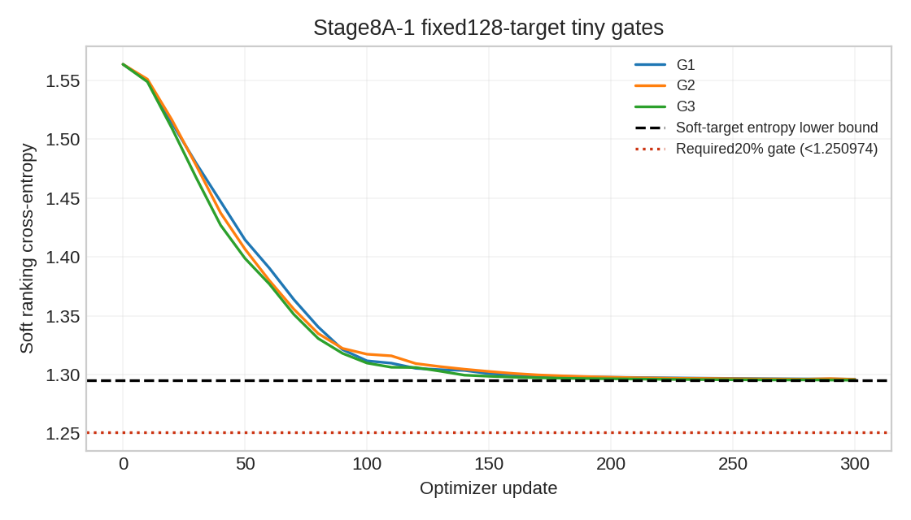

【Research Question】

比较 learned mode-mode、semantic mode-map 与 joint FSCG 的 ranking 效果，并以冻结 R2 为强基线。本阶段在 tiny 门槛停止，研究问题尚未得到正式评估。

【Frozen Inputs】

基准 commit `df28e8638a1901422d7cded42430a32ea580f02c`。Stage5A SHA `88fe3feb59b7e830ec1e40aa917484386e0d2799d0f6116f410adda2d97fdce7`；R2 SHA `e3de457d635cd30c629ce316d73a87e419a3ded8abbe0e1f2601f1071527e314`。历史冻结文件复核 2035 个均未变化。

【Graph Specification】

0C GraphSpecFrozen=YES；原 selector/radius/quota/features/neighbor/hidden/temperature 未修改。参数 G1=24066、G2=20546、G3=37187。原 message 是 raw15+raw15+17=47D，attention 是 hidden64+hidden64+17=145D；遵循冻结规范与参数数量。无 map edges 时仍为 exact zero64D。

【Training Protocol】

沿用 seed2022 的630 HeadTrain/70 HeadDev scenes；full targets 分别260151/29934。仅完成三个 FP32 tiny，各固定同一128 targets、300 AdamW 更新、lr1e-3、weight_decay1e-4。G1 FAIL 后没有再优化 G1；按逐 variant 的 tiny 要求完成 G2/G3，随后全部 STOP。未全量训练，未改 sample、loss、temperature、seed 或模型。全量训练代码已准备，但未经过实际全量/VAL运行验证。

【Normalization】

只统计 HeadTrain valid packed contexts；node continuous3..14；interaction0..10；map tangent15/16仅 lane-valid；map edge0..7/9，heading仅 lane-valid、inside fraction仅 polygon-valid。one-hot/binary/valid flags不标准化，padding/无效方向保留0。实测列均值接近0、std接近1，见 normalization audit；HeadDev和VAL不参与。新adapter16 TRAIN-window GT NaN/future-mask/target-mask poison逐位一致；冻结0C另有200-window检查。

【Tiny Overfit】

|Variant|Initial|Final|Decrease|Gate|
|---|---:|---:|---:|---|
|G1|1.563717604|1.296017528|17.1195%|FAIL|
|G2|1.563717604|1.295860529|17.1295%|FAIL|
|G3|1.563717604|1.295213342|17.1709%|FAIL|

该样本 soft-target entropy H(q)=1.294783592；要求 L<0.8L0=1.250974083。由 L=H(q)+KL(q||p)>=H(q)，理论最大下降仅17.1984%，故固定样本的20%门槛不可满足。不能因此自行放宽门槛或改样本。loss已接近下界，但正式 Tiny 判定仍是FAIL。三个 delta 非零/finite，graph gradients finite/nonzero，predictor gradient=0。

【Checkpoint Selection】

未执行 HeadDev checkpoint selection；没有 best_dev_loss.pt、last.pt 或正式 checkpoint manifest。未以VAL或HeadDev FDE选择任何模型。

【Candidate Identity】

训练前1024真实 HeadTrain targets、每个 variant 的 logit/probability maxdiff=0，candidate maxdiff=0，attention instrumentation maxdiff=0。此 PASS 仅适用于训练前 neutral audit；正式VAL CandidateIdentity未评估。

【Main Results】

未执行：tiny gate FAIL，正式训练与checkpoint freeze均未进入；未生成正式指标、CI或案例/效率结论。历史CSV不充当本阶段评估结果。

【R0】

未执行：tiny gate FAIL，正式训练与checkpoint freeze均未进入；未生成正式指标、CI或案例/效率结论。历史CSV不充当本阶段评估结果。

【R2】

未执行：tiny gate FAIL，正式训练与checkpoint freeze均未进入；未生成正式指标、CI或案例/效率结论。历史CSV不充当本阶段评估结果。

【G1 Future Interaction Graph】

未执行：tiny gate FAIL，正式训练与checkpoint freeze均未进入；未生成正式指标、CI或案例/效率结论。历史CSV不充当本阶段评估结果。

【G2 Semantic Compatibility Graph】

未执行：tiny gate FAIL，正式训练与checkpoint freeze均未进入；未生成正式指标、CI或案例/效率结论。历史CSV不充当本阶段评估结果。

【G3 Joint FSCG】

未执行：tiny gate FAIL，正式训练与checkpoint freeze均未进入；未生成正式指标、CI或案例/效率结论。历史CSV不充当本阶段评估结果。

【G1 vs R2】

未执行：tiny gate FAIL，正式训练与checkpoint freeze均未进入；未生成正式指标、CI或案例/效率结论。历史CSV不充当本阶段评估结果。

【G3 vs R2】

未执行：tiny gate FAIL，正式训练与checkpoint freeze均未进入；未生成正式指标、CI或案例/效率结论。历史CSV不充当本阶段评估结果。

【Vehicle】

未执行：tiny gate FAIL，正式训练与checkpoint freeze均未进入；未生成正式指标、CI或案例/效率结论。历史CSV不充当本阶段评估结果。

【Pedestrian】

未执行：tiny gate FAIL，正式训练与checkpoint freeze均未进入；未生成正式指标、CI或案例/效率结论。历史CSV不充当本阶段评估结果。

【Bicycle】

未执行：tiny gate FAIL，正式训练与checkpoint freeze均未进入；未生成正式指标、CI或案例/效率结论。历史CSV不充当本阶段评估结果。

【Moving Vehicle】

未执行：tiny gate FAIL，正式训练与checkpoint freeze均未进入；未生成正式指标、CI或案例/效率结论。历史CSV不充当本阶段评估结果。

【Semantic-sensitive Groups】

未执行：tiny gate FAIL，正式训练与checkpoint freeze均未进入；未生成正式指标、CI或案例/效率结论。历史CSV不充当本阶段评估结果。

【Map Availability】

未执行：tiny gate FAIL，正式训练与checkpoint freeze均未进入；未生成正式指标、CI或案例/效率结论。历史CSV不充当本阶段评估结果。

【Bootstrap】

未执行：tiny gate FAIL，正式训练与checkpoint freeze均未进入；未生成正式指标、CI或案例/效率结论。历史CSV不充当本阶段评估结果。

【Mode Change Analysis】

未执行：tiny gate FAIL，正式训练与checkpoint freeze均未进入；未生成正式指标、CI或案例/效率结论。历史CSV不充当本阶段评估结果。

【Interaction Diagnostics】

未执行：tiny gate FAIL，正式训练与checkpoint freeze均未进入；未生成正式指标、CI或案例/效率结论。历史CSV不充当本阶段评估结果。

【Semantic Diagnostics】

未执行：tiny gate FAIL，正式训练与checkpoint freeze均未进入；未生成正式指标、CI或案例/效率结论。历史CSV不充当本阶段评估结果。

【Cases】

未执行：tiny gate FAIL，正式训练与checkpoint freeze均未进入；未生成正式指标、CI或案例/效率结论。历史CSV不充当本阶段评估结果。

【Efficiency】

未执行：tiny gate FAIL，正式训练与checkpoint freeze均未进入；未生成正式指标、CI或案例/效率结论。历史CSV不充当本阶段评估结果。

【Limitations】

本阶段目前只有工程、normalization、neutral identity、gradient 与tiny证据。不能据此判断 G1/G2/G3 科学有效性或 FSCG 相对R2优势。20%总SoftCE下降门槛在该固定样本上低于数学下界，是当前阻断原因；不擅自替换为 excess-loss/KL 门槛，不进行失败驱动重采样。缓存约16GB仅本地，未上传；评价/诊断代码只有静态语法检查，尚无正式运行验证。

【Scientific Decision】

Stage8A-1 status=STOP_BEFORE_FORMAL_TRAINING。AgentGraph、LearnedGraphAdvantageOverR2、SemanticGraph、SemanticContributionToJoint、FSCG、JointComplementarity、PaperUsableFSCG、RecommendedFinalModel均为NOT_EVALUATED，不能填入未经评估的SUPPORTED/NOT_SUPPORTED。现有冻结R2结论保持。本次STOP，等待大脑AI审查；不开始下一阶段。
