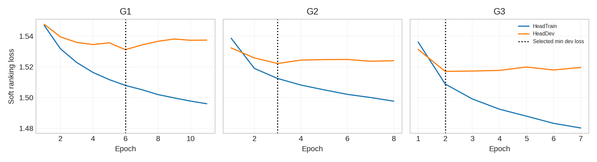
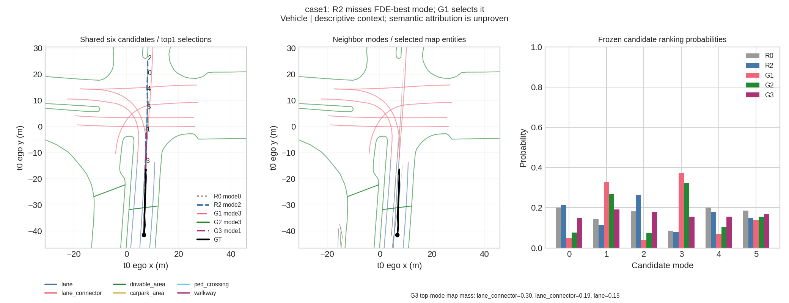
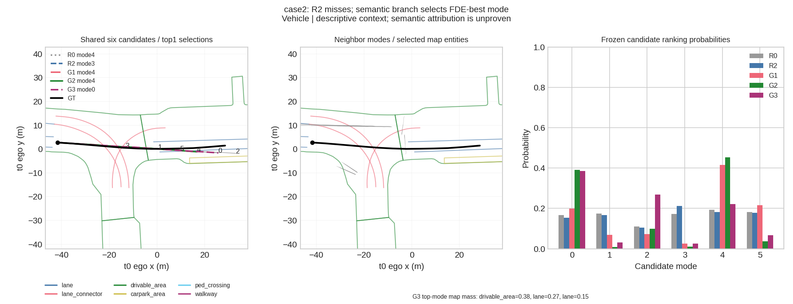
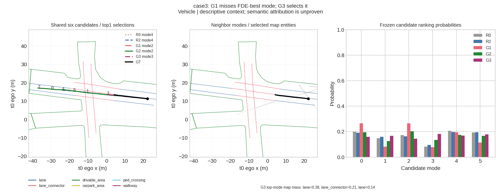
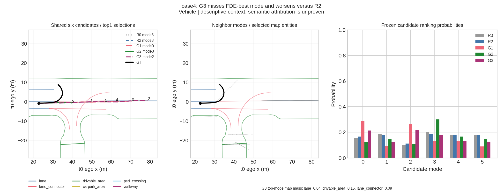

【Research Question】

是否 learned mode-mode 与 sparse semantic mode-map 可以独立/联合改善固定候选轨迹的ranking，并可靠超过冻结R2？主比较为G3−R2。全部科学判定沿用修正前冻结规则；本次只修正不可实现的工程tiny判据。

【Frozen Inputs】

Stage5A predictor SHA `88fe3feb59b7e830ec1e40aa917484386e0d2799d0f6116f410adda2d97fdce7`；R2 SHA `e3de457d635cd30c629ce316d73a87e419a3ded8abbe0e1f2601f1071527e314`。predictor eval、requires_grad=False、gradient0。历史commit `2a79b0d687192002537073147d93658bf4c6423e` 全部跟踪文件保持原样，包括原STOP与FAIL证据；见 resume_frozen_history。

【Graph Specification】

0C GraphSpecFrozen=YES。lane10m、polygon2m、原三类quota、neighbor<=50m/max8、K6、Th5/Tf12、hidden64、温度1m与15/17/18/11D特征均不变。G1/G2/G3参数24066/20546/37187。interaction value input遵循冻结raw15+raw15+17=47D；attention input145D。真实map edges为空时exact zero64D，padding不进map softmax，无NULL/fallback/筛样。

【Training Protocol】

630 HeadTrain/70 HeadDev，沿用Stage6A seed2022 scene split；targets260151/29934。AdamW lr1e-3、weight_decay1e-4、effective batch1024、max50epochs、patience5；连续epoch流末尾余数carry，严格不使用小于1024的优化步骤。G1→G2→G3均从原独立冻结初始化开始，未复用tiny/G1/G2权重。仅根据HeadDev ranking loss strict minimum选择。

|Variant|Epochs|SelectedEpoch|HeadDevLoss|HeadDevTop1FDE_record_only|Microbatch|Accumulation|AMP|EffectiveBatch|
|---|---|---|---|---|---|---|---|---|
|G1|11|6|1.531178|2.409881|128|8|False|1024|
|G2|8|3|1.522192|2.535374|128|8|False|1024|
|G3|7|2|1.517064|2.404501|128|8|False|1024|

G1: [{"epoch": 0, "reason": "frozen forward AMP compatibility failure; use FP32", "error": "value cannot be converted to type at::Half without overflow"}]
G2: [{"epoch": 0, "reason": "frozen forward AMP compatibility failure; use FP32", "error": "expected scalar type Float but found Half"}]
G3: [{"epoch": 0, "reason": "frozen forward AMP compatibility failure; use FP32", "error": "value cannot be converted to type at::Half without overflow"}]

FP16工程错误只触发允许的FP32回退，不修改冻结实现。

【Normalization】

HeadTrain-only连续列mean/std；one-hot/binary/valid flags原值，padding/无效方向保留0。实际normalized mean最大绝对值7.81e-08，非constant std接近1。HeadDev/VAL不参与。GT只用于ranking label及离线评价；observable图先构建后join标签，adapter future-poison16 TRAIN windows与冻结0C200-window审计均PASS。

【Tiny Overfit】

历史first attempt=STOP_TINY_GATE_FAILURE；failure source=INFEASIBLE_TINY_CRITERION，分类PROTOCOL_BUG。原20% total-loss gate低于H(q)=1.294783592224121，原FAIL不改写。新的ExcessLossReduction>=0.90及finite/nonzero/gradient0等附加检查，仅重判已有fixed128 seed2022/300-update FP32结果。tiny重复次数0、新增tiny更新0；修正发生在正式训练与officialVAL之前。

|Variant|HistoricalStatus|InitialExcessLoss|FinalExcessLoss|ExcessLossReduction|AmendedStatus|
|---|---|---|---|---|---|
|G1|FAIL|0.268934|0.001234|0.995412|PASS|
|G2|FAIL|0.268934|0.001077|0.995996|PASS|
|G3|FAIL|0.268934|0.000430|0.998402|PASS|

【Checkpoint Selection】

选择指标只有HeadDev ranking loss，Top1ADE/FDE/OracleGap仅记录。全部训练结束后冻结SHA，随后才第一次统一VAL；freeze后无训练/覆盖。

|Variant|Path|SHA256|BestEpoch|HeadDevLoss|Params|Selection|TrainingRegistrationSHA|
|---|---|---|---|---|---|---|---|
|G1|outputs/stage8a_future_scene_compatibility_graph/01_training/G1/formal/best_dev_loss.pt|718311dfc9f7634a8e78efe2aece9c2126b20ce87c7d34cb68b7f832c5642b0e|6|1.531178|24066|minimum HeadDev ranking loss|a33af307157558348af6732c8432d12b527e465815caf0030b6650c702820dfb|
|G2|outputs/stage8a_future_scene_compatibility_graph/01_training/G2/formal/best_dev_loss.pt|63416baee8e971bd4ce2a1e710f1e2bab31f5b918b777a186ec8c03c759db172|3|1.522192|20546|minimum HeadDev ranking loss|9c538e4909147a52da616c07598af7606e0d4b02bfd5ffe425fe7b3bbaf44ce5|
|G3|outputs/stage8a_future_scene_compatibility_graph/01_training/G3/formal/best_dev_loss.pt|7493726583b4e0b93d631644f9e59583422acf3f28a4feb9292069eba4fc5a0c|2|1.517064|37187|minimum HeadDev ranking loss|9c538e4909147a52da616c07598af7606e0d4b02bfd5ffe425fe7b3bbaf44ce5|

【Candidate Identity】

PASS。同一次fresh冻结predictor pipeline中R0/R2/G1/G2/G3共享一个候选tensor；全部fresh window raw/ego SHA与冻结cache逐位一致，GT/masks/identities也逐位核对。模型不输出/修改geometry。minADE6/minFDE6/MR6最大差0，候选maxdiff0；attention hook不改变forward。54990 full targets，150 scenes，TurningVehicle_GT1663。正式成功VAL pass为1次；首批16windows曾因availability索引错误在保存任何batch结果前终止，失败registration与修复TRAIN审计另存，未用于训练或模型选择。保留历史metric convention：minADE6是minFDE-selected mode的ADE，MR6为minFDE>2m。

【Main Results】

|Group|Model|Count|minADE6|minFDE6|MR6|Top1ADE|Top1FDE|OracleGap|HitRate|BestModeRank|MRR|Params|
|---|---|---|---|---|---|---|---|---|---|---|---|---|
|Overall|R0|54990|0.665786|1.337996|0.163757|1.204789|2.680611|1.342615|0.263266|2.397763|0.551004|0|
|Overall|R2|54990|0.665786|1.337996|0.163757|1.189506|2.645563|1.307567|0.265557|2.384306|0.553207|673|
|Overall|G1|54990|0.665786|1.337996|0.163757|1.176077|2.575000|1.237004|0.376705|2.232242|0.611346|24066|
|Overall|G2|54990|0.665786|1.337996|0.163757|1.240130|2.694337|1.356341|0.395799|2.219749|0.620594|20546|
|Overall|G3|54990|0.665786|1.337996|0.163757|1.169523|2.539384|1.201388|0.356519|2.239334|0.602131|37187|

主指标Top1FDE，单位m；Count是actor-window targets，Params是新增ranking head参数，不包含共同冻结predictor。

【R0】

重新运行Stage5A original ranking；本阶段正式结果来自统一VAL，不抄历史CSV。

|Group|Model|Count|minADE6|minFDE6|MR6|Top1ADE|Top1FDE|OracleGap|HitRate|BestModeRank|MRR|Params|
|---|---|---|---|---|---|---|---|---|---|---|---|---|
|Overall|R0|54990|0.665786|1.337996|0.163757|1.204789|2.680611|1.342615|0.263266|2.397763|0.551004|0|

【R2】

重新加载SHA冻结R2与其原HeadTrain normalization，在同一fresh VAL pipeline重新计算hand-crafted interaction features与probability。

|Group|Model|Count|minADE6|minFDE6|MR6|Top1ADE|Top1FDE|OracleGap|HitRate|BestModeRank|MRR|Params|
|---|---|---|---|---|---|---|---|---|---|---|---|---|
|Overall|R2|54990|0.665786|1.337996|0.163757|1.189506|2.645563|1.307567|0.265557|2.384306|0.553207|673|

【G1 Future Interaction Graph】

G1−R0: ΔTop1FDE=-0.105611m,95% scene CI[-0.175100,-0.038366]。

|Group|Model|Count|minADE6|minFDE6|MR6|Top1ADE|Top1FDE|OracleGap|HitRate|BestModeRank|MRR|Params|
|---|---|---|---|---|---|---|---|---|---|---|---|---|
|Overall|G1|54990|0.665786|1.337996|0.163757|1.176077|2.575000|1.237004|0.376705|2.232242|0.611346|24066|

【G2 Semantic Compatibility Graph】

G2−R0: ΔTop1FDE=0.013726m,95% scene CI[-0.065860,0.095043]。

|Group|Model|Count|minADE6|minFDE6|MR6|Top1ADE|Top1FDE|OracleGap|HitRate|BestModeRank|MRR|Params|
|---|---|---|---|---|---|---|---|---|---|---|---|---|
|Overall|G2|54990|0.665786|1.337996|0.163757|1.240130|2.694337|1.356341|0.395799|2.219749|0.620594|20546|

【G3 Joint FSCG】

G3−R2: ΔTop1FDE=-0.106179m,95% scene CI[-0.182154,-0.034933]。

|Group|Model|Count|minADE6|minFDE6|MR6|Top1ADE|Top1FDE|OracleGap|HitRate|BestModeRank|MRR|Params|
|---|---|---|---|---|---|---|---|---|---|---|---|---|
|Overall|G3|54990|0.665786|1.337996|0.163757|1.169523|2.539384|1.201388|0.356519|2.239334|0.602131|37187|

【G1 vs R2】

G1−R2: ΔTop1FDE=-0.070563m,95% scene CI[-0.135691,-0.005609]。
LearnedGraphAdvantageOverR2=YES

【G3 vs R2】

G3−R2: ΔTop1FDE=-0.106179m,95% scene CI[-0.182154,-0.034933]。
FSCG=NOT_SUPPORTED

G3−G1: ΔTop1FDE=-0.035616m,95% scene CI[-0.084928,0.014889]。
G3−G2: ΔTop1FDE=-0.154953m,95% scene CI[-0.226753,-0.095282]。

【Vehicle】

|Group|Model|Count|Top1ADE|Top1FDE|OracleGap|HitRate|
|---|---|---|---|---|---|---|
|Vehicle|R0|42332|1.361097|3.053786|1.629350|0.246220|
|Vehicle|R2|42332|1.342187|3.010194|1.585758|0.248488|
|Vehicle|G1|42332|1.309323|2.894383|1.469946|0.400028|
|Vehicle|G2|42332|1.390737|3.044520|1.620083|0.423675|
|Vehicle|G3|42332|1.302151|2.850387|1.425951|0.372083|
|StoppedVehicle|R0|5599|0.522721|1.338586|0.474902|0.227362|
|StoppedVehicle|R2|5599|0.519613|1.332262|0.468578|0.229327|
|StoppedVehicle|G1|5599|0.514151|1.312259|0.448575|0.392034|
|StoppedVehicle|G2|5599|0.665687|1.636590|0.772906|0.386855|
|StoppedVehicle|G3|5599|0.531332|1.346555|0.482871|0.363101|
|ParkedVehicle|R0|25198|0.170149|0.274905|0.128714|0.259544|
|ParkedVehicle|R2|25198|0.170911|0.276514|0.130322|0.258790|
|ParkedVehicle|G1|25198|0.180917|0.298220|0.152028|0.447020|
|ParkedVehicle|G2|25198|0.160509|0.255345|0.109153|0.495436|
|ParkedVehicle|G3|25198|0.166550|0.267106|0.120914|0.410112|
|Vehicle>5m|R0|9744|5.222604|12.071151|6.510104|0.198789|
|Vehicle>5m|R2|9744|5.141847|11.882757|6.321710|0.207512|
|Vehicle>5m|G1|9744|4.917662|11.197481|5.636435|0.286433|
|Vehicle>5m|G2|9744|5.180406|11.649180|6.088133|0.264881|
|Vehicle>5m|G3|9744|4.920888|11.082718|5.521671|0.276991|

|Group|New|Baseline|Metric|Count|Delta|CI_lower|CI_upper|Replicates|Seed|
|---|---|---|---|---|---|---|---|---|---|
|Vehicle|G3|R2|Top1FDE|42332|-0.159807|-0.260294|-0.066049|1000|2022|

【Pedestrian】

|Group|Model|Count|Top1ADE|Top1FDE|OracleGap|HitRate|
|---|---|---|---|---|---|---|
|Pedestrian|R0|12002|0.680031|1.424744|0.377417|0.315947|
|Pedestrian|R2|12002|0.676939|1.418253|0.370926|0.317614|
|Pedestrian|G1|12002|0.727498|1.496182|0.448855|0.294034|
|Pedestrian|G2|12002|0.729786|1.503265|0.455938|0.298617|
|Pedestrian|G3|12002|0.718074|1.477582|0.430255|0.301366|
|Pedestrian<5m|R0|4421|0.472621|1.000297|0.439840|0.378421|
|Pedestrian<5m|R2|4421|0.456521|0.968377|0.407921|0.387469|
|Pedestrian<5m|G1|4421|0.500884|1.023684|0.463227|0.336123|
|Pedestrian<5m|G2|4421|0.482907|1.000124|0.439667|0.367564|
|Pedestrian<5m|G3|4421|0.469059|0.964700|0.404243|0.371862|
|Pedestrian>5m|R0|7581|0.800986|1.672268|0.341014|0.279515|
|Pedestrian>5m|R2|7581|0.805480|1.680606|0.349352|0.276876|
|Pedestrian>5m|G1|7581|0.859653|1.771728|0.440474|0.269490|
|Pedestrian>5m|G2|7581|0.873758|1.796681|0.465427|0.258409|
|Pedestrian>5m|G3|7581|0.863291|1.776679|0.445425|0.260256|

|Group|New|Baseline|Metric|Count|Delta|CI_lower|CI_upper|Replicates|Seed|
|---|---|---|---|---|---|---|---|---|---|
|Pedestrian|G3|R2|Top1FDE|12002|0.059329|0.033116|0.088196|1000|2022|

【Bicycle】

|Group|Model|Count|Top1ADE|Top1FDE|OracleGap|HitRate|
|---|---|---|---|---|---|---|
|Bicycle|R0|656|0.718954|1.576419|0.498471|0.399390|
|Bicycle|R2|656|0.714702|1.570246|0.492297|0.414634|
|Bicycle|G1|656|0.784688|1.702829|0.624880|0.384146|
|Bicycle|G2|656|0.858478|1.888404|0.810456|0.375000|
|Bicycle|G3|656|0.870536|1.896604|0.818656|0.361280|

|Group|New|Baseline|Metric|Count|Delta|CI_lower|CI_upper|Replicates|Seed|
|---|---|---|---|---|---|---|---|---|---|
|Bicycle|G3|R2|Top1FDE|656|0.326358|0.043971|0.676536|1000|2022|

【Moving Vehicle】

|Group|Model|Count|Top1ADE|Top1FDE|OracleGap|HitRate|
|---|---|---|---|---|---|---|
|MovingVehicle|R0|10461|4.663247|10.624263|5.858630|0.221585|
|MovingVehicle|R2|10461|4.585787|10.450046|5.684413|0.229710|
|MovingVehicle|G1|10461|4.445435|9.976540|5.210907|0.295861|
|MovingVehicle|G2|10461|4.739767|10.516164|5.750531|0.276360|
|MovingVehicle|G3|10461|4.443047|9.863471|5.097838|0.288978|

|Group|New|Baseline|Metric|Count|Delta|CI_lower|CI_upper|Replicates|Seed|
|---|---|---|---|---|---|---|---|---|---|
|MovingVehicle|G3|R2|Top1FDE|10461|-0.586575|-0.942300|-0.248232|1000|2022|

【Semantic-sensitive Groups】

历史t0到完整centerline strict<20m memberships离线identity join；turning endpoint>5m、first/last1s secants>0.5m、abs angle>20°，保留正left/负right。GT group不进模型。

|Group|Model|Count|Top1ADE|Top1FDE|OracleGap|HitRate|
|---|---|---|---|---|---|---|
|IntersectionVehicle20|R0|32085|1.634799|3.696909|1.947279|0.252673|
|IntersectionVehicle20|R2|32085|1.614295|3.650740|1.901110|0.255072|
|IntersectionVehicle20|G1|32085|1.580899|3.518949|1.769318|0.384884|
|IntersectionVehicle20|G2|32085|1.670121|3.683570|1.933940|0.394016|
|IntersectionVehicle20|G3|32085|1.565764|3.455752|1.706121|0.368022|
|NearTurnConnector20|R0|24949|1.722145|3.917883|1.954293|0.244940|
|NearTurnConnector20|R2|24949|1.702392|3.877481|1.913891|0.247385|
|NearTurnConnector20|G1|24949|1.691852|3.799820|1.836230|0.387751|
|NearTurnConnector20|G2|24949|1.782785|3.963089|1.999498|0.397771|
|NearTurnConnector20|G3|24949|1.676788|3.735869|1.772278|0.366949|
|NearTrafficControl20|R0|31778|1.614861|3.656714|1.918069|0.249166|
|NearTrafficControl20|R2|31778|1.596005|3.611685|1.873039|0.252061|
|NearTrafficControl20|G1|31778|1.557970|3.473000|1.734354|0.389578|
|NearTrafficControl20|G2|31778|1.663419|3.665718|1.927073|0.396218|
|NearTrafficControl20|G3|31778|1.555934|3.433336|1.694691|0.360784|
|TurningVehicle_GT|R0|1663|7.745891|18.645766|4.209022|0.162357|
|TurningVehicle_GT|R2|1663|7.684997|18.530791|4.094047|0.167168|
|TurningVehicle_GT|G1|1663|7.771417|18.658841|4.222097|0.206855|
|TurningVehicle_GT|G2|1663|7.897044|18.629448|4.192704|0.205051|
|TurningVehicle_GT|G3|1663|7.893639|18.625218|4.188474|0.203848|
|GT-left|R0|831|7.310615|17.799828|3.929154|0.178099|
|GT-left|R2|831|7.281335|17.754959|3.884285|0.176895|
|GT-left|G1|831|7.477453|18.090940|4.220266|0.199759|
|GT-left|G2|831|7.673813|18.171627|4.300953|0.176895|
|GT-left|G3|831|7.589201|18.043657|4.172983|0.204573|
|GT-right|R0|832|8.180644|19.490687|4.488554|0.146635|
|GT-right|R2|832|8.088174|19.305692|4.303558|0.157452|
|GT-right|G1|832|8.065026|19.226060|4.223927|0.213942|
|GT-right|G2|832|8.120006|19.086719|4.084585|0.233173|
|GT-right|G3|832|8.197711|19.206080|4.203946|0.203125|

【Map Availability】

固定actor-level定义：any of6 modes有真实map edge为MapNonEmpty；all6无edge为ZeroMap。RouteCenterlineAvailable仅V/B且任意mode有lane/connector；PedSemanticSpecificAvailable仅P且任意mode有crossing/walkway。分组独立于新ranking，未用于训练筛样。

|Group|Model|Count|Top1ADE|Top1FDE|OracleGap|HitRate|
|---|---|---|---|---|---|---|
|MapNonEmpty|R0|48471|1.332717|2.978244|1.500121|0.267294|
|MapNonEmpty|R2|48471|1.315558|2.938797|1.460674|0.269378|
|MapNonEmpty|G1|48471|1.300088|2.858693|1.380570|0.368034|
|MapNonEmpty|G2|48471|1.372753|2.993917|1.515794|0.376473|
|MapNonEmpty|G3|48471|1.292862|2.818830|1.340707|0.349611|
|ZeroMap|R0|6519|0.253599|0.467608|0.171506|0.233318|
|ZeroMap|R2|6519|0.252265|0.465262|0.169160|0.237153|
|ZeroMap|G1|6519|0.254012|0.465642|0.169539|0.441172|
|ZeroMap|G2|6519|0.254028|0.466853|0.170751|0.539500|
|ZeroMap|G3|6519|0.252453|0.461605|0.165503|0.407885|
|RouteCenterlineAvailable|R0|34407|1.644666|3.713254|1.981909|0.255471|
|RouteCenterlineAvailable|R2|34407|1.621063|3.658844|1.927499|0.258174|
|RouteCenterlineAvailable|G1|34407|1.583699|3.522421|1.791076|0.384864|
|RouteCenterlineAvailable|G2|34407|1.685500|3.710838|1.979493|0.389339|
|RouteCenterlineAvailable|G3|34407|1.575847|3.470922|1.739577|0.361438|
|PedSemanticSpecificAvailable|R0|9769|0.668123|1.398831|0.358315|0.315897|
|PedSemanticSpecificAvailable|R2|9769|0.666442|1.395146|0.354630|0.317023|
|PedSemanticSpecificAvailable|G1|9769|0.718810|1.477117|0.436601|0.295220|
|PedSemanticSpecificAvailable|G2|9769|0.718220|1.477191|0.436674|0.297267|
|PedSemanticSpecificAvailable|G3|9769|0.707260|1.454218|0.413702|0.297983|

ZeroMap的G2/G3改变只能由shared node scorer/interaction与representation产生，不能归因于semantic map branch。

【Bootstrap】

paired whole-scene cluster：150scenes、1000draws、seed2022；相同resampling indices用于所有6 comparisons和groups。actor sums/counts随whole scene一起重复，percentile2.5/97.5%，Δ=new−baseline。FDE/ADE负向改善，HitRate正向改善。secondary subgroup CIs未作multiplicity correction，groups重叠，不能视为独立replications。

|Group|New|Baseline|Metric|Count|Delta|CI_lower|CI_upper|Replicates|Seed|
|---|---|---|---|---|---|---|---|---|---|
|Overall|G3|R2|Top1FDE|54990|-0.106179|-0.182154|-0.034933|1000|2022|
|Overall|G1|R0|Top1FDE|54990|-0.105611|-0.175100|-0.038366|1000|2022|
|Overall|G1|R2|Top1FDE|54990|-0.070563|-0.135691|-0.005609|1000|2022|
|Overall|G2|R0|Top1FDE|54990|0.013726|-0.065860|0.095043|1000|2022|
|Overall|G3|G1|Top1FDE|54990|-0.035616|-0.084928|0.014889|1000|2022|
|Overall|G3|G2|Top1FDE|54990|-0.154953|-0.226753|-0.095282|1000|2022|

【Mode Change Analysis】

|Analysis|Targets|ChangedCount|ChangedRate|ChangedImproved|ChangedWorsened|ChangedErrorUnchanged|MeanGainImproved|MeanHarmWorsened|NetFDEDeltaOverall|AgreementRate|
|---|---|---|---|---|---|---|---|---|---|---|
|R2→G3|54990|27365.000000|0.497636|15162.000000|12203.000000|0.000000|1.989112|1.992964|-0.106179|0.502364|
|G1↔G2|54990|nan|nan|nan|nan|nan|nan|nan|nan|0.533752|
|G1↔G3|54990|nan|nan|nan|nan|nan|nan|nan|nan|0.541026|
|G2↔G3|54990|nan|nan|nan|nan|nan|nan|nan|nan|0.606310|

HitRate以minFDE candidate index作ranking oracle；不代表轨迹行为预测准确率。

【Interaction Diagnostics】

|Model|Branch|ActorType|Category|AttentionMass|Count|
|---|---|---|---|---|---|
|G1|distance|Bicycle|[0,2)m|0.175410|656|
|G1|distance|Bicycle|[10,20)m|0.288740|656|
|G1|distance|Bicycle|[2,5)m|0.173911|656|
|G1|distance|Bicycle|[20,50)m|0.218730|656|
|G1|distance|Bicycle|[5,10)m|0.142843|656|
|G1|distance|Bicycle|[50,inf)m|0.000366|656|
|G1|distance|Pedestrian|[0,2)m|0.363948|12002|
|G1|distance|Pedestrian|[10,20)m|0.167994|12002|
|G1|distance|Pedestrian|[2,5)m|0.177794|12002|
|G1|distance|Pedestrian|[20,50)m|0.131999|12002|
|G1|distance|Pedestrian|[5,10)m|0.156891|12002|
|G1|distance|Pedestrian|[50,inf)m|0.000291|12002|
|G1|distance|Vehicle|[0,2)m|0.021278|42332|
|G1|distance|Vehicle|[10,20)m|0.349324|42332|
|G1|distance|Vehicle|[2,5)m|0.129318|42332|
|G1|distance|Vehicle|[20,50)m|0.251292|42332|
|G1|distance|Vehicle|[5,10)m|0.239816|42332|
|G1|distance|Vehicle|[50,inf)m|0.002004|42332|
|G1|interaction|Bicycle|Bicycle→Bicycle|0.229389|656|
|G1|interaction|Bicycle|Bicycle→Pedestrian|0.250964|656|
|G1|interaction|Bicycle|Bicycle→Vehicle|0.519647|656|
|G1|interaction|Pedestrian|Pedestrian→Bicycle|0.018874|12002|
|G1|interaction|Pedestrian|Pedestrian→Pedestrian|0.717949|12002|
|G1|interaction|Pedestrian|Pedestrian→Vehicle|0.262094|12002|
|G1|interaction|Vehicle|Vehicle→Bicycle|0.017928|42332|
|G1|interaction|Vehicle|Vehicle→Pedestrian|0.135383|42332|
|G1|interaction|Vehicle|Vehicle→Vehicle|0.839721|42332|
|G3|distance|Bicycle|[0,2)m|0.140370|656|
|G3|distance|Bicycle|[10,20)m|0.305168|656|
|G3|distance|Bicycle|[2,5)m|0.163706|656|
|G3|distance|Bicycle|[20,50)m|0.243529|656|
|G3|distance|Bicycle|[5,10)m|0.146849|656|
|G3|distance|Bicycle|[50,inf)m|0.000378|656|
|G3|distance|Pedestrian|[0,2)m|0.350336|12002|
|G3|distance|Pedestrian|[10,20)m|0.172458|12002|
|G3|distance|Pedestrian|[2,5)m|0.173810|12002|
|G3|distance|Pedestrian|[20,50)m|0.141490|12002|
|G3|distance|Pedestrian|[5,10)m|0.160370|12002|
|G3|distance|Pedestrian|[50,inf)m|0.000454|12002|
|G3|distance|Vehicle|[0,2)m|0.022253|42332|
|G3|distance|Vehicle|[10,20)m|0.320427|42332|
|G3|distance|Vehicle|[2,5)m|0.148626|42332|
|G3|distance|Vehicle|[20,50)m|0.237157|42332|
|G3|distance|Vehicle|[5,10)m|0.262419|42332|
|G3|distance|Vehicle|[50,inf)m|0.002148|42332|
|G3|interaction|Bicycle|Bicycle→Bicycle|0.157842|656|
|G3|interaction|Bicycle|Bicycle→Pedestrian|0.235771|656|
|G3|interaction|Bicycle|Bicycle→Vehicle|0.606388|656|
|G3|interaction|Pedestrian|Pedestrian→Bicycle|0.009078|12002|
|G3|interaction|Pedestrian|Pedestrian→Pedestrian|0.688557|12002|
|G3|interaction|Pedestrian|Pedestrian→Vehicle|0.301282|12002|
|G3|interaction|Vehicle|Vehicle→Bicycle|0.008699|42332|
|G3|interaction|Vehicle|Vehicle→Pedestrian|0.111853|42332|
|G3|interaction|Vehicle|Vehicle→Vehicle|0.872479|42332|

在各模型选中top1 mode上计算attention mass；pair方向为target query→neighbor context，邻居保留原6mode。future-min-distance bins预注册为0/2/5/10/20/50/∞m。零邻居actors贡献0，均值保留它们。仅描述权重分布，无因果解释。

【Semantic Diagnostics】

|Model|Branch|ActorType|Category|AttentionMass|Count|
|---|---|---|---|---|---|
|G2|map|Bicycle|carpark_area|0.000000|656|
|G2|map|Bicycle|drivable_area|0.286591|656|
|G2|map|Bicycle|lane|0.347002|656|
|G2|map|Bicycle|lane_connector|0.235310|656|
|G2|map|Bicycle|ped_crossing|0.000000|656|
|G2|map|Bicycle|walkway|0.000000|656|
|G2|map|Pedestrian|carpark_area|0.000000|12002|
|G2|map|Pedestrian|drivable_area|0.231999|12002|
|G2|map|Pedestrian|lane|0.000000|12002|
|G2|map|Pedestrian|lane_connector|0.000000|12002|
|G2|map|Pedestrian|ped_crossing|0.170251|12002|
|G2|map|Pedestrian|walkway|0.505182|12002|
|G2|map|Vehicle|carpark_area|0.201665|42332|
|G2|map|Vehicle|drivable_area|0.242711|42332|
|G2|map|Vehicle|lane|0.263733|42332|
|G2|map|Vehicle|lane_connector|0.131256|42332|
|G2|map|Vehicle|ped_crossing|0.000000|42332|
|G2|map|Vehicle|walkway|0.000000|42332|
|G3|map|Bicycle|carpark_area|0.000000|656|
|G3|map|Bicycle|drivable_area|0.283962|656|
|G3|map|Bicycle|lane|0.341362|656|
|G3|map|Bicycle|lane_connector|0.243578|656|
|G3|map|Bicycle|ped_crossing|0.000000|656|
|G3|map|Bicycle|walkway|0.000000|656|
|G3|map|Pedestrian|carpark_area|0.000000|12002|
|G3|map|Pedestrian|drivable_area|0.246210|12002|
|G3|map|Pedestrian|lane|0.000000|12002|
|G3|map|Pedestrian|lane_connector|0.000000|12002|
|G3|map|Pedestrian|ped_crossing|0.165097|12002|
|G3|map|Pedestrian|walkway|0.495209|12002|
|G3|map|Vehicle|carpark_area|0.209829|42332|
|G3|map|Vehicle|drivable_area|0.227277|42332|
|G3|map|Vehicle|lane|0.265296|42332|
|G3|map|Vehicle|lane_connector|0.136868|42332|
|G3|map|Vehicle|ped_crossing|0.000000|42332|
|G3|map|Vehicle|walkway|0.000000|42332|

G2/G3各自top1 mode的真实entity attention；按V/P/B与六类entity分组。空map mode贡献0。每个actor top-attention实体存本地sidecar，完整alpha存本地batch结果。Attention不是semantic causal attribution。

【Cases】

aggregate evaluation与scientific decision完成后按固定类别选4个distinct actor instances：R2错/G1选FDE-best；R2错/G2或G3选FDE-best且有semantic context；G1错/G3选FDE-best；G3恶化failure。每图展示GT、6candidates、5model概率/top1、neighbor modes及selected map entities，同一geometry轴。Case2只描述正确ranking与道路语义context共现，不能证明“因为语义”。

【Efficiency】

|Component|Model|TargetBatch|SceneWindows|Params|Mean_ms|Median_ms|P95_ms|PeakCUDA_MiB|IncrementalCUDA_MiB|Warmup|MeasuredForwards|Scope|
|---|---|---|---|---|---|---|---|---|---|---|---|---|
|A reranker forward|R2|128|mixed frozen inputs|673|0.285727|0.283920|0.306461|36.962402|1.093750|100|500|normalized tensors already on CUDA; excludes feature construction, retrieval and predictor|
|A reranker forward|G1|128|mixed frozen inputs|24066|1.360391|1.342416|1.475891|85.634277|49.765625|100|500|normalized tensors already on CUDA; excludes feature construction, retrieval and predictor|
|A reranker forward|G2|128|mixed frozen inputs|20546|2.190458|2.147776|2.459694|41.893066|6.024414|100|500|normalized tensors already on CUDA; excludes feature construction, retrieval and predictor|
|A reranker forward|G3|128|mixed frozen inputs|37187|3.142781|3.076112|3.495114|85.634277|49.765625|100|500|normalized tensors already on CUDA; excludes feature construction, retrieval and predictor|
|B live CPU graph+retrieval|G3 features|128|17|0|647.228616|646.979122|648.994613|0.000000|0.000000|2|10|live selector, all neighbor-mode edges, GEOS semantic features, normalization; static HD map index already loaded; frozen predicted candidates supplied; CPU→CUDA transfer excluded|
|C frozen predictor forward|Stage5A|124|16|650403|55.851047|55.594608|57.296186|185.438965|149.217773|100|500|original16 full scene-window batch, all actors and lanes; CUDA input prepared; excludes dataset loading and batch construction; different unit from128-target reranker|

A：RTX3080 batch128、100warmup/500measured；CUDA已准备normalized输入，不含geometry feature/retrieval。B：live CPU retrieval/graph/features/normalization，128targets，2warmup/10timings，HDmap index已加载，排除predictor/CPU→CUDA。C：原16完整scene-window predictor batch，实际target数见表；100/500。单位不同，不能把offline cache或A宣称为完整online latency。

【Limitations】

Single fixed seed/model run，VAL150及相关overlapping secondary groups；未作多seed或multiplicity-adjusted subgroup确证。attention/cases为descriptive。候选geometry固定，所有改善限ranking；不能claim更强oracle geometry。t0→future预测图可能对输入候选误差敏感，diagnostic不建立因果。Checkpoint/cache/raw maps/完整actor表仅本地，未上传数据或凭据。历史停止记录未覆盖。

【Scientific Decision】

AgentGraph = SUPPORTED
LearnedGraphAdvantageOverR2 = YES
SemanticGraph = NOT_SUPPORTED
SemanticContributionToJoint = NOT_SUPPORTED
FSCG = NOT_SUPPORTED
JointComplementarity = NO
PaperUsableFSCG = NO
RecommendedFinalModel = R2

G3−R2 的 Overall Top1FDE 虽可靠改善，但 Pedestrian Δ=0.059329m，95% scene CI[0.033116,0.088196]，属于可靠恶化。这违反 FSCG 的预注册 Vehicle/Pedestrian 无可靠恶化条件，因此 FSCG=NOT_SUPPORTED。

G1−R2 的 Overall Top1FDE 虽可靠改善，但 Pedestrian Δ=0.077930m，95% scene CI[0.039651,0.125965]，属于可靠恶化。这也不满足推荐 G1 的预注册条件，因此 RecommendedFinalModel=R2。

G3−G1 的 Overall Δ=-0.035616m，95% scene CI[-0.084928,0.014889] 包含0；同时未满足冻结的 targeted semantic 支持条件，SemanticContributionToJoint=NOT_SUPPORTED。

FSCG 未满足预定支持条件，按授权STOP；不调模型。
只有AgentGraph与SemanticContributionToJoint受支持且FSCG支持/targeted支持时，才满足重新讨论联合innovation的预定条件。本报告不因G3胜R0自动宣布创新。
