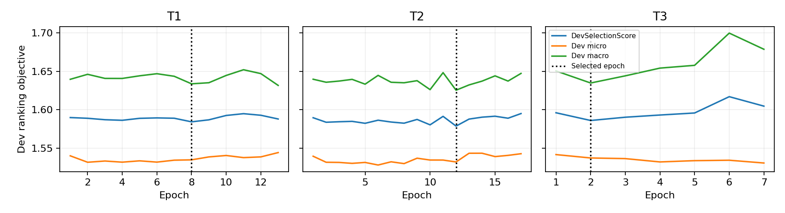
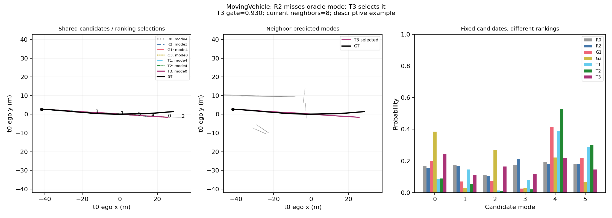
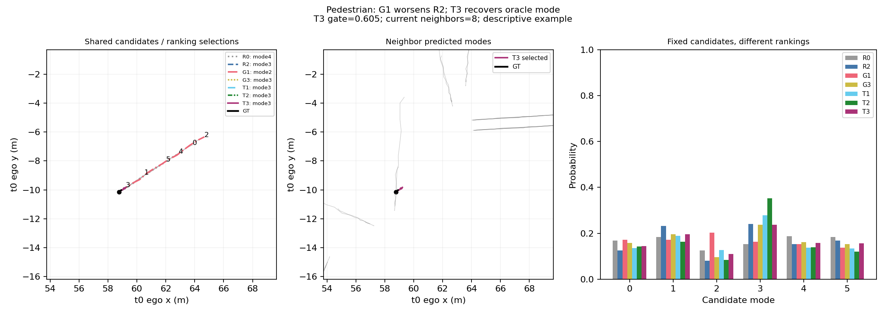
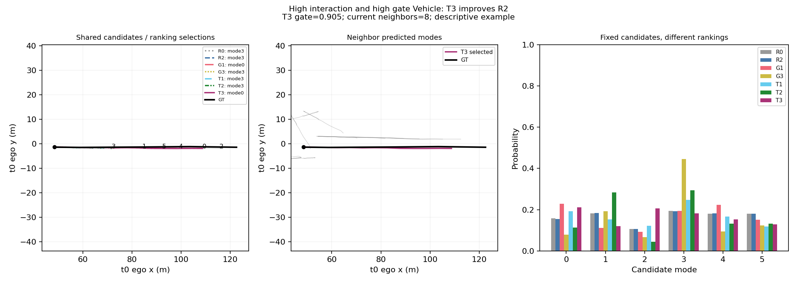
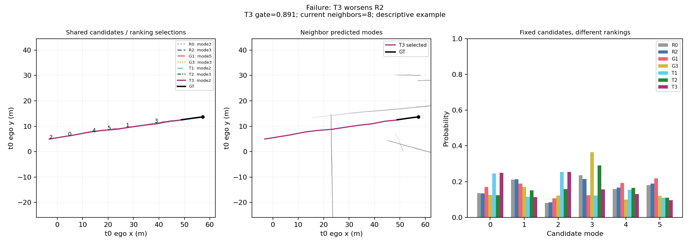

【Research Question】

在冻结R2 reliability上，通过target-type低秩adapter和actor-level learned gate使用future interaction残差，能否保留Vehicle收益并避免Pedestrian/Bicycle负迁移？

Official VAL is no longer an untouched confirmation set for the Stage9 hypothesis.

Official VAL result = development-reuse evidence。Stage9设计受Stage8 VAL结果启发，不能称为独立test-like confirmation。Stage9模型选择、normalization和early stopping仅用HeadTrain/HeadDev。

【Why Stage8 G1 Failed on Heterogeneous Types】

历史Stage8发现类型间冲突；新阶段重新评价G1/G3 reference，不修改Stage8结论。Vehicle收益与Pedestrian/Bicycle退化为development hypothesis，不能据此声称因果机制。SemanticGraph、SemanticContributionToJoint、FSCG历史NOT_SUPPORTED均保留。

【Frozen R2 Base】

Stage5A predictor SHA `88fe3feb59b7e830ec1e40aa917484386e0d2799d0f6116f410adda2d97fdce7`。R2 SHA `e3de457d635cd30c629ce316d73a87e419a3ded8abbe0e1f2601f1071527e314`。两者eval/requires_grad=False，gradient=0；本阶段不修改candidate geometry。R0/R2/G1/G3/T1/T2/T3同一次fresh pipeline评价，未抄历史表。

【TA-FIG Architecture】

l_TA(i,k)=l_R2(i,k)+g_i·delta_graph(i,k)。只复用G1 15D mode nodes、17D individual directed mode-mode edges、current-valid/self-excluded/<=50m/nearest max8、K6/Tf12、1层message passing。Node15→64→64，raw47→64→64 message，hidden145→64→1 attention，LayerNorm(h_node+m_int)，64→32→1 score。Stage9无map branch或semantic inputs；G3的semantic计算仅用于独立冻结历史reference，不传入T1/T2/T3。

Params: T1=24066，T2/T3=27515，新增均<40k。

【Type Adapter】

三个target-type adapter共享graph backbone后各自64→8→64，ReLU，上投影weight/bias zero-init；h_type=h+A_type(h)。T2/T3共同adapter初始化逐位相同，seed2224；没有独立三个GNN。

【Reliability Gate】

8→16→1/ReLU/Sigmoid，seed2225，actor的6mode使用同一个gate。输入只有V/P/B one-hot、历史recent/net/path motion、selected neighbor_count/8、nearest current neighbor_distance/50；无neighbor时distance=1，clip[0,1]，context不z-score。历史motion复用Stage8 HeadTrain-only node columns5/6/7统计。无manual type prior或后处理gate。

【Balanced Objective】

T1/T2 micro SoftCE；T3 L=.5 micro+.5 present-type macro。q=softmax(-FDE/1m)。macro按完整1024target batch中的存在类型计算，通过exact type count权重积累128×8microbatch，不按microbatch各自macro平均。HeadTrain样本不重采样。

T3 exact first formal batch half-macro gradient norm=0.00339364，finite/nonzero；诊断本身optimizer更新0。每epoch type counts/loss/contribution及micro/macro见训练曲线。

【No Leakage】

TRAIN16-window GT=NaN、future/target masks翻转、semantic字段NaN后，observable graph/gate逐位不变。future graph仅使用冻结预测candidate；GT仅作ranking监督和离线评价。HeadTrain630/HeadDev70严格复用Stage6A split；Stage8 normalization仅读取future node/interaction统计，未读semantic arrays。TRAIN cache identity join逐位核对FDE与original logits；fresh R2输入验证maxdiff<1e-6。未用test。

【Tiny Overfit】

固定128 HeadTrain targets/seed2022/300 FP32 AdamW updates，各variant独立。T3 entropy floor按同一balanced权重计算；不是使用micro entropy代替macro下界。ExcessLossReduction>=90%。所有predictor/R2 grad0、graph grads finite/nonzero、候选不需梯度。tiny权重丢弃；正式训练重置原初始化。

|Variant|status|InitialLoss|FinalLoss|EntropyFloor|InitialExcessLoss|FinalExcessLoss|ExcessLossReduction|Updates|
|---|---|---|---|---|---|---|---|---|
|T1|PASS|1.513122|1.295329|1.294784|0.218338|0.000545|0.997503|300|
|T2|PASS|1.513122|1.295444|1.294784|0.218338|0.000661|0.996974|300|
|T3|PASS|1.516789|1.340449|1.339689|0.177101|0.000760|0.995708|300|

|Variant|Targets|LogitMaxDiff|ProbabilityMaxDiff|CandidateMaxDiff|GateMin|GateMax|Status|
|---|---|---|---|---|---|---|---|
|T1|1024|0.000000|0.000000|0.000000|1.000000|1.000000|PASS|
|T2|1024|0.000000|0.000000|0.000000|0.452403|0.560326|PASS|
|T3|1024|0.000000|0.000000|0.000000|0.452403|0.560326|PASS|

【Formal Training】

T1→T2→T3；每个从独立冻结初始化开始，无warm-start。AdamW1e-3/weight_decay1e-4，effective1024，max50/patience5，FP32，epoch余数carry且无短optimizer batch。无AMP、无variant搜索。

|Variant|selected_epoch|executed_epochs|HeadDevSelectionScore|precision|microbatch|effective_batch|accumulation|elapsed_seconds|
|---|---|---|---|---|---|---|---|---|
|T1|8|13|1.584259|FP32|128|1024|8|671.041126|
|T2|12|17|1.578726|FP32|128|1024|8|1373.880131|
|T3|2|7|1.586005|FP32|128|1024|8|562.104314|

【Checkpoint Selection】

三者都只按DevSelectionScore=.5 OverallDevSoftCE+.5 MacroTypeDevSoftCE的strict minimum选checkpoint。Dev macro按整个HeadDev全体targets汇总，各存在类型平均。Top1FDE仅记录。全部freeze SHA后才跑Stage9 secondary VAL。

|Variant|Path|SHA256|SelectedEpoch|HeadDevSelectionScore|Params|
|---|---|---|---|---|---|
|T1|outputs/stage9a_type_adaptive_future_graph/02_checkpoints/T1_best.pt|426d108c2f295043196283a4700e934a867853d79effc15d9d4ebbfa5f4788a6|8|1.584259|24066|
|T2|outputs/stage9a_type_adaptive_future_graph/02_checkpoints/T2_best.pt|7e2e06add3dd9b7a7db89663d6182a28b287534630e085389637678f7b0d9e4a|12|1.578726|27515|
|T3|outputs/stage9a_type_adaptive_future_graph/02_checkpoints/T3_best.pt|f305e5c0f687c916e3c66018e9a2e5af0cde5aee67a9bbc142d13ffdf149342f|2|1.586005|27515|

【Candidate Identity】

PASS。fresh Stage5A预测所有VAL source windows与冻结cache raw/ego逐位相同；七个ranking共享一个候选tensor。candidate/minADE6/minFDE6/MR6 maxdiff=0，54990 full targets/150 scenes。沿用原指标约定：minADE6是minFDE-selected mode的ADE，MR6=minFDE>2m；不把ranking收益称为candidate geometry改善。

【Main Results】

|Group|Model|Count|minADE6|minFDE6|MR6|Top1ADE|Top1FDE|OracleGap|HitRate|BestModeRank|MRR|Params|
|---|---|---|---|---|---|---|---|---|---|---|---|---|
|Overall|R0|54990|0.665786|1.337996|0.163757|1.204789|2.680611|1.342615|0.263266|2.397763|0.551004|0|
|Overall|R2|54990|0.665786|1.337996|0.163757|1.189506|2.645563|1.307567|0.265557|2.384306|0.553207|673|
|Overall|G1|54990|0.665786|1.337996|0.163757|1.176077|2.575000|1.237004|0.376705|2.232242|0.611346|24066|
|Overall|G3|54990|0.665786|1.337996|0.163757|1.169523|2.539384|1.201388|0.356519|2.239334|0.602131|37187|
|Overall|T1|54990|0.665786|1.337996|0.163757|1.202606|2.619044|1.281048|0.356829|2.254283|0.601028|24066|
|Overall|T2|54990|0.665786|1.337996|0.163757|1.186933|2.591931|1.253935|0.356265|2.249627|0.601230|27515|
|Overall|T3|54990|0.665786|1.337996|0.163757|1.223901|2.685396|1.347400|0.386052|2.243863|0.614656|27515|

T3−R2 Overall: Δ=0.039833m，95% scene CI[-0.030473,0.111795]。

Official VAL is no longer an untouched confirmation set for the Stage9 hypothesis.

Official VAL result = development-reuse evidence。Stage9设计受Stage8 VAL结果启发，不能称为独立test-like confirmation。Stage9模型选择、normalization和early stopping仅用HeadTrain/HeadDev。

【R2】

|Group|Model|Count|minADE6|minFDE6|MR6|Top1ADE|Top1FDE|OracleGap|HitRate|BestModeRank|MRR|Params|
|---|---|---|---|---|---|---|---|---|---|---|---|---|
|Overall|R2|54990|0.665786|1.337996|0.163757|1.189506|2.645563|1.307567|0.265557|2.384306|0.553207|673|

冻结baseline，Stage9始终锚定其logits。

【T1 Shared Residual Graph】

|Group|Model|Count|minADE6|minFDE6|MR6|Top1ADE|Top1FDE|OracleGap|HitRate|BestModeRank|MRR|Params|
|---|---|---|---|---|---|---|---|---|---|---|---|---|
|Overall|T1|54990|0.665786|1.337996|0.163757|1.202606|2.619044|1.281048|0.356829|2.254283|0.601028|24066|

T1−R2 Overall: Δ=-0.026519m，95% scene CI[-0.106740,0.053036]。
ResidualGraph=NOT_SUPPORTED

【T2 Type-Adaptive Graph】

|Group|Model|Count|minADE6|minFDE6|MR6|Top1ADE|Top1FDE|OracleGap|HitRate|BestModeRank|MRR|Params|
|---|---|---|---|---|---|---|---|---|---|---|---|---|
|Overall|T2|54990|0.665786|1.337996|0.163757|1.186933|2.591931|1.253935|0.356265|2.249627|0.601230|27515|

T2−T1 Pedestrian: Δ=-0.022684m，95% scene CI[-0.047429,0.000992]。
TypeAdaptation=WEAK_SUPPORTED

【T3 TA-FIG】

|Group|Model|Count|minADE6|minFDE6|MR6|Top1ADE|Top1FDE|OracleGap|HitRate|BestModeRank|MRR|Params|
|---|---|---|---|---|---|---|---|---|---|---|---|---|
|Overall|T3|54990|0.665786|1.337996|0.163757|1.223901|2.685396|1.347400|0.386052|2.243863|0.614656|27515|

T3−T2 Pedestrian: Δ=-0.025171m，95% scene CI[-0.050950,-0.001041]。
BalancedTraining=NOT_SUPPORTED

【Vehicle】

|Group|Model|Count|Top1ADE|Top1FDE|OracleGap|HitRate|BestModeRank|MRR|
|---|---|---|---|---|---|---|---|---|
|Vehicle|R0|42332|1.361097|3.053786|1.629350|0.246220|2.350657|0.549234|
|Vehicle|R2|42332|1.342187|3.010194|1.585758|0.248488|2.339554|0.551128|
|Vehicle|G1|42332|1.309323|2.894383|1.469946|0.400028|2.142115|0.630330|
|Vehicle|G3|42332|1.302151|2.850387|1.425951|0.372083|2.161887|0.616376|
|Vehicle|T1|42332|1.339385|2.942009|1.517573|0.379288|2.167367|0.619257|
|Vehicle|T2|42332|1.321813|2.912235|1.487798|0.373524|2.171147|0.616445|
|Vehicle|T3|42332|1.375707|3.041877|1.617440|0.408060|2.161698|0.632114|

T3−R2 Vehicle: Δ=0.031683m，95% scene CI[-0.061514,0.123098]。

【Pedestrian】

|Group|Model|Count|Top1ADE|Top1FDE|OracleGap|HitRate|BestModeRank|MRR|
|---|---|---|---|---|---|---|---|---|
|Pedestrian|R0|12002|0.680031|1.424744|0.377417|0.315947|2.577904|0.552837|
|Pedestrian|R2|12002|0.676939|1.418253|0.370926|0.317614|2.556407|0.555800|
|Pedestrian|G1|12002|0.727498|1.496182|0.448855|0.294034|2.552408|0.543889|
|Pedestrian|G3|12002|0.718074|1.477582|0.430255|0.301366|2.511248|0.551834|
|Pedestrian|T1|12002|0.736814|1.517436|0.470109|0.282370|2.551241|0.539711|
|Pedestrian|T2|12002|0.726035|1.494752|0.447425|0.297284|2.521996|0.548822|
|Pedestrian|T3|12002|0.707417|1.469581|0.422254|0.307115|2.534244|0.552501|

T3−R2 Pedestrian: Δ=0.051328m，95% scene CI[0.031796,0.072418]。

【Bicycle】

|Group|Model|Count|Top1ADE|Top1FDE|OracleGap|HitRate|BestModeRank|MRR|
|---|---|---|---|---|---|---|---|---|
|Bicycle|R0|656|0.718954|1.576419|0.498471|0.399390|2.141768|0.631657|
|Bicycle|R2|656|0.714702|1.570246|0.492297|0.414634|2.123476|0.639939|
|Bicycle|G1|656|0.784688|1.702829|0.624880|0.384146|2.190549|0.620478|
|Bicycle|G3|656|0.870536|1.896604|0.818656|0.361280|2.262195|0.603150|
|Bicycle|T1|656|0.898194|1.932636|0.854688|0.269817|2.429878|0.546545|
|Bicycle|T2|656|0.915559|1.996273|0.918325|0.321646|2.330793|0.578252|
|Bicycle|T3|656|0.877260|1.925739|0.847790|0.410061|2.233232|0.625254|

T3−R2 Bicycle: Δ=0.355493m，95% scene CI[0.075663,0.666220]。

【Moving Vehicle】

|Group|Model|Count|Top1ADE|Top1FDE|OracleGap|HitRate|BestModeRank|MRR|
|---|---|---|---|---|---|---|---|---|
|MovingVehicle|R0|10461|4.663247|10.624263|5.858630|0.221585|3.086225|0.466413|
|MovingVehicle|R2|10461|4.585787|10.450046|5.684413|0.229710|3.041105|0.473742|
|MovingVehicle|G1|10461|4.445435|9.976540|5.210907|0.295861|2.732435|0.530955|
|MovingVehicle|G3|10461|4.443047|9.863471|5.097838|0.288978|2.686072|0.531058|
|MovingVehicle|T1|10461|4.601441|10.236926|5.471293|0.285919|2.755090|0.523884|
|MovingVehicle|T2|10461|4.515669|10.082033|5.316400|0.284581|2.746391|0.523908|
|MovingVehicle|T3|10461|4.709620|10.553944|5.788311|0.260778|2.898098|0.500575|

T3−R2 MovingVehicle: Δ=0.103898m，95% scene CI[-0.269017,0.457459]。

【Interaction Context】

evaluation前冻结count0/1-2/3-5/6-8，距离[0,5)/[5,10)/[10,20)/[20,50]m。无邻居target归Neighbor0，distance bins排除；不改变模型输入或筛样。

|Group|Model|Count|Top1ADE|Top1FDE|OracleGap|HitRate|BestModeRank|MRR|
|---|---|---|---|---|---|---|---|---|
|Neighbor0|R0|308|3.180688|7.025581|4.239935|0.220779|2.672078|0.505844|
|Neighbor0|R2|308|3.116807|6.929711|4.144065|0.220779|2.672078|0.505574|
|Neighbor0|G1|308|2.528066|5.879027|3.093381|0.288961|2.558442|0.542532|
|Neighbor0|G3|308|2.733775|6.067553|3.281907|0.324675|2.441558|0.569968|
|Neighbor0|T1|308|2.548974|5.908461|3.122814|0.227273|2.607143|0.511851|
|Neighbor0|T2|308|2.638515|6.048443|3.262796|0.207792|2.646104|0.500379|
|Neighbor0|T3|308|2.384101|5.458603|2.672957|0.269481|2.532468|0.540097|
|Neighbor1-2|R0|1490|2.675920|5.839797|3.203297|0.209396|2.619463|0.506767|
|Neighbor1-2|R2|1490|2.672917|5.836965|3.200466|0.218121|2.640268|0.506600|
|Neighbor1-2|G1|1490|2.913384|6.236203|3.599704|0.314094|2.516779|0.555727|
|Neighbor1-2|G3|1490|2.905444|6.121947|3.485448|0.314094|2.467785|0.560861|
|Neighbor1-2|T1|1490|2.952538|6.276829|3.640329|0.302685|2.533557|0.548166|
|Neighbor1-2|T2|1490|2.929695|6.229353|3.592853|0.283221|2.557047|0.538658|
|Neighbor1-2|T3|1490|3.085729|6.537965|3.901465|0.311409|2.581208|0.548960|
|Neighbor3-5|R0|3263|2.089907|4.666322|2.571027|0.283175|2.490040|0.551594|
|Neighbor3-5|R2|3263|2.070976|4.588839|2.493543|0.290224|2.469813|0.556063|
|Neighbor3-5|G1|3263|2.073019|4.468579|2.373284|0.359792|2.335581|0.594264|
|Neighbor3-5|G3|3263|1.996587|4.302416|2.207121|0.331903|2.336807|0.580774|
|Neighbor3-5|T1|3263|2.170307|4.646815|2.551519|0.322096|2.369599|0.575554|
|Neighbor3-5|T2|3263|2.072641|4.460391|2.365095|0.357340|2.322709|0.595102|
|Neighbor3-5|T3|3263|2.152608|4.690923|2.595628|0.359485|2.372663|0.591409|
|Neighbor6-8|R0|49929|1.090853|2.429758|1.188935|0.263835|2.383424|0.552564|
|Neighbor6-8|R2|49929|1.075742|2.396897|1.156074|0.265637|2.369304|0.554705|
|Neighbor6-8|G1|49929|1.057274|2.321608|1.080785|0.380220|2.214985|0.614546|
|Neighbor6-8|G3|49929|1.054018|2.295488|1.054664|0.359591|2.224899|0.604957|
|Neighbor6-8|T1|49929|1.078837|2.357074|1.116251|0.361513|2.236235|0.604821|
|Neighbor6-8|T2|49929|1.068087|2.339950|1.099127|0.359290|2.233231|0.604120|
|Neighbor6-8|T3|49929|1.100490|2.422252|1.181428|0.390735|2.223598|0.618596|
|0-5m|R0|24175|0.691441|1.533256|0.676468|0.278552|2.315574|0.565966|
|0-5m|R2|24175|0.690054|1.527752|0.670964|0.280869|2.304736|0.567804|
|0-5m|G1|24175|0.688517|1.500636|0.643848|0.390072|2.182254|0.621938|
|0-5m|G3|24175|0.682751|1.476984|0.620196|0.369349|2.185812|0.613537|
|0-5m|T1|24175|0.703561|1.527155|0.670367|0.367446|2.205832|0.610751|
|0-5m|T2|24175|0.698471|1.521043|0.664254|0.365502|2.201531|0.610376|
|0-5m|T3|24175|0.705476|1.542186|0.685397|0.407528|2.173857|0.630680|
|5-10m|R0|19056|1.254425|2.801925|1.454867|0.250630|2.406906|0.543831|
|5-10m|R2|19056|1.233568|2.760127|1.413069|0.252414|2.394521|0.545944|
|5-10m|G1|19056|1.203415|2.644861|1.297802|0.383501|2.201354|0.616837|
|5-10m|G3|19056|1.196369|2.611402|1.264344|0.357525|2.226963|0.602867|
|5-10m|T1|19056|1.231972|2.694494|1.347436|0.363035|2.228275|0.605270|
|5-10m|T2|19056|1.213612|2.671722|1.324663|0.355898|2.238665|0.601371|
|5-10m|T3|19056|1.270636|2.801502|1.454443|0.382347|2.228170|0.614024|
|10-20m|R0|8410|2.047144|4.564238|2.321479|0.252200|2.543520|0.532402|
|10-20m|R2|8410|2.020682|4.494856|2.252096|0.255767|2.522117|0.535793|
|10-20m|G1|8410|2.020546|4.427896|2.185137|0.342806|2.369679|0.583884|
|10-20m|G3|8410|2.008546|4.360214|2.117455|0.337218|2.351724|0.582741|
|10-20m|T1|8410|2.066073|4.493422|2.250662|0.328537|2.383591|0.576863|
|10-20m|T2|8410|2.041565|4.438366|2.195607|0.347206|2.348157|0.587667|
|10-20m|T3|8410|2.118852|4.641359|2.398600|0.354340|2.404994|0.586019|
|20-50m|R0|3041|2.445022|5.392211|2.934334|0.255837|2.562973|0.533021|
|20-50m|R2|3041|2.390027|5.265703|2.807825|0.257810|2.542585|0.535663|
|20-50m|G1|3041|2.408373|5.219188|2.761311|0.330483|2.410062|0.575644|
|20-50m|G3|3041|2.392203|5.140917|2.683040|0.304834|2.411049|0.563729|
|20-50m|T1|3041|2.461534|5.309589|2.851711|0.324893|2.409076|0.573019|
|20-50m|T2|3041|2.392341|5.148693|2.690816|0.325222|2.388030|0.575364|
|20-50m|T3|3041|2.459838|5.355831|2.897953|0.338047|2.423874|0.577984|

其余motion/GT-displacement分组见 [motion table](../06_tables/stage9a_motion_results.csv)。

【Bootstrap】

paired whole-scene cluster，150scene/1000replicates/seed2022；全pair/group共享resampling indices，actor sums与counts随完整scene一起重复，percentile95% CI。Δ=new−baseline，负FDE改善。除指定六比较外，T2−T1和T3−G3用于要求的机制/reference比较，未加variant。subgroup CIs未作multiplicity correction，groups重叠，属于development reuse secondary evidence。

|Group|New|Baseline|Metric|Count|Delta|CI_lower|CI_upper|Replicates|Seed|
|---|---|---|---|---|---|---|---|---|---|
|Overall|T3|R2|Top1FDE|54990|0.039833|-0.030473|0.111795|1000|2022|
|Overall|T1|R2|Top1FDE|54990|-0.026519|-0.106740|0.053036|1000|2022|
|Overall|T2|R2|Top1FDE|54990|-0.053632|-0.124100|0.014212|1000|2022|
|Overall|T3|T1|Top1FDE|54990|0.066352|0.013166|0.124820|1000|2022|
|Overall|T3|T2|Top1FDE|54990|0.093465|0.034407|0.155384|1000|2022|
|Overall|T3|G1|Top1FDE|54990|0.110396|0.052703|0.169104|1000|2022|
|Overall|T3|G3|Top1FDE|54990|0.146012|0.081574|0.213292|1000|2022|
|Overall|T2|T1|Top1FDE|54990|-0.027113|-0.069192|0.017245|1000|2022|

|Group|New|Baseline|Metric|Count|Delta|CI_lower|CI_upper|Replicates|Seed|
|---|---|---|---|---|---|---|---|---|---|
|Vehicle|T3|R2|Top1FDE|42332|0.031683|-0.061514|0.123098|1000|2022|
|Pedestrian|T3|R2|Top1FDE|12002|0.051328|0.031796|0.072418|1000|2022|
|Bicycle|T3|R2|Top1FDE|656|0.355493|0.075663|0.666220|1000|2022|
|MovingVehicle|T3|R2|Top1FDE|10461|0.103898|-0.269017|0.457459|1000|2022|
|Vehicle>5m|T3|R2|Top1FDE|9744|0.021319|-0.381228|0.396554|1000|2022|
|Pedestrian<5m|T3|R2|Top1FDE|4421|0.007354|-0.024913|0.042801|1000|2022|
|Pedestrian>5m|T3|R2|Top1FDE|7581|0.076973|0.051736|0.107002|1000|2022|

【Vehicle Benefit Retention】

VehicleRetentionRatio=-0.27357079388355776；冻结target>=.70。R2−G1与R2−T3转为正向improvement后相除；非正分母不宣布保留成功。VehicleBenefitRetained=NO

【Pedestrian Recovery】

G1PedDegradation=0.077930m；T3PedDegradation=0.051328m；RecoveryRatio=0.34135092739601947。>=.8仅描述性工程目标。负迁移resolved的冻结条件为T3−R2 point<=+.01m且CI不可靠恶化；不由单一recovery ratio决定统计支持。PedestrianNegativeTransferResolved=NO

【Gate Diagnostics】

|Group|Model|Count|MeanGate|MedianGate|P10Gate|P90Gate|FixedGate|
|---|---|---|---|---|---|---|---|
|Overall|T1|54990|1.000000|1.000000|1.000000|1.000000|1|
|Overall|T2|54990|0.669198|0.633045|0.576416|0.925343|0|
|Overall|T3|54990|0.671692|0.655748|0.604289|0.810548|0|
|Vehicle|T1|42332|1.000000|1.000000|1.000000|1.000000|1|
|Vehicle|T2|42332|0.679455|0.631814|0.583352|0.945517|0|
|Vehicle|T3|42332|0.689089|0.657780|0.643168|0.845896|0|
|Pedestrian|T1|12002|1.000000|1.000000|1.000000|1.000000|1|
|Pedestrian|T2|12002|0.630747|0.648987|0.566885|0.691700|0|
|Pedestrian|T3|12002|0.609243|0.614514|0.586479|0.632603|0|
|Bicycle|T1|656|1.000000|1.000000|1.000000|1.000000|1|
|Bicycle|T2|656|0.710768|0.679259|0.634356|0.925256|0|
|Bicycle|T3|656|0.691621|0.672779|0.662039|0.780565|0|
|MovingVehicle|T1|10461|1.000000|1.000000|1.000000|1.000000|1|
|MovingVehicle|T2|10461|0.869951|0.926000|0.653666|0.979859|0|
|MovingVehicle|T3|10461|0.797136|0.812744|0.658163|0.923837|0|
|StoppedVehicle|T1|5599|1.000000|1.000000|1.000000|1.000000|1|
|StoppedVehicle|T2|5599|0.608999|0.622883|0.529870|0.652373|0|
|StoppedVehicle|T3|5599|0.651037|0.654768|0.632828|0.659579|0|
|ParkedVehicle|T1|25198|1.000000|1.000000|1.000000|1.000000|1|
|ParkedVehicle|T2|25198|0.616725|0.628709|0.570817|0.652750|0|
|ParkedVehicle|T3|25198|0.652960|0.656279|0.641002|0.660033|0|
|Vehicle>5m|T1|9744|1.000000|1.000000|1.000000|1.000000|1|
|Vehicle>5m|T2|9744|0.885779|0.935450|0.682625|0.980852|0|
|Vehicle>5m|T3|9744|0.809897|0.830352|0.661416|0.927120|0|
|Pedestrian<5m|T1|4421|1.000000|1.000000|1.000000|1.000000|1|
|Pedestrian<5m|T2|4421|0.584529|0.585967|0.546253|0.646636|0|
|Pedestrian<5m|T3|4421|0.590448|0.589341|0.580420|0.611235|0|
|Pedestrian>5m|T1|7581|1.000000|1.000000|1.000000|1.000000|1|
|Pedestrian>5m|T2|7581|0.657700|0.672005|0.601055|0.696164|0|
|Pedestrian>5m|T3|7581|0.620205|0.623308|0.598871|0.635651|0|

T1 gate固定1，T2/T3来自各自训练网络。分布只描述残差使用强度；gate大小不能证明某类型更依赖交互，也未据gate结果做手工覆写。

【Mode Change】

|Group|Count|ChangedCount|ChangedRate|ImprovedCount|WorsenedCount|ChangedErrorUnchanged|UnchangedCount|MeanGain|MeanHarm|NetTop1FDEDelta|
|---|---|---|---|---|---|---|---|---|---|---|
|Overall|54990|26970|0.490453|15453|11517|0|28020|1.465256|2.156207|0.039833|
|Vehicle|42332|20335|0.480369|12663|7672|0|21997|1.703388|2.986338|0.031683|
|Pedestrian|12002|6355|0.529495|2667|3688|0|5647|0.384874|0.445363|0.051328|
|Bicycle|656|280|0.426829|123|157|0|376|0.375191|1.779312|0.355493|

mode是否FDE-best只作ranking oracle；不是行为预测accuracy。

【Cases】

aggregate decision之后按冻结条件选distinct instances；largest requested-category FDE effect，lexical identity tie-break；case3 high interaction=Neighbor6-8，high gate=Vehicle gate top quartile。cases不能代替bootstrap或证明因果。

Unavailable categories: []

【Efficiency】

|Boundary|Model|BatchTargets|Params|IncludesFrozenR2Forward|FrozenR2Params|MeanMs|MedianMs|P95Ms|PeakMiB|IncrementalMiB|Warmup|Measured|Scope|
|---|---|---|---|---|---|---|---|---|---|---|---|---|---|
|reranker forward|R2|128|673|0|0|0.285831|0.283488|0.306176|35.953125|1.093750|100|500|FP32 normalized CUDA feature tensors prepared; excludes predictor, feature construction and transfer; gate-only cost is included in graph and combined rows|
|reranker forward|G1|128|24066|0|0|1.337246|1.329200|1.479496|85.409668|49.765625|100|500|FP32 normalized CUDA feature tensors prepared; excludes predictor, feature construction and transfer; gate-only cost is included in graph and combined rows|
|combined R2+graph reranker|T1|128|24066|1|673|1.594757|1.588224|1.711146|84.352051|49.393555|100|500|includes frozen R2 head plus graph residual; FP32 normalized CUDA feature tensors prepared; excludes predictor, feature construction and transfer; gate-only cost is included in graph and combined rows|
|graph residual only|T1|128|24066|0|673|1.332206|1.325840|1.450032|84.349121|49.390625|100|500|R2 logits prepared for graph-residual-only rows; FP32 normalized CUDA feature tensors prepared; excludes predictor, feature construction and transfer; gate-only cost is included in graph and combined rows|
|combined R2+graph reranker|T2|128|27515|1|673|3.112936|3.050400|3.474454|84.368652|49.393555|100|500|includes frozen R2 head plus graph residual; FP32 normalized CUDA feature tensors prepared; excludes predictor, feature construction and transfer; gate-only cost is included in graph and combined rows|
|graph residual only|T2|128|27515|0|673|2.834730|2.784256|3.119309|84.365723|49.390625|100|500|R2 logits prepared for graph-residual-only rows; FP32 normalized CUDA feature tensors prepared; excludes predictor, feature construction and transfer; gate-only cost is included in graph and combined rows|
|gate only|T2|128|161|0|673|0.255678|0.252000|0.274339|35.982910|1.007812|100|500|FP32 normalized CUDA feature tensors prepared; excludes predictor, feature construction and transfer; gate-only cost is included in graph and combined rows|
|combined R2+graph reranker|T3|128|27515|1|673|3.109836|3.046208|3.421266|84.368652|49.393555|100|500|includes frozen R2 head plus graph residual; FP32 normalized CUDA feature tensors prepared; excludes predictor, feature construction and transfer; gate-only cost is included in graph and combined rows|
|graph residual only|T3|128|27515|0|673|2.833496|2.781296|3.086355|84.365723|49.390625|100|500|R2 logits prepared for graph-residual-only rows; FP32 normalized CUDA feature tensors prepared; excludes predictor, feature construction and transfer; gate-only cost is included in graph and combined rows|
|gate only|T3|128|161|0|673|0.253142|0.250096|0.270722|35.982910|1.007812|100|500|FP32 normalized CUDA feature tensors prepared; excludes predictor, feature construction and transfer; gate-only cost is included in graph and combined rows|

100warmup/500measured，batch128，RTX3080 FP32。Stage9 combined rows包含冻结R2 forward与新graph residual；另外分开报告graph residual only与gate only。Params列为新graph参数，FrozenR2Params单列673个冻结base参数。prepared normalized CUDA输入，不包含frozen predictor、graph construction或transfer。gate-only耗时已经包含在graph和combined rows中，不能重复相加；不测semantic retrieval，Stage9无map graph。

【Limitations】

Official VAL is no longer an untouched confirmation set for the Stage9 hypothesis.

Official VAL result = development-reuse evidence。Stage9设计受Stage8 VAL结果启发，不能称为独立test-like confirmation。Stage9模型选择、normalization和early stopping仅用HeadTrain/HeadDev。

单seed、单训练run；HeadDev Bicycle158 targets导致macro selection可能较噪。bootstrap表征scene采样不确定性，不能消除已用VAL启发假设的适应性。type adapter与gate联合消融仅T1−T2，不归因于某一模块。T3−T2隔离固定平衡目标。连续的gate不是可信度校准或因果机制；R2 fallback只有gate=0才精确，不能称为自动保证无负迁移。full-horizon actor-window单位、case选择偏倚与overlapping groups均需保留。数据、checkpoint、完整actor表/cache仅本地。

【Scientific Decision】

ResidualGraph = NOT_SUPPORTED
TypeAdaptation = WEAK_SUPPORTED
BalancedTraining = NOT_SUPPORTED
TAFIG = NOT_SUPPORTED
TAFIG_STRONG = NO
VehicleBenefitRetained = NO
PedestrianNegativeTransferResolved = NO
PaperUsableTAFIG = NO
RecommendedFinalModel = R2
ReadyStage9BConfirmatoryCV = NO

STRONG_PLUS=False

T3−R2 Overall: Δ=0.039833m，95% scene CI[-0.030473,0.111795]。

T3−R2 Pedestrian: Δ=0.051328m，95% scene CI[0.031796,0.072418]。
T3−R2 Bicycle: Δ=0.355493m，95% scene CI[0.075663,0.666220]。

T3 Overall未可靠改善，Pedestrian与Bicycle均可靠恶化；Pedestrian point delta也超过+.01m。Vehicle收益保留比为负，未满足>=.70条件，因此TAFIG与PaperUsableTAFIG均不受支持。

T2−T1 Pedestrian: Δ=-0.022684m，95% scene CI[-0.047429,0.000992]。 Pedestrian仅点估计改善且CI包含0，因此TypeAdaptation=WEAK_SUPPORTED。

T3−T2 Pedestrian: Δ=-0.025171m，95% scene CI[-0.050950,-0.001041]。 虽然Pedestrian改善，T3−T2 Overall: Δ=0.093465m，95% scene CI[0.034407,0.155384]。T3−T2 Vehicle: Δ=0.129642m，95% scene CI[0.053743,0.210415]。 Overall和Vehicle可靠恶化，故BalancedTraining=NOT_SUPPORTED。

判据按00_manifest/stage9a_protocol.json执行，未见结果后修改。PaperUsableTAFIG=YES也仅表示值得进一步确认的development evidence；成功必须由大脑AI设计Stage9B TRAIN700 frozen scene-level CV，本阶段不执行Stage9B。失败STOP，不调gate/rank/radius/loss/seed、不加semantic、不重训predictor。
